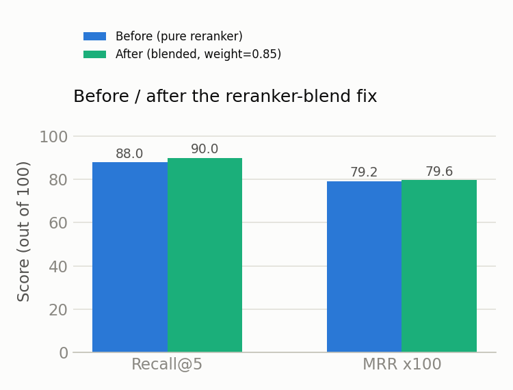
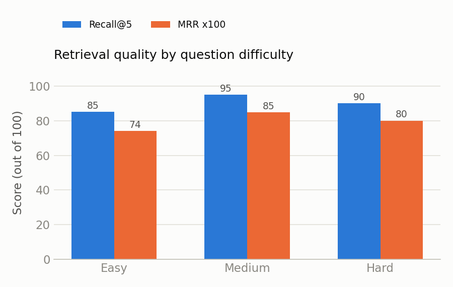
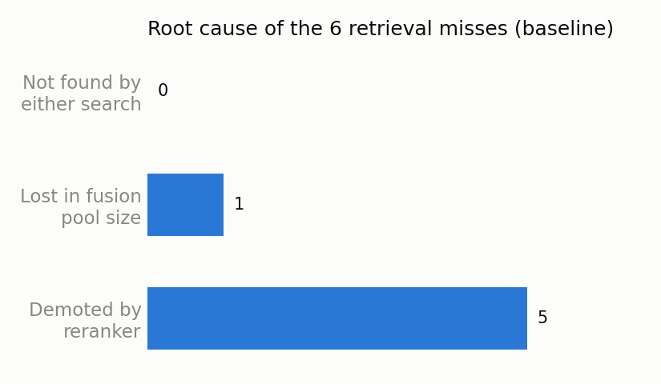

# FastAPI docs assistant — a self-diagnosing RAG system

A retrieval-augmented Q&A assistant over the official FastAPI documentation
that answers developer questions with citations — and, unlike most RAG
demos, measures and documents *why* it fails and what fixing it actually
did to the numbers, instead of reporting a single feel-good metric.

**Status:** retrieval pipeline complete and evaluated. Generation is
implemented but blocked on Anthropic API credit — see
[Current limitations](#current-limitations).

## Why this project is different

Most portfolio RAG projects stop at "it works, here's a demo." This one
includes an honest audit trail:

- [`results/failure_analysis.md`](results/failure_analysis.md) — diagnosed
  *why* 6 of 50 test questions missed their target document (spoiler: 5 of
  6 weren't a search problem at all, the reranker was demoting correct
  results), applied a fix, and reports two iterations of that fix — the
  first one looked reasonable and actually made MRR worse. The second
  worked. Both are documented.
- [`AUDIT.md`](AUDIT.md) — a full security/quality/production-readiness
  audit of this exact codebase, including a finding that the reported
  Recall@5 number involved tuning a hyperparameter against the same set
  it's evaluated on (a real methodological weakness, called out rather
  than hidden).

## Results




| metric | before | after (full 50-question set) | after (15-question held-out set) |
|---|:---:|:---:|:---:|
| Recall@5 | 88.0% | **90.0%** | 100.0%\*\* |
| MRR | 0.792 | 0.792-0.796\* | 0.769\*\* |

\* small run-to-run floating-point jitter in the cross-encoder means MRR
isn't perfectly reproducible bit-for-bit; see `AUDIT.md`. Recall@5 is
stable across runs.

\*\* the "full 50" column has a data-leakage caveat -- the reranker blend
weight was tuned against those same 50 questions. The held-out column is
15 questions never used for tuning, but by chance it doesn't contain any
of the 6 originally-diagnosed failure cases, so treat 100% as "no
regressions on unseen questions," not "the fix generalizes perfectly."
Full writeup: [`results/failure_analysis.md`](results/failure_analysis.md#correcting-the-evaluation-methodology-tuning-vs-held-out).

Measured against a 50-question hand-labeled test set
(`data/test_set.json`, 20 easy / 20 medium / 10 hard, covering routing,
parameters, Pydantic validation, dependencies, security, WebSockets,
background tasks, testing, deployment, and more).

### Where the baseline failures came from



5 of the 6 baseline misses weren't a search problem at all -- the correct
document was already found by semantic and/or keyword search, then pushed
out of the final top-5 by the cross-encoder reranker. See
[`results/failure_analysis.md`](results/failure_analysis.md) for the
per-question breakdown and root-cause analysis.

## Architecture

```
data/raw/*.md  (FastAPI docs, gitignored -- see Setup)
      |
      v
src/ingestion.py        clean markdown, resolve code-snippet includes,
                         strip HTML/admonitions
      |
      v
data/processed/fastapi_docs.json   (155 cleaned documents, committed)
      |
      v
src/indexing.py         chunk by real tokenizer offsets (512 tokens,
                         50 overlap), embed, store in ChromaDB
      |
      v
data/chroma/  (vector store, gitignored, rebuilt by indexing.py)
      |
      v
src/retrieval.py        hybrid search: BM25 + semantic, fused with
                         Reciprocal Rank Fusion, reranked with a
                         cross-encoder, blended with the fusion score
      |
      v
src/generation.py       Claude API call with a strict citation prompt
      |
      v
dashboard/app.py        Streamlit chat UI with sources + dev-mode metrics
```

Parallel pipelines: `src/evaluation.py` (Recall@k/MRR against the test
set), `src/failure_analysis.py` (diagnoses *why* a retrieval miss
happened), `tests/test_regression.py` (blocks a change if it drops a
metric >5% relative to `results/regression_baseline.json`), `src/llm_judge.py`
and `src/hallucination_detection.py` (faithfulness/relevance scoring and
claim-level hallucination checks — written, not yet verified against a
live call, see [Current limitations](#current-limitations)).

## Tech stack

| Stage | Choice | Why |
|---|---|---|
| Embeddings | `sentence-transformers/all-MiniLM-L6-v2` | Fast, free, local baseline — deliberately not the fanciest option, see limitations |
| Vector store | ChromaDB (local, persistent) | Zero-config, no external service required |
| Keyword search | BM25 (`rank-bm25`) | Catches exact identifiers (`HTTPException`, `async def`) that embeddings can blur |
| Fusion | Reciprocal Rank Fusion | Combines two differently-scaled rankings without hand-tuned weights |
| Reranking | `cross-encoder/ms-marco-MiniLM-L-6-v2`, blended 85/15 with the fusion score | See `results/failure_analysis.md` for why the blend exists |
| Generation | Claude API (`claude-sonnet-5`) | Strict citation-required system prompt |
| Dashboard | Streamlit | Chat UI, source citations, dev-mode metrics |

## Setup

```bash
python -m venv .venv
.venv\Scripts\activate          # Windows
pip install -r requirements.txt
```

The FastAPI documentation itself is not committed (`data/raw/` is
gitignored — it's a straight copy of another repo's docs). To rebuild it
from scratch:

```bash
git clone https://github.com/fastapi/fastapi.git ../fastapi
cp -r ../fastapi/docs/en/docs/* data/raw/
python src/ingestion.py
```

`data/processed/fastapi_docs.json` (the cleaned output) *is* committed, so
you can skip straight to indexing if you don't need to re-derive it:

```bash
python src/indexing.py          # builds chunks + vector store
python src/evaluation.py        # Recall@5 / MRR against data/test_set.json
python src/failure_analysis.py  # diagnoses retrieval misses
```

To run the dashboard:

```bash
streamlit run dashboard/app.py
```

Generation requires an Anthropic API key:

```bash
echo "ANTHROPIC_API_KEY=sk-ant-..." > .env
python src/generation.py "How do I handle a 404 error in FastAPI?"
```

## Agentic layer

`src/agent.py` wraps the RAG pipeline above in Claude tool-use, so the
assistant decides per question whether to search the docs, check GitHub for
a known issue, escalate to a human, or log a documentation gap for review,
instead of always running the same fixed retrieval step. See the module
docstring for the full routing rules.

```bash
python src/agent.py "Does FastAPI support server-sent events natively?"
```

Two of the four tools have real side effects and need their own setup
beyond the `ANTHROPIC_API_KEY` above:

- **`escalate_to_human`** books a real Google Calendar event.
- **`log_question_for_review`** appends a real row to a Google Sheet.

### Test fakes and scoring logic now live in their own package

`tests/test_agent.py`'s scriptable Anthropic-client fakes, and
`src/injection_tests.py`'s attack-checking logic, used to be defined
directly in this repo. They're now
[agentfixture](https://github.com/naomytcheums-dotcom/agentfixture) --
extracted once a second project needed the same fakes, and improved
here in the process: dogfooding it against this project's own
`data/injection_test_set.json` surfaced a real gap (no per-tool call
limit, only a single global one) that's now fixed upstream. Not yet on
PyPI -- installed here as a local editable dependency (see
`requirements.txt`).

### Phase 02 setup (Google Calendar + Sheets)

1. Create a project at [console.cloud.google.com](https://console.cloud.google.com/),
   enable the **Google Calendar API** and **Google Sheets API** for it.
2. Create a **service account**, then a JSON key for it (IAM & Admin →
   Service Accounts → Keys → Add key). Save the file somewhere outside the
   repo.
3. Share the target calendar and the target spreadsheet with the service
   account's email address (looks like
   `something@project-id.iam.gserviceaccount.com`) -- Editor access on
   both, the same way you'd share them with a person.
4. Add to `.env`:
   ```
   GOOGLE_SERVICE_ACCOUNT_FILE=C:\path\to\the\key.json
   GOOGLE_CALENDAR_ID=the-calendar's-id@group.calendar.google.com
   GOOGLE_SHEET_ID=the-spreadsheet-id-from-its-url
   ```

Without this, `escalate_to_human` and `log_question_for_review` raise a
clear `EnvironmentError` naming the missing variable rather than failing
silently or crashing with an opaque Google API error.

## Voice channel (optional, Phase 08)

The dashboard sidebar has a **"Read answers aloud"** toggle, and a mic
button ("Ask by voice") sits above the text input. Both go through the
browser's own Web Speech API -- no telephony platform, no Twilio/SIP
setup, nothing to configure. `dashboard/voice.py` sanitizes an answer
(strips citation markers, code fences, markdown emphasis) before handing
it to `speechSynthesis`, and `dashboard/components/voice_input/` is a
bare static HTML/JS Streamlit component wrapping `SpeechRecognition`.

**Known gap:** the sanitization and HTML-generation logic is unit
tested (`tests/test_voice.py`), and the component was confirmed to
mount and render correctly in a live dashboard session. What's *not*
verified is an actual microphone transcription or audible playback --
this environment has no real audio hardware. Voice recognition also
needs a Chromium-based browser (Safari/Firefox support is inconsistent)
and, on most browsers, HTTPS or `localhost` to grant mic access at all.

## Deploying the dashboard (free)

Streamlit Community Cloud deploys straight from this GitHub repo:

1. Go to [share.streamlit.io](https://share.streamlit.io), sign in with
   GitHub, click **New app**, pick this repo, branch `main`, and set the
   main file path to `dashboard/app.py`.
2. Under **Advanced settings → Secrets**, add:
   ```toml
   ANTHROPIC_API_KEY = "sk-ant-..."
   ```
   (only needed once there's credit on the account -- without it the app
   still deploys and runs, generation just shows the same graceful "not
   configured" message it does locally).
3. Deploy. First load takes a minute or two: `data/chroma/` (the vector
   store) isn't committed to git -- it's binary and derived, not source --
   so `dashboard/app.py` detects it's missing on a fresh deployment and
   rebuilds it from the committed `data/processed/fastapi_docs.json`
   automatically. Every load after that is fast.

No credit card, no server to manage, free tier is enough for a portfolio demo.

## Deploying via Docker (Render / Fly.io)

The Streamlit Cloud path above needs no Dockerfile at all. This path is
for anywhere that expects a container instead -- same app, different
host.

**Locally:**

```bash
docker compose up --build
```

Opens on [localhost:8501](http://localhost:8501). `ANTHROPIC_API_KEY` and
the `GOOGLE_*` variables (see "Phase 02 setup" above) are read from your
shell environment or a `.env` file in the project root -- `docker-compose.yml`
passes them through. The vector store persists in a named volume across
restarts, so it's rebuilt once, not on every `docker compose up`.

**On Render:** connect the repo as a
[Blueprint](https://render.com/docs/blueprint-spec) -- Render reads
[`render.yaml`](render.yaml) and builds the [`Dockerfile`](Dockerfile)
automatically. Add the same environment variables in the Render
dashboard (they're declared `sync: false` in the blueprint, meaning
Render prompts for them rather than committing secrets to the repo).

**On Fly.io:** `fly launch` in the project root detects the `Dockerfile`
and generates a `fly.toml` for you; `fly deploy` after that. No
Fly-specific config is committed here since `fly launch` writes one
tailored to your app name and region.

Either host builds the same image `docker compose` builds locally --
what you test on your machine is what runs in production, not two
different setups that happen to look similar.

## Current limitations

Documented in full in [`AUDIT.md`](AUDIT.md). The headline ones:

- **Generation, hallucination detection, LLM-judge calibration, and the
  agent's live tool-routing decisions are all blocked on API credit.** The
  code is written and imports cleanly, but none of it has been exercised
  against a live Claude response yet -- `tests/test_agent.py` and
  `tests/test_integrations.py` cover the request-shaping and error-handling
  logic against injected fakes, not a real model's actual choices.
- **`escalate_to_human` and `log_question_for_review` are also untested
  against real Google APIs**, for the same reason -- no service account is
  configured yet. See "Phase 02 setup" above.
- **The Docker image is untested against a real Docker daemon** -- no
  Docker available in the environment this was built in. `tests/test_deployment.py`
  validates the Dockerfile's structure (required instructions present,
  correct entrypoint) and `render.yaml`'s shape, not that `docker build`
  actually succeeds.
- **The Recall@5/MRR headline numbers have a data-leakage caveat**: the
  reranker blend weight was tuned against the same 50-question set now
  used to report the result. A tuning/held-out split now exists
  (`data/test_set.json`'s `held_out` field, `evaluation.py --held-out-only`)
  for future parameter changes, but this specific past decision can't be
  retroactively un-leaked -- see the Results section above and
  `results/failure_analysis.md`.
- 105 unit tests across `tests/` (ingestion, retrieval scoring, agent
  routing, integrations, resilience, evaluation, observability, deployment
  config, voice-text sanitization), all run in CI -- plus agentfixture's
  own 25, in its own repo, covering the fakes and scoring logic this
  project now imports rather than duplicates. Still nothing for
  `generation.py` itself -- hard to test meaningfully without live API
  access.
- **Voice input/output is untested against real audio** -- see "Voice
  channel (optional, Phase 08)" above.
- No type hints across `src/` yet.

## Project structure

```
rag-fastapi-assistant/
├── data/
│   ├── raw/                    FastAPI docs copy (gitignored)
│   ├── processed/              cleaned docs + chunks (committed)
│   ├── test_set.json           50 labeled questions
│   ├── agent_eval_set.json     12 labeled tool-routing cases (Phase 04)
│   ├── injection_test_set.json 12 adversarial prompts (Phase 03)
│   └── telemetry.jsonl         per-request cost/latency log (gitignored, Phase 05)
├── src/                        pipeline stages (see Architecture) + agent.py,
│                                integrations.py, agent_evaluation.py,
│                                injection_tests.py, observability.py
├── dashboard/app.py             Streamlit UI
├── tests/test_regression.py
├── calibration/                 LLM-judge calibration harness (see calibration/README.md)
├── results/                     evaluation + failure-analysis output
├── .github/workflows/           CI regression check
├── Dockerfile, .dockerignore,   container build + local/Render deploy
│   docker-compose.yml, render.yaml   (Phase 06)
├── AUDIT.md                     full code/security/quality audit
└── requirements.txt
```
