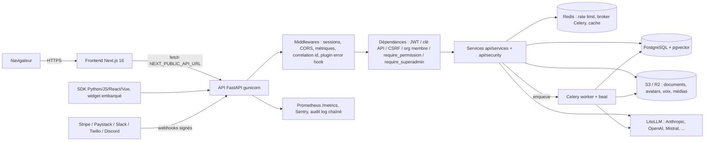
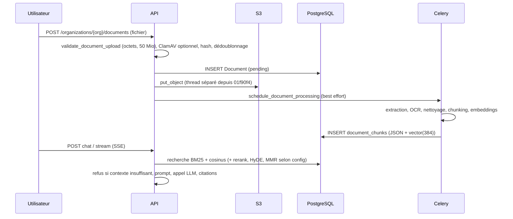

# 03 — Architecture réelle

Audit du 2026-10-10, HEAD `59d5ec9`. Tout ce qui est décrit est **observé dans le code** ; le fonctionnement en production n'est pas prouvé (voir `10_TESTS_CI_DEPLOIEMENT.md`).

## Volumétrie (mesurée)
| Élément | Valeur | Méthode |
|---|---:|---|
| Fichiers Python de `api/` (hors migrations) | 692 | `Get-ChildItem` |
| Lignes Python de `api/` (hors migrations) | ≈ 87 200 | comptage de lignes (inclut commentaires volumineux) |
| Routeurs | 101 fichiers dans `api/routers` | |
| Services | 284 fichiers dans `api/services` | |
| Modules de sécurité | 71 dans `api/security` | |
| Tâches Celery | 49 fichiers dans `api/tasks`, 105 décorateurs `@celery_app.task`/`@shared_task` | décompte textuel |
| Entrées du beat schedule | ≈ 61 | décompte textuel approximatif dans `api/tasks/celery_app.py` |
| Opérations HTTP OpenAPI | **943** sur **788** chemins (POST 356, GET 420, DELETE 85, PATCH 80, PUT 2) | `app.openapi()` |
| Modèles / tables | 177 | `db.py` |
| Migrations | 136 | |
| Frontend TS/TSX (hors node_modules) | ≈ 21 400 lignes ; 57 pages ; 187 composants ; 56 fichiers `lib/` | décomptes |
| Dépendances | `requirements-api.txt` 66 paquets épinglés ; `requirements-optional.txt` 8 (docling, deepeval, dspy, mem0ai, lightrag-hku, beeai-framework, presidio-analyzer, openlineage-python) ; frontend 13 dépendances + 17 de dev | décomptes |

## Pile technique observée
- Backend : FastAPI 0.141.1, Python 3.13, SQLAlchemy 2.0 async (`sqlalchemy[asyncio]==2.0.40`), asyncpg, Alembic 1.19, Pydantic Settings, Authlib, pyotp, webauthn, Celery 5.6.3 + Redis, gunicorn/uvicorn, boto3, stripe 11.4.1, LiteLLM 1.99.0, pgvector 0.3.6, sentence-transformers 5.7 + torch CPU, MCP 2.0.0, a2a-sdk 1.2.0.
- Frontend : Next.js 16.3.8, React 19.2.8, Tailwind (selon `agents.md`), react-markdown + `rehype-sanitize`, reactflow, recharts, Sentry.
- Données : PostgreSQL (Supabase annoncé) + pgvector ; Redis (Upstash annoncé) ; S3 compatible (R2/MinIO).
- **Prototype historique** : `src/` + `dashboard/` (Streamlit/Chroma) est toujours dans le dépôt, c'est la cible de `render.yaml` et de `Dockerfile`.

## Flux principaux

## Points d'entrée
- API : `api/main.py` (`app = FastAPI(...)`, 101 modules de routeurs, lifespan, middlewares) ; démarrage prod `gunicorn -c gunicorn.conf.py api.main:app` (`Dockerfile.api`).
- Worker/beat : `api/tasks/celery_app.py` ; `docker-entrypoint.sh` sait lancer un worker + gunicorn, mais **`Dockerfile.api` ne l'utilise pas** (CMD = gunicorn seul, worker retiré après un essai concluant négativement sur 512 Mo).
- Frontend : `frontend/app/` (App Router).
- Prototype : `dashboard/app.py` (Streamlit), `src/`.
- Outils : `scripts/` (19 fichiers suivis), `bob/` (37 fichiers : pilote « Bob », voir annexe).

## Composants (responsabilité → risques connus → tests)
| Composant | Fichiers | Risque connu | Tests |
|---|---|---|---|
| Authentification | `api/routers/auth.py`, `api/security/jwt.py`, `csrf.py`, `api/dependencies.py` | rate limiting dégradé sans Redis (repli en mémoire de processus) | `test_auth_api.py` (174), `test_auth_security.py` |
| Autorisation | `api/security/permissions.py`, `permission_catalog.py` (52 clés) | routes classées « sans dépendance d'auth » à examiner (04) | `test_rbac_custom.py`, `test_roles_and_permissions.py` |
| Multi-tenant | filtres `organization_id` dans services ; RLS activé mais non contraignant | **isolation non garantie par la base** | `test_document_idor.py`, `test_a2a_idor.py`, `test_p0_*` |
| Documents/RAG | `api/security/documents.py`, `api/services/document_*`, `retrieval_pipeline.py` | chargement mémoire des chunks, chemins chunking non tous câblés | nombreux (`test_documents.py` 255) |
| Facturation | `api/services/billing_*`, `api/routers/billing.py`, `admin_subscriptions.py` | voir `09` | `test_p0_*`, `test_p1_*`, `test_p2_*` |
| Agents/MCP/A2A | `api/services/agent_orchestrator.py`, `api/services/mcp/*`, `api/routers/a2a.py` | exposition d'outils ; stdio MCP désactivé par défaut | `test_agent_orchestrator.py` (52), `test_mcp_*` |
| Tâches | `api/tasks/*` | pas de worker/beat garanti en production | `test_celery_integration.py` |
| Frontend | `frontend/` | données fictives sur `/maquette` | vitest 178 tests |

## Dépendances circulaires / duplications / code mort
**NON MESURÉ** : aucun outil d'analyse de graphe d'imports n'a été exécuté. Deux duplications structurelles sont visibles : (1) deux pipelines RAG coexistent (`src/` legacy et `api/`), (2) deux chemins de similarité vectorielle (numpy en mémoire et pgvector HNSW) — voir `06_RAG_PIPELINE.md`.

---
## Annexe — Exploration automatisée « agents, MCP, LLM, Celery, stockage, intégrations, observabilité »
*(rapport d'un sous-agent en lecture seule, repris tel quel ; numéros de ligne parfois approximatifs ; aucun test exécuté ; à ne pas lire comme une preuve de fonctionnement)*

<!-- ANNEXE_AJOUTEE -->
### Audit READ-ONLY — état observé

> Aucun fichier `.env` ouvert. Aucun secret ou contenu sensible reproduit.  
> Audit basé sur lecture ciblée (`api/`, `tests/`, `sdks/`, `bob/`, `agents.md`).  
> Les tests n’ont pas été exécutés : leur présence ne prouve donc pas le fonctionnement effectif.

#### 1. LLM layer

- **LiteLLM centralisé — IMPLÉMENTATION OBSERVÉE — FONCTIONNEMENT NON PROUVÉ**  
  `api/services/llm_providers.py:87-101` — `PROVIDER_SETTINGS` déclare Anthropic, OpenAI, Gemini, Mistral, Ollama, OpenAI-compatible et Watsonx.  
  `api/services/llm_providers.py:106-127` — `get_available_providers()` et `get_default_provider()`.  
  `api/services/llm_providers.py:242-269` — appel `litellm.acompletion`, timeout et boucle de retry.  
  `api/services/llm_providers.py:500` — `chat_completion_with_fallback()`.

- **Modèles par défaut — IMPLÉMENTATION OBSERVÉE — FONCTIONNEMENT NON PROUVÉ**  
  Modèles et provider par défaut dans `api/config.py` ; les clés de configuration sont référencées par `PROVIDER_SETTINGS`. Valeurs secrètes non inspectées.

- **Streaming — IMPLÉMENTATION OBSERVÉE — FONCTIONNEMENT NON PROUVÉ**  
  `api/services/llm_providers.py:344-393` — `chat_completion_stream()`, `stream=True`, usage final.  
  `api/services/llm_providers.py:395-445` — streaming avec tools. Les streams ne sont pas retryés après émission de tokens (`:352-358`, `:428`).

- **Limites / retries / coût — IMPLÉMENTATION OBSERVÉE — FONCTIONNEMENT NON PROUVÉ**  
  Timeout via `settings.LLM_TIMEOUT` (`:242`), retries configurables (`:269`).  
  Usage et crédits reliés à `api/services/token_usage.py`, `cost_tracking.py`, `billing_credits.py`, `security/credit_packs.py`, notamment `api/services/agent_orchestrator.py:31-34`.  
  **Non déterminé** : preuve d’un plafond global de dépense par modèle et d’un hard-stop budgétaire complet. Des quotas organisationnels existent dans `api/routers/quotas.py` et `api/services/billing_usage.py`.

- **BYOK — IMPLÉMENTATION OBSERVÉE — FONCTIONNEMENT NON PROUVÉ**  
  `api/services/llm_byok.py` et `api/services/agent_orchestrator.py:35` — résolution de clé d’organisation.  
  **Non déterminé** : couverture complète de tous les providers et absence de fuite de clé lors d’un fallback.

- **Prompt injection / cache — IMPLÉMENTATION OBSERVÉE — FONCTIONNEMENT NON PROUVÉ**  
  `api/services/prompt_injection_detection.py`, `agent_guardrails.py`, `agent_context_only.py`.  
  `api/services/cache_service.py` — cache applicatif.  
  **Non déterminé** : garantie que toutes les réponses LLM passent par la défense injection et le cache, ni invalidation complète par tenant/modèle/prompt.

- **Tests — TEST PRÉSENT (`tests/test_llm_providers.py`)**  
  Le fichier couvre dispatch, erreurs, fallback et retry avec mock LiteLLM. Aucun appel fournisseur réel prouvé.

#### 2. Agents, autonomie, workflows, tools, A2A, MCP, BeeAI

- **Orchestrateur — IMPLÉMENTATION OBSERVÉE — FONCTIONNEMENT NON PROUVÉ**  
  `api/services/agent_orchestrator.py:1-45` — runs persistés en base, traces, crédits, BYOK, mémoire, permissions et tools.  
  `api/services/agent_orchestrator.py:53-75` — limitation explicite : un run correspond principalement à un appel LLM ; pas d’entité agent persistée complète dans cette couche.  
  `api/services/agent_orchestrator.py` — `run_agent`, `run_multi_agent`, statut, arrêt, trace ; annulation inter-processus non garantie.

- **Autonomous agents — IMPLÉMENTATION OBSERVÉE — FONCTIONNEMENT NON PROUVÉ**  
  `api/services/autonomous_agents.py` et `api/tasks/autonomous_agents.py:28-169` — exécution de plans, consolidation/nettoyage mémoire et vérification de guardrails.  
  Déclencheurs : tâches Celery et routes `api/routers/autonomous_agents.py`.  
  Outils/permissions : `agent_tools.py`, `agent_permissions.py`, `tool_permissions.py`, `tool_timeout.py`, `tool_budget.py`.  
  **Non déterminé** : matrice exhaustive des données accessibles et de tous les effets de bord pour chaque agent. Human approval existe via `api/routers/human_approval.py` et `workflow_block_human.py`, mais son obligation par type d’agent n’est pas établie.

- **Planning / mémoire — IMPLÉMENTATION OBSERVÉE — FONCTIONNEMENT NON PROUVÉ**  
  `api/services/task_planning.py`, `agent_memory.py`, `agent_long_term_memory.py`, `agent_traces.py`. Persistance DB des runs/traces/mémoires observée.

- **Workflows et blocks — IMPLÉMENTATION OBSERVÉE — FONCTIONNEMENT NON PROUVÉ**  
  `api/services/workflow_engine.py`, `workflow_blocks.py`, `workflow_block_{llm,rag,search,http,code,database,email,calendar,condition,human}.py`, `api/services/workflow_triggers.py`.  
  **Non déterminé** : fonctionnement complet des retries, compensation/rollback et validation humaine obligatoire pour chaque block.

- **Tool registry / sécurité — IMPLÉMENTATION OBSERVÉE — FONCTIONNEMENT NON PROUVÉ**  
  `api/services/tools.py`, `tool_wiring.py`, `tool_validation.py`, `parallel_tools.py`, `tool_timeout.py`, `tool_budget.py`. Validation JSON-schema et timeout sont réutilisés par MCP (`api/routers/mcp_server.py:120-126`).

- **A2A — IMPLÉMENTATION OBSERVÉE — FONCTIONNEMENT NON PROUVÉ**  
  `api/routers/a2a.py`; tests présents dans `tests/test_a2a_router.py` et `tests/test_a2a_integration.py`. Le test d’intégration décrit un appel BeeAI/LiteLLM payant mais est mocké/non exécutable sans credentials.

- **MCP client — IMPLÉMENTATION OBSERVÉE — FONCTIONNEMENT NON PROUVÉ**  
  `api/services/mcp/client.py:127-170` — découverte et appel de tools externes.  
  `api/services/mcp/discovery.py:19-97` — CRUD, cache des tools, firewall.  
  `api/services/mcp/firewall.py:43-79` — permissions/audit.

- **MCP server : déclarés vs appelables — IMPLÉMENTATION OBSERVÉE — FONCTIONNEMENT NON PROUVÉ**  
  `api/routers/mcp_server.py:74-112` déclare tools built-in, custom, SQL et Bob.  
  `api/services/mcp/builtin_tools.py:40-370` implémente les quatre tools Bob : `create_rag_agent`, `run_eval_benchmark`, `get_failure_report`, `update_retrieval_config`.  
  Le endpoint `tools/list` expose aussi des tools génériques et custom (`mcp_server.py:86-112`).  
  **Test présent** : `tests/test_mcp_builtin_tools.py` (référencé dans `bob/mcp-tools.md:94`).  
  **Non déterminé** : tests pour chaque tool générique/custom effectivement appelable par MCP.

- **BeeAI / auto-évolution — STUB/MOCK ou NON DÉTERMINÉ**  
  `api/services/beeai_orchestrator.py` existe ; `api/services/rag_evolution_engine.py`, `rag_control_plane.py`, `rag_genome.py` existent.  
  Les capacités d’auto-évolution documentées par `agents.md` ne sont pas entièrement prouvées par une boucle autonome complète avec rollback et commit.

#### 3. `bob/` et `agents.md`

- **Modes FACTORY, GUARDIAN, AUTOPSY, CHANGELAB — IMPLÉMENTATION OBSERVÉE — FONCTIONNEMENT NON PROUVÉ**  
  `agents.md:1-4`, `:40-120` décrit les quatre modes.  
  `bob/mcp-tools.md:1-94` documente les quatre tools et cite `tests/test_mcp_builtin_tools.py`.  
  `bob/` contient documentation et scripts d’expérimentation (`bob/lab/*.py`), pas une implémentation autonome du cycle Git/benchmark/rollback complet.

- **Capacités réelles — IMPLÉMENTATION OBSERVÉE — FONCTIONNEMENT NON PROUVÉ**  
  Les quatre tools MCP sont réellement routés par `api/routers/mcp_server.py:104-153`, avec rattachement de l’organisation à la clé API et rate-limit.  
  Le ChangeLab documenté dans `agents.md` (`git checkout`, commit, push, PR) relève d’une procédure/documentation ; aucune preuve d’exécution automatique complète n’a été établie.

#### 4. Celery

- **Configuration — IMPLÉMENTATION OBSERVÉE — FONCTIONNEMENT NON PROUVÉ**  
  `api/tasks/celery_app.py:95-139` — broker/backend configurables, liste explicite de modules.  
  `:170+` — beat schedule ; purge comptes et blacklist notamment.  
  `:78-93` — publication fail-fast avec thread daemon, timeout d’environ une seconde et cooldown si broker indisponible.

- **Tâches — IMPLÉMENTATION OBSERVÉE — FONCTIONNEMENT NON PROUVÉ**  
  Modules couvrent ingestion documents/connecteurs, reindex, évaluations, billing, analytics, notifications, webhooks, workflows, agents autonomes, sécurité, nettoyage et intégrations. Exemples : `api/tasks/document_processing.py`, `external_source_sync.py`, `evaluation_jobs.py`, `autonomous_agents.py`.

- **Retries / ACK / idempotence — NON DÉTERMINÉ**  
  Des décorateurs Celery sont présents, mais l’audit ciblé n’établit pas une politique uniforme `acks_late`, retries et idempotence pour toutes les tâches.  
  `api/tasks/celery_app.py:500-511` — signaux succès/échec.

- **Sans worker — IMPLÉMENTATION OBSERVÉE — FONCTIONNEMENT NON PROUVÉ**  
  Les dispatchs sont mis en échec rapidement lorsque le broker est inaccessible (`:78-93`). Une tâche publiée mais sans worker reste dépendante du broker ; stratégie générale de récupération des tâches orphelines/stuck non établie. Redis est utilisé comme broker/backend configurable ; le cache et rate-limit sont également référencés dans les services Redis.

#### 5. Storage

- **S3/R2 documents — IMPLÉMENTATION OBSERVÉE — FONCTIONNEMENT NON PROUVÉ**  
  `api/services/document_storage.py:395-440` — boto3, bucket documents séparé, endpoint compatible R2.  
  `:426-440` — upload et clé privée ; `:487-523` — download/delete.  
  `:3-10` — documents privés, sans ACL publique.

- **Assets publics — IMPLÉMENTATION OBSERVÉE — FONCTIONNEMENT NON PROUVÉ**  
  `api/services/storage.py:59-124` — bucket assets/avatar/branding, ACL `public-read`, préfixe branding.  
  `:224-238` — suppression avatar/branding.

- **Média — IMPLÉMENTATION OBSERVÉE — FONCTIONNEMENT NON PROUVÉ**  
  `api/services/media.py:118-166` — upload S3 et suppression DB + objets.  
  **NON TROUVÉ** : fallback local document/storage explicite.  
  **Non déterminé** : politique de rétention globale au-delà des suppressions et tâches de purge.

#### 6. Intégrations, imports/exports, SDKs

- **Email / Resend — IMPLÉMENTATION OBSERVÉE — FONCTIONNEMENT NON PROUVÉ**  
  `api/services/email.py`, `api/config.py:204+`, `api/services/resend_domains.py`.

- **Webhooks — IMPLÉMENTATION OBSERVÉE — FONCTIONNEMENT NON PROUVÉ**  
  `api/services/webhooks.py`, `api/routers/webhooks.py`, `api/tasks/webhooks.py`. Signatures entrantes/outbound présentes dans `api/security/chat_integrations_signature.py`; couverture exacte de chaque type non établie.

- **Slack/Discord/Teams/Twilio/voix — IMPLÉMENTATION OBSERVÉE — FONCTIONNEMENT NON PROUVÉ**  
  Routes `api/routers/chat_integrations_slack.py`, `chat_integrations_discord.py`, `twilio.py`, `voice.py`; services `telephony.py`, `twilio_sms.py`, `voice.py`, `voice_messages.py`.  
  **NON TROUVÉ** : route Telegram dédiée dans la sélection ciblée. WhatsApp est configuré via Twilio (`api/config.py:2462+`).

- **Connecteurs importeurs — IMPLÉMENTATION OBSERVÉE — FONCTIONNEMENT NON PROUVÉ**  
  Services et tâches pour Notion, Drive, OneDrive, Confluence, GitHub et Airbyte : `api/services/{notion,google_drive,onedrive,confluence,github}_extraction.py`, `airbyte_client.py`; tâches correspondantes sous `api/tasks/`.  
  `api/config.py:2396-2403` décrit Airbyte comme non déployé/optionnel : **NON DÉTERMINÉ en production**.

- **Exports — IMPLÉMENTATION OBSERVÉE — FONCTIONNEMENT NON PROUVÉ**  
  `api/services/data_export.py`, `conversation_export.py`, routes documents/export.  
  Tests documentation OpenAPI : `tests/docs/test_api_reference.py:59-82`.

- **SDK Python — IMPLÉMENTATION OBSERVÉE — FONCTIONNEMENT NON PROUVÉ**  
  `sdks/python/rag_saas_sdk/client.py:23-176` — chat, documents, agents, knowledge bases, streaming et context manager.  
  **TEST PRÉSENT** : `sdks/python/tests/test_client.py`.

- **SDK JS — IMPLÉMENTATION OBSERVÉE — FONCTIONNEMENT NON PROUVÉ**  
  `sdks/js/src/client.ts:1-100` — chat, documents, search, agents, usage, analytics, embed, conversations, knowledge bases.  
  **Non déterminé** : synchronisation exhaustive avec l’OpenAPI.

- **SDK React/Vue — IMPLÉMENTATION OBSERVÉE — FONCTIONNEMENT NON PROUVÉ**  
  React : `sdks/react/src/RAGWidget.tsx`, `hooks.ts`, tests `sdks/react/src/__tests__/`.  
  Vue : `sdks/vue/src/RAGWidget.vue`, `composables.ts`.  
  Ils exposent principalement le widget/hooks, pas l’ensemble de l’API backend.

#### 7. Observabilité

- **Prometheus / health — IMPLÉMENTATION OBSERVÉE — FONCTIONNEMENT NON PROUVÉ**  
  `api/main.py:15`, `:435-459` — métriques, `/health`, `/health/ready`.  
  `api/monitoring.py` — rendu métriques et durée requêtes.

- **Logs / corrélation — IMPLÉMENTATION OBSERVÉE — FONCTIONNEMENT NON PROUVÉ**  
  `api/main.py:57`, `:102`, `:303` — logging structuré et middleware de correlation ID.  
  `api/security/logging_correlation.py`.

- **Sentry / Grafana — IMPLÉMENTATION OBSERVÉE — FONCTIONNEMENT NON PROUVÉ**  
  Configuration Sentry dans `api/config.py:2368+`.  
  Endpoints statut Loki/Datadog/tracing dans `api/routers/observability.py:30-60`.  
  `api/config.py:2434-2437` indique que Grafana Cloud/Loki/Tempo reste incomplet tant que les paramètres d’instance ne sont pas renseignés.

### Questions non établies

- Les tests passent-ils réellement dans l’environnement courant ?
- Les plafonds de coût et quotas sont-ils appliqués atomiquement à tous les chemins LLM, y compris streaming, fallback, BeeAI et MCP ?
- Quelle est la matrice exacte outils/données/effets de bord pour chaque agent autonome ?
- Les tâches Celery sont-elles toutes idempotentes, avec `acks_late`, retry et récupération des tâches bloquées ?
- Airbyte, Grafana/Sentry et chaque fournisseur d’intégration sont-ils effectivement configurés en production ?
- Les SDK JS/Python reflètent-ils exactement les routes API actuelles ?
- Existe-t-il une stratégie complète de rétention, purge et reprise pour tous les objets S3/R2 et toutes les données d’agents ?
