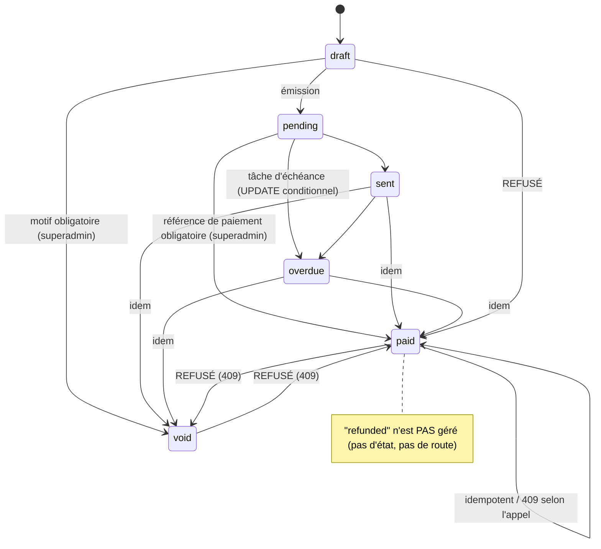

# 09 — Facturation, abonnements, crédits, paiements

Audit du 2026-10-10, HEAD `59d5ec9`. Statuts : « IMPLÉMENTATION OBSERVÉE » (code relu), « TEST RÉUSSI » (test exécuté avec résultat cité), « NON PROUVÉ ». **Aucun paiement réel, aucune clé Stripe/Paystack, aucun webhook réel** : tous les tests de ce domaine utilisent des fournisseurs simulés ; 8 tests « live » sont ignorés faute de clé.

## Plans, abonnements, factures, crédits — composants
| Élément | Code | Remarque |
|---|---|---|
| Plans (`Plan`), abonnements (`Subscription`) | `api/models/admin.py`, `api/services/admin_subscriptions.py` | un plan `is_active=false` ne peut plus être choisi par une organisation (BILL-017, `8bb5ede`) |
| Factures (`Invoice`, `InvoiceLine`) | `api/models/billing.py`, `api/services/billing_invoices.py` | machine d'états V1 |
| Crédits (`Credit`, `CreditTransaction`) | `api/services/billing_credits.py` | types observés : grant, purchase, consume, refund |
| Stripe | `api/services/billing_stripe.py` | checkout abonnement et packs de crédits, portail, webhooks, annulation chez le fournisseur |
| Paystack | `api/services/billing_paystack.py` | checkout abonnement, webhooks ; **pas d'achat de crédits** (501) |
| Routes organisation | `api/routers/billing.py` (préfixe `/organizations/{org_id}/billing`) | |
| Routes plateforme | `api/routers/admin_subscriptions.py` (`/admin/...`) | écritures financières réservées au rôle superadmin (SADM-005) |
| Tâches | `api/tasks/billing.py` | allocation mensuelle de crédits, auto-recharge, factures périodiques, factures en retard |

## Transitions d'état — factures (règles décidées le 2026-10-10 et implémentées)

- Preuves : `tests/test_p1_bill002_invoice_state_machine.py`, `tests/test_p1_r2_invoice_proof_and_rules.py` (24 cas, dont 13 échouaient avant correctif), `tests/test_p1_sadm005_*`. Exécutés le 2026-10-10 ; GitHub Actions `backend-tests` **success** sur `4ee2c22` (run 38041400768) et GitHub `CI` **success** sur `59d5ec9` (main) ; CircleCI `api-tests` success sur `59d5ec9` (build #494).
- **Décisions métier non documentées dans le produit avant le 2026-10-10** : `overdue → void`, `draft → paid` refusé, pas de paiement partiel, payer/annuler une facture **ne modifie pas** le statut de l'abonnement (`docs/admin/BILLING.md`). Ces règles viennent d'un message de décision de l'utilisatrice, pas d'une spécification antérieure.
- La route organisation `/pay` n'est utilisable par une organisation que si `BILLING_ALLOW_SELF_SERVICE_PAID_PLANS=true` (auto-hébergé, faux par défaut) ; l'audit porte alors `self_service: true`.
- **Limite** : une référence de paiement saisie par un superadmin n'est comparée à aucune source bancaire. La preuve est humaine (traçabilité, pas vérification).

## Transitions — abonnements
- Statuts observés : `active`, `past_due`, `canceled` (+ un état « pending » évoqué dans les commentaires du code Stripe — NON DÉTERMINÉ comme valeur d'enum).
- Les transitions passent par `update/reactivate/cancel/extend_subscription` (verrou de ligne `SELECT … FOR UPDATE` depuis `7a19b2d`, R4) et par les gestionnaires de webhooks Stripe/Paystack (verrouillés, avec gardes d'ordre : un événement tardif ne rouvre pas un abonnement terminé).
- Annulation : un appel réseau au fournisseur est fait **sans verrou**, puis la ligne est relue sous verrou (pas de verrou tenu pendant l'I/O). Échec fournisseur → 502 à texte fixe (R6 pour la synchro catalogue).
- Preuve de concurrence : test opt-in sur PostgreSQL jetable, **résultat : échec avant correctif (mise à jour perdue), succès après** ; non exécuté en CI.

## Transitions — crédits
- Débits : `deduct_credits` (tout-ou-rien, verrouillé), `deduct_credits_up_to` (débit partiel + « shortfall » enregistré dans le registre, BILL-008).
- Crédits/remboursements : verrouillés depuis `4b0a810` (BILL-011) ; montants négatifs refusés (BILL-020). Preuve PostgreSQL jetable : 40 crédits + 40 débits concurrents → solde 100 000 stable après correctif (99 980 avant).
- `auto_refill_credits` et `grant_monthly_plan_credits` : lignes verrouillées et ligne de registre écrite ; idempotence mensuelle par motif.
- Packs de crédits Stripe : une seule attribution par **session de checkout** (clé `credit_pack_session:<id>` dans `payment_events`), paiements différés `async_payment_succeeded` gérés, devise vérifiée (BILL-014, `e543e41`).

## Voies pouvant créer du crédit ou une facture payée sans preuve de paiement (recensement)
| Voie | Garde | Statut |
|---|---|---|
| Recharge directe `POST …/credits/purchase` | `CREDITS_ALLOW_UNPAID_TOPUP` (défaut `False`) + refus si un fournisseur est configuré | test `tests/test_billing.py`; **valeur réelle en production NON VÉRIFIÉE** |
| Changement de plan payant sans paiement (`subscribe/upgrade/downgrade`) | 402 sauf plan gratuit/moins cher ; opt-out `BILLING_ALLOW_SELF_SERVICE_PAID_PLANS` | testé (BILL-001) |
| `mark-paid` plateforme | superadmin + référence ≥ 3 caractères, auditée | testé ; preuve non vérifiée contre une banque |
| Remise de crédits par un superadmin (V2) | ligne de registre | commit `e7b60d7` (utilisatrice) ; non relu en détail dans cet audit |
| Auto-recharge `CREDITS_AUTO_REFILL` | désactivée par défaut, ligne de registre | testé |
| Allocation mensuelle par plan | idempotente | testée |
| Webhooks Stripe/Paystack | signature + `claim_payment_event` (idempotence par id) ; gardes d'ordre | testés avec événements synthétiques ; **jamais confrontés à un vrai fournisseur** |

## Problèmes confirmés ou restants
- **BILL-016** remboursement : stub 501 permanent ; événements `charge.refunded`/litiges ignorés → OUVERT.
- **BILL-012** plafonds de dépense : contrôle pré-vol non atomique (20 appels concurrents de 100 sous un plafond de 500 → 2 000 dépensés, rapport d'origine) → OUVERT (non revérifié).
- **BILL-018** multi-devises (plans en EUR, packs en USD affichés en €) → OUVERT.
- **Paystack** : pas d'achat de crédits ; pas d'horodatage d'événement (décision V6 : ne rien changer) ; un payload signé reste rejouable (seule l'idempotence par id protège).
- **V10** noms des clés de permission : décision « ne rien changer ».
- Facturation périodique et rappels (Celery beat) : **aucun worker/beat n'est déployé par `render.yaml`** ; l'exécution réelle en production n'est pas établie.

## Ce qui n'a pas pu être vérifié
Comportement réel avec Stripe/Paystack sandbox, taxes (TVA 20 % fixe selon le rapport d'origine), numérotation sur base réelle, emails de facture (Resend), génération PDF en production, concurrence de webhooks réels.
