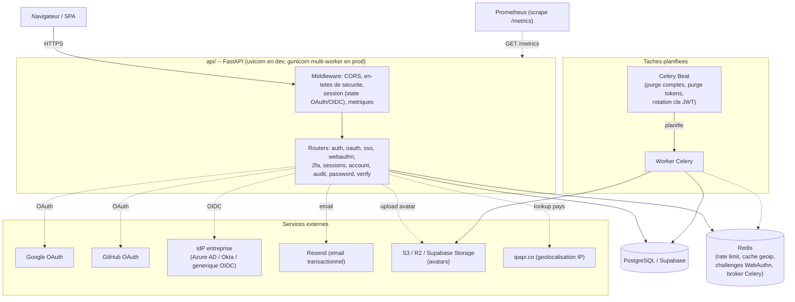
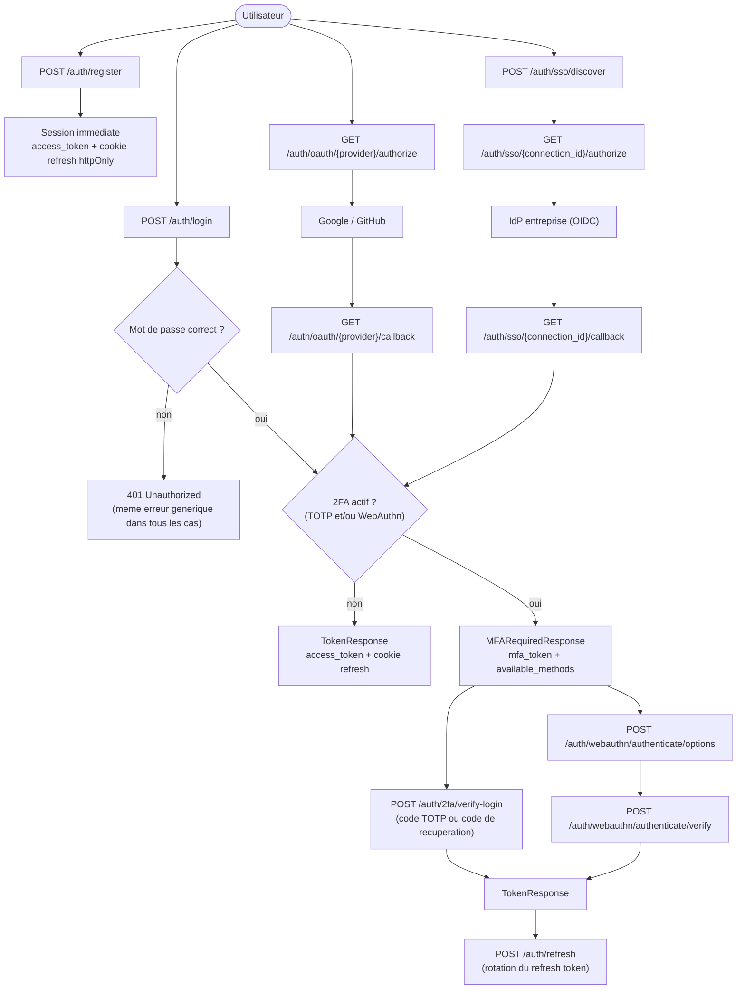

# Running api/ locally

The auth backend (Partie 1.1) needs several real services configured to
exercise every feature end-to-end. This documents what's needed and how
to run each layer -- see `.env.example` for the full variable list with
inline comments; nothing here duplicates the actual values (never commit
real secrets, including into this file).

**Deploying to production?** See `docs/DEPLOYMENT_GUIDE.md` instead --
reverse proxy/HTTPS setup, the `X-Forwarded-For` trusted-proxy
requirement, and a pre-deployment security checklist. This document
covers local development and the API's own architecture.

## Architecture (audit Categorie 5, item 31)

### Vue d'ensemble des composants



### Flux d'authentification (inscription -> connexion -> 2FA)



### Schéma de la base de données

Les tables `*_tokens`/`*_codes` (réinitialisation mot de passe, vérification
email, restauration de compte, réactivation du consentement) partagent
toutes la même forme -- `id`, `user_id` FK, un hash du token, `expires_at`,
`used_at` -- et sont regroupées ci-dessous sous une seule entité pour la
lisibilité; le détail exact de chacune est dans `api/models/`.

```mermaid
erDiagram
    USERS ||--o{ OAUTH_ACCOUNTS : "lie"
    USERS ||--o{ SESSIONS : "possede"
    USERS ||--o{ ENTERPRISE_SSO_ACCOUNTS : "lie"
    USERS ||--o{ WEBAUTHN_CREDENTIALS : "enregistre"
    USERS ||--o{ PASSWORD_HISTORY : "historise"
    USERS ||--o{ TWO_FACTOR_RECOVERY_CODES : "possede"
    USERS ||--o{ REVOKED_ACCESS_TOKENS : "revoque"
    USERS ||--o{ AUDIT_LOGS : "genere (nullable)"
    USERS ||--o{ TOKENS_EPHEMERES : "demande"
    ENTERPRISE_SSO_CONNECTIONS ||--o{ ENTERPRISE_SSO_ACCOUNTS : "scope"

    USERS {
        uuid id PK
        string email
        string hashed_password "nullable -- compte OAuth/SSO seul"
        enum role "user / admin / superadmin"
        bool is_active
        bool is_email_verified
        string totp_secret
        bool totp_enabled
        datetime deleted_at "soft-delete"
        datetime deletion_scheduled_at
    }
    OAUTH_ACCOUNTS {
        uuid id PK
        uuid user_id FK
        enum provider "google / github"
        string provider_account_id
    }
    ENTERPRISE_SSO_CONNECTIONS {
        uuid id PK
        string email_domain UK
        string issuer
        string client_id
        string client_secret_encrypted "chiffre (Fernet)"
        bool is_enabled
    }
    ENTERPRISE_SSO_ACCOUNTS {
        uuid id PK
        uuid user_id FK
        uuid connection_id FK
        string provider_subject
    }
    SESSIONS {
        uuid id PK
        uuid user_id FK
        string refresh_token_hash
        string access_token_jti
        string device_info
        string ip_address
        datetime expires_at
        datetime last_seen_at
        datetime revoked_at
    }
    WEBAUTHN_CREDENTIALS {
        uuid id PK
        uuid user_id FK
        bytes credential_id UK
        bytes public_key
        int sign_count
        string nickname
    }
    JWT_SIGNING_KEYS {
        uuid id PK
        string secret "chiffre (Fernet)"
        bool is_active
        datetime retired_at
    }
    AUDIT_LOGS {
        uuid id PK
        uuid user_id FK "nullable"
        string action
        string ip
        string checksum "chaine HMAC anti-alteration"
    }
    PASSWORD_HISTORY {
        uuid id PK
        uuid user_id FK
        string password_hash
    }
    TWO_FACTOR_RECOVERY_CODES {
        uuid id PK
        uuid user_id FK
        string code_hash
        datetime used_at
    }
    REVOKED_ACCESS_TOKENS {
        uuid id PK
        uuid user_id FK
        string jti UK
        datetime expires_at
    }
    TOKENS_EPHEMERES {
        uuid id PK
        uuid user_id FK
        string token_hash
        datetime expires_at
        datetime used_at
        string _note "regroupe: reset password, verif email,\nrestauration compte, verrouillage 2FA,\nreactivation consentement"
    }
```



## Required for the API to start at all

- **PostgreSQL** (`DATABASE_URL`, `postgresql+asyncpg://...`) -- any
  Postgres works; Supabase's free tier is what this was built and tested
  against. Its direct connection (`db.<ref>.supabase.co`) is IPv6-only
  unless you pay for the IPv4 add-on -- use the **Session pooler**
  connection string instead (`aws-<n>-<region>.pooler.supabase.com:5432`,
  username `postgres.<project-ref>`) if you're on an IPv4-only network.
  Run migrations once: `python -m alembic upgrade head`.
- `JWT_SECRET_KEY`, `SESSION_MIDDLEWARE_SECRET` -- generate both with
  `python -c "import secrets; print(secrets.token_urlsafe(48))"`.

Start the server: `uvicorn api.main:app --reload`, then `http://localhost:8000/docs`.

**The server reads `.env` once at startup** -- restart it after changing
any environment variable, `--reload` only watches `.py` files.

## Optional layers, and what breaks without them

Every layer below fails gracefully if unconfigured (a clear error, not a
crash) -- the API stays usable for everything that doesn't need it.

### Resend (1.1.3 password reset, 1.1.4 email verification)

`RESEND_API_KEY` from resend.com/api-keys. Until your own sending domain
shows "Verified" under resend.com/domains, Resend's sandbox sender
(`onboarding@resend.dev`, the default in `.env.example`) only delivers to
*your own* Resend account email -- fine for solo dev/testing, not for
real users. Verify a domain (DNS records shown in the Resend dashboard)
and switch `EMAIL_FROM_ADDRESS` to that domain for real recipients.

Without a key configured: registration/reset/OTP requests still succeed
(HTTP-wise), the email send is skipped with a logged warning.

### Google / GitHub OAuth (1.1.5, 1.1.6)

Create credentials at Google Cloud Console (OAuth client, type "Web
application") and github.com/settings/developers ("New OAuth App"). In
both, the redirect URI must be exactly:
`{OAUTH_REDIRECT_BASE_URL}/auth/oauth/{provider}/callback`
(e.g. `http://localhost:8000/auth/oauth/google/callback`) -- a mismatch
here is the #1 cause of `redirect_uri_mismatch` errors.

Set `GOOGLE_OAUTH_CLIENT_ID`/`GOOGLE_OAUTH_CLIENT_SECRET` and/or
`GITHUB_OAUTH_CLIENT_ID`/`GITHUB_OAUTH_CLIENT_SECRET`. A provider with
either half unset is simply not registered -- its `/authorize` route
returns 503 instead of crashing the app.

Manual verification (no way to automate a real provider's consent screen):
open `http://localhost:8000/auth/oauth/google/authorize` (or `github`) in
a browser, sign in, approve -- you land on `{FRONTEND_URL}/oauth-callback`
(404 is expected with no frontend yet) with `#access_token=...` in the
URL fragment if it worked.

**2FA-enabled accounts get `#mfa_required=true&mfa_token=...` instead** --
Google/GitHub proving who the user is does not satisfy this app's own
2FA requirement (it's a separate credential the provider knows nothing
about), so the callback routes through the same MFA hand-off as a
password login: the frontend must follow up with `POST /auth/2fa/verify-login`
using that `mfa_token`, exactly as it would after `/auth/login` returns
`MFARequiredResponse`. Unlike the consent screen itself, this branch
*is* covered by the automated suite (`test_oauth_callback_requires_2fa_when_the_account_has_it_enabled`)
by faking the token-exchange step, not the browser.

### 2FA recovery codes (1.1.7)

`POST /auth/2fa/enable` (and later `POST /auth/2fa/recovery-codes/regenerate`)
returns 10 single-use codes in plaintext, exactly once -- only their
SHA-256 hash is stored. Alongside the JSON `recovery_codes` list, the
same response also includes `recovery_codes_file`: a ready-to-download
`data:text/plain;base64,...` URI with the same codes, meant for
`<a download="recovery-codes.txt" href="{recovery_codes_file}">` --
same technique `/auth/2fa/setup`'s `qr_code_data_uri` already uses for
the QR ``, so there's no separate "fetch the codes again" endpoint
that would undermine "shown exactly once."

They're the fallback for `POST /auth/2fa/verify-login` when the
authenticator device itself is lost: `POST /auth/2fa/verify-recovery-code`
takes the same `mfa_token` from `/auth/login` plus one recovery code
instead of a 6-digit TOTP code. Disabling 2FA (`POST /auth/2fa/disable`)
deletes any unused codes, and consuming one always emails the account a
"a recovery code was used" notice. Unlike TOTP itself, this whole flow is
fully covered by the automated suite -- no physical device involved.

**Every state change here is notified by email**, not just consuming a
code: enabling 2FA, disabling it, and regenerating recovery codes all
send one. Enabling is the highest-stakes case -- `/setup` hands the TOTP
secret back in plaintext (as the QR code) to anyone holding a valid
access token, and `/enable` only needs a code derived from that same
secret, so a stolen token alone could let an attacker turn 2FA on under
a secret only THEY control and lock the real owner out. Disabling and
regenerating both already require a valid *current* TOTP code to reach
(a much stronger bar), but get the same treatment anyway: a stolen
unlocked device with the authenticator app already open could still
pass that check, and both actions are exactly what someone in that
position would use to cut off the real owner's own fallback.

**Lost the device AND all 10 codes:** `POST /auth/2fa/lockout-recovery/request`
(email + password) starts a last-resort removal of 2FA that only becomes
confirmable (`POST /auth/2fa/lockout-recovery/confirm`) after
`TWO_FA_LOCKOUT_RECOVERY_DELAY_HOURS` (default 24h) -- the same
"we'll do this in N hours unless you stop us" pattern GitHub/Google use.
Logging in normally with the authenticator or a recovery code in the
meantime cancels any pending request automatically, so a compromised
mailbox + leaked password alone can't silently wipe 2FA while the real
owner is still actively using the account.

**Running low on codes:** `GET /auth/2fa/recovery-codes/status` returns
`{"total": 10, "remaining": N}` (counts only, never the codes themselves)
so the frontend can prompt "regenerate your codes" before the user is
down to zero, instead of them finding out only when `/verify-recovery-code`
starts failing.

**Adding a password as a fallback (OAuth-only accounts):** `POST /account/set-password`
(authenticated) lets a Google/GitHub-only account (`hashed_password` is
`None`) set one. Without this, losing access to the linked provider --
disabled account, revoked access, provider outage -- would mean losing
access to this app too, with no way back in at all. Rejected with 400 if
the account already has a password (use `/auth/password/forgot` to
change an existing one instead).

### S3-compatible storage (1.1.13 avatar upload)

Any S3-compatible bucket: AWS S3, Cloudflare R2 (needs a payment method
on file even for free-tier usage), or **Supabase Storage's own S3 API**
(no card needed, same project as `DATABASE_URL` --
Storage → create a bucket dedicated to avatars → Configuration → S3 →
New access key). `S3_BUCKET_NAME` must be a bucket dedicated to avatars:
the object key has no extra prefix of its own, so a shared bucket would
collide with other uploads.

Uploaded files are validated against their actual magic bytes (the real
leading signature of a PNG/JPEG/WEBP file), not the Content-Type header
the client declared -- see `_detect_image_content_type()` in
`api/services/storage.py`. Account purge (1.1.10) also deletes the
avatar object from the bucket, not just the database row, so a
hard-deleted account doesn't leave storage orphaned.

### RGPD consent withdrawal and account restore (1.1.10, 1.1.12)

`POST /account/consent/withdraw` (authenticated) deactivates the account
and revokes every session immediately, but -- unlike `DELETE /account/me`
-- schedules no purge: withdrawing consent (RGPD Art. 7(3)/21) and asking
for erasure (Art. 17) are different rights with different consequences
here.

`DELETE /account/me` itself is undoable during its `ACCOUNT_PURGE_DELAY_DAYS`
grace window: `POST /account/restore/request` (public, `{"email": "..."}`,
same silent/generic response either way as `/auth/password/forgot`) emails
a link if that account is still within its grace period; `POST /account/restore/confirm`
(`{"token": "..."}`) reactivates it. Restoring does not log the user in --
it clears `deleted_at`/`deletion_scheduled_at` and they log in normally
afterward, same as a password reset. `ACCOUNT_RESTORE_TOKEN_EXPIRE_MINUTES`
must stay below `ACCOUNT_PURGE_DELAY_DAYS` converted to minutes (`api/config.py`
validates this at startup, 5.7) -- the restore link's own expiry, not
`deletion_scheduled_at`, is what `/account/restore/confirm` checks, so it
must never still be valid after `api/tasks/account_purge.py` could
already have hard-deleted the row.

`consent_withdrawn_at` and `deleted_at` are never both set on the same
row: both `withdraw_consent()` and `delete_account()` require
`is_active=True` to be reached at all, and each sets it `False` as its
first effect, so triggering one locks the other out until its own
reactivation path restores `is_active=True` first.

**Consent withdrawal is undoable too, on purpose:** `POST /account/consent/reactivate/request`
(public, same silent/generic shape as the two above) + `POST /account/consent/reactivate/confirm`
(`{"token": "...", "accept_terms": true}`) reverses `/account/consent/withdraw`
-- `accept_terms` must be `true`, since consent has to be freely given
again, not silently restored to whatever it was before. This is
deliberately a separate flow from `/account/restore/*`: it only applies
to a consent-withdrawn account, never to one that's also fully deleted
(`is_deleted`) -- undoing a deletion is `/account/restore/*`'s job, not
this one's.

**Two warnings before permanent deletion, not one (4.6):**
`DELETE /account/me` sends an immediate confirmation email the moment
deletion is requested; a separate Celery task
(`api/tasks/account_deletion_reminder.py`, same daily-beat pattern as
account purge) sends a second, closer-to-the-deadline reminder once
`deletion_scheduled_at` falls within `ACCOUNT_DELETION_REMINDER_DAYS_BEFORE`
(default 3 days) -- a single email 30 days out is easy to forget by the
time it actually matters. Sent once per deletion cycle
(`User.deletion_reminder_sent_at`), cleared by
`POST /account/restore/confirm` so a later deletion is eligible for its
own fresh reminder.

### Data export in CSV, and profile/preferences change notifications (audit Categorie 3)

`GET /account/export-csv` returns the same data as `GET /account/export`
(RGPD Art. 20 portability), rendered as a two-column `field,value` CSV
instead of JSON -- CSV is inherently flat, so a nested structure (the
`sessions` list, e.g.) flattens to `sessions[0].device_info`,
`sessions[1].device_info`, etc. rather than needing a second file or a
zip archive. Both endpoints share `api/services/data_export.py`'s
`build_account_export_data()` so the two formats can never quietly drift
apart on which fields are actually included -- only how they're
rendered. An empty list (no linked OAuth accounts, e.g.) still gets a
`(none)` row rather than silently vanishing from the output.

`PATCH /account/profile` and `PATCH /account/preferences` each email the
account once the request actually changes a recognized field (RGPD Art.
12/13 transparency: the data subject should know when their own stored
data changes) -- never for a no-op PATCH with no recognized fields
present, which would otherwise describe a change that didn't happen.

### Forced re-consent when TERMS_VERSION changes (4.3)

`get_current_user` (`api/dependencies.py`) blocks a request with 403 if
`user.terms_version != settings.TERMS_VERSION` -- an account that
consented under an older version of the terms can't keep using the
service until it re-consents via `POST /account/consent/accept-updated-terms`
(`{"accept_terms": true}`).

**Not every route is behind this gate.** A small, deliberate set uses
`get_current_user_any_consent_status` instead (identity/active/blacklist
checks only, no terms-freshness check), because these can't be
conditioned on accepting NEW terms first without violating the very
rights they exist to serve: `GET /account/export` (RGPD Art. 15/20),
`DELETE /account/me` (Art. 17), `POST /account/consent/withdraw`
(Art. 7(3)/21), `GET`/`DELETE /sessions*` (basic account security --
you must always be able to see or kill your own sessions),
`POST /auth/2fa/setup`, `/enable`, `/disable`, `/recovery-codes/regenerate`,
and `GET /recovery-codes/status` (same reasoning as sessions -- each
already requires either no prior 2FA state or a valid current TOTP code,
so turning 2FA on/off or rotating recovery codes is basic account
security, not "ordinary use" that can wait on a new-terms prompt),
`GET /account/me` (so a frontend has something to show the "please
accept updated terms" prompt with), and
`POST /account/consent/accept-updated-terms` itself (it obviously can't
require the problem it fixes to already be fixed).

### "New sign-in" notifications (1.1.8, 1.1.9)

Every session-issuing endpoint (login, refresh, the OAuth callback,
2FA verify-login/verify-recovery-code) emails the account when a login
looks new. "New" requires BOTH the User-Agent AND the IP address to be
unrecognized together, not the User-Agent alone -- a stolen refresh
token replayed from a different network still triggers the email even
if the attacker sends a matching User-Agent string. Known, accepted
limitation: both signals are still just headers (attacker-influenceable
in principle), and a legitimate user roaming between networks will see
more of these emails than a User-Agent-only check would produce -- an
intentional trade favoring not missing a real hijack over minimizing
false positives. See `api/security/sessions.py`'s `issue_session()`
docstring.

### Access token revocation (1.1.15)

An access token is normally a stateless JWT -- valid until it expires,
nothing the server can do about it before then. `revoked_access_tokens`
(a real table, not Redis -- these rows need to survive as reliably as
the rest of this app's security-relevant data) is what makes it
revocable: every access token carries a `jti`, stored on the `Session`
row it's paired with, and `GET/POST` `Depends(get_current_user)` checks
that `jti` against this table on every request.

**Every place that already revoked a session now blacklists its access
token too** -- logout, refresh rotation (the pre-rotation token), a
specific "log out that device" call, and every "kill every session"
action: password reset, account deletion, consent withdrawal, 2FA
disable, 2FA lockout-recovery. This is `revoke_session()` /
`revoke_all_sessions_for_user()` (`api/security/sessions.py`), not
something each caller does separately -- a stolen access token dies
the moment ANY of those happen, not just at its own natural ~15-minute
expiry.

Cost: one extra indexed DB read on every authenticated request (see
`get_current_user`'s docstring in `api/dependencies.py`). Housekeeping:
`api/tasks/token_blacklist_cleanup.py` (same Celery Beat schedule as
account purge, offset by 15 minutes) deletes blacklist rows once their
underlying token would have expired anyway, so the table doesn't grow
forever.

### JWT key rotation (1.1.15)

`JWT_PREVIOUS_SECRET_KEYS` (comma-separated) holds keys still accepted
when *verifying* a token, never used to *sign* a new one. Two different
procedures, same mechanism:

- **Routine rotation**: generate a new `JWT_SECRET_KEY`, move the OLD
  value into `JWT_PREVIOUS_SECRET_KEYS`, redeploy. Already-issued access
  tokens keep working (verified against the previous key) until they
  naturally expire; remove the old key from the list once
  `ACCESS_TOKEN_EXPIRE_MINUTES` has comfortably passed.
- **Responding to a leak**: generate a new `JWT_SECRET_KEY` and leave
  `JWT_PREVIOUS_SECRET_KEYS` empty (do NOT list the leaked key). Every
  access token signed with the leaked key fails to verify immediately --
  correct, since a leaked signing key means an attacker could have
  forged arbitrary tokens for any user, so nothing signed with it can be
  trusted anymore. Refresh tokens are unaffected (random opaque values,
  hashed in the database, not JWTs), so real users get a fresh,
  correctly-signed access token via `POST /auth/refresh` without needing
  to log in again -- only actually-forged/stolen tokens die.

### CSRF protection on /auth/refresh and /auth/logout (1.1.16)

These are the only two endpoints that authenticate purely off a cookie,
no `Authorization` header required -- every other protected route needs
a Bearer token a cross-site attacker's forged request can't produce.
Double-submit: `issue_session()` sets a second, JS-readable `csrf_token`
cookie alongside the httpOnly refresh cookie; both routes require an
`X-CSRF-Token` header matching it (`api/security/csrf.py`). A frontend
reads `document.cookie` for `csrf_token` and echoes it back on every
call to these two endpoints. SameSite=lax on the refresh cookie already
blocks most cross-site cookie-riding in modern browsers -- this is
defense-in-depth on top of that, not a replacement for it.

### User.role (5.1 -- Partie 1.2's RBAC, item 1.2.1 Super Admin)

`users.role` is a Postgres `userrole` enum (`user` / `admin` / `superadmin`,
default `user` -- `api/models/user.py`'s `UserRole`), added by migration
`0010` in place of an old, unused `is_superadmin` boolean it was
originally reserved for.

Two dependencies gate on it (`api/dependencies.py`), stacked by strictness:

- `require_admin` -- `role` is `admin` **or** `superadmin`. Gates every
  existing `/admin/*` route (audit logs, failed-login dashboard, JWT key
  rotation history, SSO connection management). 404 on failure -- an
  admin-only route's existence isn't information a regular user needs.
- `require_superadmin` -- `role` must be exactly `superadmin`. Gates
  `PATCH /admin/users/{id}/role` (`api/routers/admin_users.py`), the
  first genuinely superadmin-exclusive capability: changing another
  account's role. Before this, a role change was only possible via
  direct database access. 403 on failure, not 404 -- unlike
  `require_admin`, everyone who can reach this dependency is already an
  admin or better, so a stricter tier existing above them isn't a
  meaningful information leak.

`PATCH /admin/users/{id}/role` refuses to demote the last remaining
superadmin (a hard lockout safety net -- otherwise a lone superadmin
could accidentally remove the only account able to undo the mistake),
and records every change in the tamper-evident audit log (audit finding
18) under `AuditAction.USER_ROLE_CHANGED`.

**Deliberately reuses this existing enum rather than adding a separate
`is_superadmin` boolean column** even though an early draft of this
step's spec asked for one -- migration 0010 already removed exactly that
boolean in favor of this enum, specifically because a boolean can only
ever represent two tiers. Reintroducing it would recreate two sources of
truth for the same fact (`role == "superadmin"` vs `is_superadmin ==
True`) with nothing stopping them from silently drifting apart.

1.2.3 through 1.2.6 (Admin/Manager/Member/Viewer as *organization-scoped*
roles, distinct from the global `User.role` above) and 1.2.8 (granular
per-resource permissions) remain open. 1.2.2 (Organization Owner) is
covered next.

### Organizations (Etape 1.2.2 -- first slice of Partie 1.3 multi-tenant)

The minimum structure needed for org-scoped roles to mean anything:
`organizations` (`api/models/organization.py`'s `Organization`) and
`organization_members` (`OrganizationMember`, an association object --
not a bare many-to-many table, since it carries its own data: `role`,
`invited_by`, `joined_at`). Workspaces, invitations, quotas, and
branding (the rest of Partie 1.3/1.4) are separate, later steps.

**Every new account gets a default organization automatically** --
`POST /auth/register` creates one named `"Organisation de {email}"` and
makes the new user its Owner, in the SAME database transaction as the
account itself (`api/security/organizations.py`'s
`create_organization_with_owner`, shared with `POST /organizations`
below) -- if organization creation fails, the whole registration rolls
back rather than leaving a real account with no organization at all.
**Not yet wired into OAuth or enterprise-SSO sign-up** (`api/routers/oauth.py`,
`api/routers/enterprise_sso.py`) -- a disclosed gap, not an oversight.

Endpoints (`api/routers/organizations.py`):

| Endpoint | Access |
|---|---|
| `POST /organizations` | Any authenticated user; creator becomes Owner |
| `GET /organizations` | Any authenticated user -- their own memberships only |
| `GET /organizations/{id}` | Any member (Owner/Admin/Manager/Member/Viewer) |
| `PATCH /organizations/{id}` | Owner only |
| `DELETE /organizations/{id}` | Owner only |

Three stacked dependencies (`api/security/organizations.py`, mirroring
`api/dependencies.py`'s `require_admin`/`require_superadmin` layering):
`require_org_member` (base layer -- resolves `org_id` from the URL path
automatically, same FastAPI mechanism a route handler's own path
parameters use; 404s a non-member so they can't probe which
organization IDs exist), `require_org_admin` (Owner or Admin, 403 for
anyone below that), `require_org_owner` (Owner only). A get-only helper,
`get_user_org_role(db, user_id, org_id)`, returns `None` for "not a
member" rather than raising, for call sites that want to branch on role
without a hard failure.

`DELETE /organizations/{id}` is a plain Core `DELETE`, not
`session.delete()` -- cleanup of `organization_members` rows relies
entirely on the database's own `ON DELETE CASCADE` (the Alembic
migration), same "trust the FK, not an ORM cascade walk" pattern as
`api/tasks/account_purge.py` and `api/routers/enterprise_sso.py`'s
connection deletion. **This is exactly why that specific behavior is
tested against real Postgres** (`tests/test_postgres_integration.py`),
not the fast SQLite suite -- SQLite does not enforce foreign keys by
default, so a cascade test against it would pass or fail by accident,
proving nothing about the real database.

`User.organizations` / `User.owned_organizations` (properties) and
`Organization.owner` (property) exist as the model asks for, but --
like `User.oauth_accounts`/`User.sessions` before them -- this codebase
never lazy-loads an ORM relationship from an async request handler (SQLAlchemy's
async lazy-loading needs a greenlet bridge that isn't always available
where you'd expect, and fails loudly rather than silently when it
isn't). Every real call site either queries `OrganizationMember`
directly or eager-loads first (`selectinload(User.organization_memberships)
.selectinload(OrganizationMember.organization)`) before touching these
properties.

### Organization Admin (Etape 1.2.3)

Member management, gated by `require_org_admin` (Owner **or** Admin) --
distinct from `require_org_owner`, which stays reserved for
renaming/deleting the organization itself:

| Endpoint | Access |
|---|---|
| `GET /organizations/{org_id}/members` | Manager+ (widened by Etape 1.2.4, see below) |
| `POST /organizations/{org_id}/members/invite` | Manager+, with restrictions (widened by Etape 1.2.4, see below) |
| `PATCH /organizations/{org_id}/members/{user_id}/role` | Admin+ (unchanged) |
| `DELETE /organizations/{org_id}/members/{user_id}` | Admin+ (unchanged) |

`require_org_admin_or_owner` also exists (`api/security/organizations.py`)
as a literal alias of `require_org_admin` -- there has never been an
"Admin excluding Owner" tier in this permission model, so the two names
check exactly the same thing.

**"Invite" is an immediate add, not an email link someone has to
accept** -- this app has no invitation-token flow yet (item 1.3.4).
`POST .../members/invite` looks up an EXISTING account by email and
adds them directly; an email with no matching account gets a clean 404
("they must register first"), not an invitation to sign up. When 1.3.4
is built, it's a separate, additive flow (a pending-invite table +
email link), not a replacement for this endpoint.

**An Owner can't be touched through these endpoints, by anyone** --
stricter than the spec's literal "an Admin can't do this" (which would
still let the Owner demote/remove themselves): `reject_if_target_is_owner`
(`api/security/organizations.py`) blocks the role-update and remove
endpoints regardless of the caller's own role, since an organization
has exactly one Owner (enforced at creation) and there is no ownership-transfer
endpoint yet for anyone to fix an accidental self-demotion with -- a
deliberately stronger rule than asked for, not a narrower one. Trying
to grant the Owner role through `invite` or the role-update endpoint is
rejected at the Pydantic validation layer (422), before either handler
even runs.

### Organization Manager / Workspaces (Etape 1.2.4)

The Manager tier sits strictly **between** Member and Admin
(`require_org_manager`, `api/security/organizations.py`: Owner, Admin,
or Manager) and gets two capabilities, both scoped so it never widens
what an Admin-gated endpoint already accepted:

**1. Inviting members** -- `GET /organizations/{org_id}/members` and
`POST /organizations/{org_id}/members/invite` (`api/routers/organization_members.py`)
were widened from `require_org_admin` to `require_org_manager`.
Role-update and remove **stayed Admin-only, unchanged** -- "Manager
cannot manage roles" is this step's spec, applied literally.

Opening `invite` to Manager creates a privilege-escalation path if left
unchecked: a Manager could otherwise invite a brand-new account
directly as `admin` or `manager`, handing out a role tier they
themselves have no way to grant through role-update. `invite_organization_member`
now rejects that in-handler (403) whenever the caller's own role is
`manager` and the requested role is `admin` or `manager` -- Managers
may only invite people in as `member` or `viewer`. This restriction
does not apply to Admin/Owner-issued invites.

**2. Managing workspaces** -- a new, deliberately minimal `workspaces`
table (`api/models/workspace.py`: `id`, `organization_id`, `name`,
`created_by`, timestamps; no knowledge-base or agent linkage yet --
that's Partie 1.3.2's fuller scope once those things exist) and four
endpoints (`api/routers/workspaces.py`):

| Endpoint | Access |
|---|---|
| `GET /organizations/{org_id}/workspaces` | Any member (Owner/Admin/Manager/Member/Viewer) |
| `POST /organizations/{org_id}/workspaces` | Manager+ |
| `PATCH /workspaces/{workspace_id}` | Manager+ |
| `DELETE /workspaces/{workspace_id}` | Manager+ |

Listing is deliberately open to every member, not just Manager+ -- the
spec named permissions for the mutating verbs only; a Member or Viewer
has no reason to be hidden from what workspaces exist in their own
organization, they just can't create, rename, or delete one.

The two endpoints addressed by workspace id rather than org id
(`PATCH`/`DELETE /workspaces/{workspace_id}`) have no `org_id` path
parameter for `require_org_manager` to resolve automatically, so a
dedicated dependency, `require_workspace_permission(action)`
(`api/security/workspaces.py`), looks the organization up **from** the
workspace first, then applies the same Owner/Admin/Manager check -- 404
(not 403) for both "no such workspace" and "you're not a member of its
organization," the same anti-enumeration reasoning as
`require_org_member`. (Etape 1.2.8 renamed this from the original
`require_workspace_manager` and added a granular-permission check in
front of the same role logic -- see that step's own section below.)

Deleting an organization cascades to its workspaces the same way it
cascades to memberships -- database-level `ON DELETE CASCADE`
(`api/alembic/versions/0015_workspaces.py`), verified against real
Postgres (`tests/test_postgres_integration.py`), since SQLite doesn't
enforce foreign keys by default.

Organization-settings management (`organization_settings`, 1.3.9) has no
endpoints yet -- it doesn't exist. When it does, it should reuse
`require_org_admin` the same way the endpoints above do, not invent a
parallel permission check.

### Member (Etape 1.2.5)

Member has no dedicated permission function of its own -- it's the
absence of Manager/Admin/Owner on checks that already exist. What it
CAN do is exactly what `require_org_member` already grants (any
membership at all, the same tier Viewer also sits at): view organization
details (`GET /organizations/{id}`) and list workspaces
(`GET /organizations/{id}/workspaces`). What it CANNOT do is everything
gated by `require_org_manager`/`require_org_admin`/`require_org_owner`
above -- invite or manage members, create/rename/delete workspaces,
rename/delete the organization.

`require_org_member_or_higher` (`api/security/organizations.py`) exists
as a literal alias of `require_org_member` -- this step's spec asks for
it by that name explicitly, the same reasoning as
`require_org_admin_or_owner` above. **Despite the name, it is not
"Member-tier or above, excluding Viewer"** -- it is the exact same
membership check, since Viewer legitimately needs the same read access
(nothing in this codebase has ever needed a check that admits Member but
rejects Viewer; if one is needed later, e.g. for a write endpoint Viewer
specifically shouldn't reach that isn't already covered by
`require_org_manager`, it should be its own function, not silently
folded into this alias).

**No `documents` or `conversations` endpoints were added.** The spec for
this step asked for basic CRUD on both as a way to exercise Member's
"can create/edit own resources" capability, but neither table exists,
and building one now would be throwaway: both belong to later Parties
of the cahier des charges (2 -- Knowledge Base, 3 -- RAG pipeline /
conversations) where their real shape depends on decisions not made yet
(embeddings, workspace linkage, LLM provider, citation tracking). A
`documents` table built today to satisfy this permission test would
either be abandoned when the real one is designed, or -- worse --
quietly become the real one by default, missing everything Partie 2
actually specifies. `Workspace` (Etape 1.2.4) took the same stance
explicitly (deliberately minimal, no KB/agent linkage yet) -- this is
that same boundary, held one step further. Member/Viewer's read vs.
write distinction is proven instead on the two org-scoped resources that
DO exist today (organizations, workspaces) -- see
`tests/test_workspaces.py`'s Etape 1.2.5 tests, including an explicit
cross-org isolation check standing in for "a Member can't reach another
Member's resources" until a personal resource exists to test that
against directly.

### RBAC policy engine -- Casbin (Etape 1.2.7)

A data-driven `(role, resource, action)` policy table (`casbin_rule`,
migration `0016`), loaded once into memory at startup
(`api/security/rbac.py`'s `init_rbac()`, called from `api/main.py`'s
`lifespan`). **This is additive, not a replacement** -- see the sections
below for exactly what it does and does not touch, and why.

**Domain-scoped, not the spec's literal flat model.** Casbin requests
here are `(sub, dom, obj, act)` with `dom` = organization id --
`api/casbin_model.conf` uses Casbin's documented "RBAC with domains"
pattern, plus an explicit
`enforcer.add_named_domain_matching_func("g", casbin.util.key_match)`
call (undocumented as a *requirement* in most Casbin RBAC-with-domains
examples, but empirically necessary here: role-to-role inheritance edges
are seeded with a wildcard domain, `"*"`, so a real per-org role
assignment like `("dana", "manager", "org-A")` can chain through them --
verified against real Postgres in
`tests/test_rbac_integration.py::test_the_same_user_can_hold_different_roles_in_different_organizations`).
The step's literal model (`p, role, resource, action` + `g, user, role`,
no domain) was rejected: it stores one role per user, globally, which
cannot represent "Dana is Manager in org A but only Member in org B" --
exactly how `OrganizationMember.role` has worked since Etape 1.2.2. That
would have been a real cross-tenant correctness regression, caught
before writing any of the seeding code, not after.

**What Casbin does NOT touch, and why -- read this before wiring it into
anything else.** `api/security/organizations.py`'s
`require_org_manager`/`require_org_admin`/`require_org_owner` are
**unchanged**, still the hardcoded role-tuple checks they always were.
Rewiring them onto Casbin was implemented and verified to produce an
identical truth table for every role (`tests/test_rbac_integration.py`'s
`org_tier` policies exist for exactly this reason) -- then reverted,
after finding that `tests/conftest.py`'s `client` fixture
(`ASGITransport` + `AsyncClient`, no `LifespanManager`) never actually
runs `api/main.py`'s `lifespan`. Confirmed empirically: a minimal
FastAPI app with a lifespan that appends to a list, driven through the
exact same `ASGITransport` pattern this codebase's fixtures use,
recorded zero startup/shutdown events. `init_rbac()` would therefore
never run during the ~450-test fast suite, so any function hard-depending
on `get_enforcer()` would 500 on every test that reaches it -- a
regression across effectively the whole permission test suite, in
service of a step whose own validation criterion is "existing tests
still pass." A silent fallback to the old hardcoded check when
uninitialized was considered and rejected too: that would make "verified
against 447 tests" actually mean "the fallback got exercised, Casbin
never did" -- worse than not claiming the migration at all.

Also unchanged, for a different reason: `invite_organization_member`'s
Manager-cannot-invite-as-admin/manager guard
(`api/routers/organization_members.py`) and
`reject_if_target_is_owner` (`api/security/organizations.py`). Both are
payload- or target-dependent -- a static `(role, resource, action)`
triple has no way to see request body content or compare against a
specific target row, and a bespoke Casbin matcher function per such rule
would defeat the point of one shared policy table. These stay exactly
where they are; Casbin is not the right tool for them.

**What it's actually for, today**: `require_permission(resource,
action)` is a new, additive FastAPI dependency for resource types that
have no `require_*` of their own -- concretely, `documents` and
`conversations` (Parties 2/3), deliberately not built yet (see Etape
1.2.5's own reasoning above). It is not used by any route right now.
When those resources exist, a route can do
`Depends(require_permission("documents", "create"))` -- it layers on
top of `require_org_member` for the exact same membership lookup and
404 anti-enumeration behavior every other org-scoped dependency already
has; the Casbin check is the only new logic.

**Default policies** (`api/security/rbac.py`'s `TIER_POLICIES` +
`RESOURCE_POLICIES` + `ROLE_HIERARCHY`) mirror this step's own spec
table, restated with inheritance instead of repetition: viewer's grants
(`workspaces:read`, `documents:read`, `conversations:read`,
`organization:read`) are the floor; member/manager/admin/owner each add
only what THEY newly grant, and inherit everything below via
`ROLE_HIERARCHY`'s chain (`admin -> manager -> member -> viewer`,
`owner -> admin`). `superadmin: * / *` is seeded exactly as the spec's
table names it, but is **inert** -- nothing calls `enforce()` with a
superadmin-domain check today, so this is stored default data, not a
live bypass of org-membership checks. Wiring it up is a separate,
deliberate decision: today a superadmin's real power
(`api/dependencies.py`'s `require_superadmin`) is a completely separate,
global axis from organization membership -- a superadmin is NOT
automatically a member of every organization, and silently making this
policy live would grant that for the first time.

**Performance**: `enforce()` is synchronous and never touches the
database -- only `load_policy()`/`add_policy()` (async) do, and both
run exactly once, at startup. Editing `casbin_rule` by hand takes effect
only on the next restart; there is no runtime-reload endpoint, since
every real policy is seeded in code, not hand-edited, today.

**Debugging**: `api/security/rbac.py`'s `init_rbac()` logs
`"RBAC (Casbin) initialized: %d policies, %d role edges"` at startup --
a count of 0 policies means the migration hasn't been applied or
`casbin_rule` is empty for a reason worth investigating, not "nothing to
worry about." To inspect policies directly:
`SELECT ptype, v0, v1, v2, v3 FROM casbin_rule ORDER BY ptype, v0;` --
`ptype='g'` rows are role-to-role edges (`v0` inherits `v1`, in domain
`v2`), `ptype='p'` rows are grants (`v0` role, `v1` domain, `v2`
resource, `v3` action). To add a new default policy, edit
`RESOURCE_POLICIES` in `api/security/rbac.py` and restart -- `init_rbac()`
adds only what's missing (`has_policy` checked first), so this is safe
to do repeatedly without duplicating rows.

**Migrating the existing org hierarchy onto Casbin is real future
work**, gated on first fixing `tests/conftest.py`'s `client` fixture to
actually run the app's lifespan (e.g. via `asgi-lifespan`'s
`LifespanManager`) -- a change to a fixture roughly 450 tests share,
deliberately not bundled into this step. Once that's fixed, the
`org_tier` policies already seeded and verified above
(`tests/test_rbac_integration.py`) are ready to be the actual
implementation behind `require_org_manager`/`admin`/`owner`, one
function at a time, each re-verified against its own existing test file
before moving to the next.

### Granular per-resource permissions (Etape 1.2.8)

**What this adds on top of roles, in one sentence**: "this one Viewer
can also `update` this one workspace" -- a per-(organization, resource,
user, action) override, without changing that user's role or anyone
else's access. Table: `resource_permissions` (migration `0017`),
functions: `api/security/resource_permissions.py`'s
`grant_resource_permission`/`revoke_resource_permission`/
`check_resource_permission`/`get_user_resource_permissions`.

**Priority order, exactly**: a matching, non-expired
`resource_permissions` row **beats** the caller's organization role,
which beats an outright deny. Checked in that order everywhere this
step wires it in -- the granular layer is consulted FIRST; its absence
is not itself a decision, it just falls through to the unchanged role
check. This is purely additive: an Owner/Admin/Manager who already
passes the role check is never blocked by the absence of a granular
row, and Etape 1.2.2/1.2.3's stricter-than-asked Owner-protection rules
are completely unaffected (see below for exactly what is, and isn't,
wired up).

**Not built on Casbin.** Etape 1.2.7's engine works entirely off an
in-memory policy set loaded once at startup -- fine for role-tier
policies that rarely change, wrong for a grant that an Admin can create
and REVOKE in real time: a production deployment realistically runs
several worker processes, each with its own separate in-memory Casbin
enforcer, so a revoked grant could stay silently active on other workers
until each happens to restart. `check_resource_permission` instead reads
straight from Postgres on every call -- one indexed lookup (the unique
constraint's own composite index), always consistent across every
process, nothing to cache or go stale. Same performance category as
every other `require_*` dependency in this codebase (`require_org_member`,
`get_user_org_role`, ...), all of which already do one query per
request; no caching layer was added, on purpose.

**What's actually enforced today, live, on a real endpoint**:
`PATCH`/`DELETE /workspaces/{id}` now use
`require_workspace_permission("update"/"delete")`
(`api/security/workspaces.py`) instead of the original
`require_workspace_manager` -- a granted, non-expired permission for
THAT specific workspace + action passes immediately; its absence falls
through to the exact same Owner/Admin/Manager check as before (every
pre-existing test in `tests/test_workspaces.py`, none of which ever
grant a `resource_permissions` row, exercises that unchanged fallback
path -- 62/62 still pass unchanged). `create_workspace` is untouched: a
workspace has no id to grant a permission against before it exists.

**What's stored but NOT wired into a live endpoint, and why**:
`organization` (`read`/`update`/`delete`/`manage_members`) grants are
fully functional through the management endpoints below (grantable,
listable, revocable, checkable), but `api/routers/organizations.py`'s
`require_org_owner`-gated `PATCH`/`DELETE /organizations/{id}` were
deliberately left untouched. Renaming/deleting an entire organization is
this system's highest blast-radius action, and Etape 1.2.2/1.2.3 already
chose a stricter-than-asked stance there (Owner-only, no exceptions --
not even for Admin). Punching a granular-override hole into that in this
same step was judged not worth the risk; workspace update/delete (one
workspace, not the whole organization) is the lower-risk live wiring
this step ships instead.

**Which (resource_type, action) pairs can even be granted**:
`api/security/resource_permissions.py`'s `SUPPORTED_RESOURCE_ACTIONS` --
`workspace: {read, update, delete}`, `organization: {read, update,
delete, manage_members}`. The spec's fuller resource table (document,
conversation, agent, workspace, knowledge_base, organization x create,
read, update, delete, share, export, execute, configure) names several
resource types with no real table yet (Parties 2/3, same reasoning as
Etape 1.2.5) and several actions (`configure`/`share`/`export`/`execute`)
with no enforcement point on ANY existing endpoint. `grant_resource_permission`
rejects both (400) rather than silently accepting a grant nothing would
ever check -- the columns themselves are plain strings, not DB enums
(same "a new value should never need a migration" reasoning as
`api/models/audit_log.py`'s `AuditAction`), so widening this set as real
endpoints get built needs no schema change, just adding an entry here.

**Management endpoints** (`api/routers/resource_permissions.py`), all
Admin+ of the organization that owns the resource except the last:

| Endpoint | Access |
|---|---|
| `GET /resources/{type}/{id}/permissions` | Admin+ of the resource's organization |
| `POST /resources/{type}/{id}/permissions` | Admin+, AND the caller must already have the action themselves (see below) |
| `DELETE /resources/{type}/{id}/permissions/{user_id}/{action}` | Admin+ of the resource's organization |
| `GET /users/me/permissions` | Any authenticated user -- their own grants only |

An unsupported `resource_type` gets 400 (the type itself has no
supported context to resolve an organization from, true regardless of
the id); a resource id that doesn't exist (for a supported type) gets
404; an Admin+ member who doesn't own this specific resource's
organization also gets 404, not 403 -- same anti-enumeration shape as
`require_org_member` everywhere else.

**"A user cannot grant a permission they don't have themselves"** --
checked at grant time (`api/routers/resource_permissions.py`'s
`_caller_can_perform`), restating the SAME role semantics already live
elsewhere (`require_org_manager`/`admin`/`owner`,
`require_workspace_permission`) for whichever action is being granted.
Concretely: an Admin passes this endpoint's own Admin+ gate, but
`organization:delete` is Owner-only (unchanged since Etape 1.2.2) -- an
Admin who doesn't ALSO hold a granular `organization:delete` grant of
their own gets a 403 trying to grant it to someone else, even though
they cleared the endpoint's outer gate.

**Two more grant-time rules**: the target user must already be a member
of the resource's organization (400 otherwise -- granting access to a
total outsider is a different, bigger hole than this step opens), and a
user cannot grant a permission to themselves (400) -- both checked
before the row is ever written, not just documented as expected
behavior.

**Debugging**: `GET /resources/{type}/{id}/permissions` and
`GET /users/me/permissions` both return an `is_expired` flag per row
rather than silently hiding expired grants -- a revoked-by-expiry
permission stays visible (for audit purposes) instead of disappearing,
distinct from an explicitly revoked one (`DELETE`), which really is
gone. Every grant/revoke is journalled to the audit log
(`RESOURCE_PERMISSION_GRANTED`/`_REVOKED`, `api/models/audit_log.py`) --
`check_resource_permission` itself is not (it runs on every request; see
`api/security/audit_log.py`'s own reasoning for why only state CHANGES
get audited, not every read-check).

### Teams (Partie 1.3.3)

A logical grouping of users WITHIN an organization (e.g. "Support",
"Engineering") -- orthogonal to the organization role hierarchy (Etape
1.2.2-1.2.6), not a replacement for it. A user's org role (Member,
Manager, ...) governs what they can do across the whole organization;
team membership is a separate axis (who they work with day to day), and
a user can belong to several teams at once. Tables: `teams`,
`team_members` (migration `0018`); `TeamMember.role` is its own small
`admin`/`member` axis, scoped to ONE team.

**How the two axes combine** (`api/security/teams.py`): org
Owner/Admin/Manager can always view or manage ANY team in their
organization, even one they were never personally added to -- an
administrative override, the same "higher org tiers can always reach
into org-scoped resources" pattern `require_org_admin`/`owner` already
establish; without it, a team whose only team-admin left the company
would become permanently unmanageable. A team's own `admin` role, in
the other direction, only grants membership-management power WITHIN
that one team -- it never surpasses org-level roles, and a plain org
Member made a team's admin gains nothing outside that team.

| Endpoint | Access |
|---|---|
| `GET /organizations/{org_id}/teams` | Manager+ (org-level) |
| `POST /organizations/{org_id}/teams` | Manager+ (org-level); creator becomes the team's own admin |
| `GET /teams/{team_id}` | Team member, OR org Manager+ |
| `PATCH /teams/{team_id}` | Manager+ (org-level) -- NOT the team's own admin, see below |
| `DELETE /teams/{team_id}` | Manager+ (org-level) |
| `GET /teams/{team_id}/members` | Team member, OR org Manager+ |
| `POST /teams/{team_id}/members` | Team admin, OR org Manager+ |
| `PATCH /teams/{team_id}/members/{user_id}` | Team admin, OR org Manager+ |
| `DELETE /teams/{team_id}/members/{user_id}` | Team admin, OR org Manager+ |

**Why renaming/deleting a team is Manager+ (org-level) and not
`require_team_admin`**: a team's own admin manages who's ON the team;
whether the team exists at all is judged an organization-level
administrative concern, the same boundary `api/security/workspaces.py`
draws between workspace membership (implicit, anyone in the org can
read) and workspace CRUD (Manager+). Confirmed by
`tests/test_teams.py::test_team_admin_who_is_a_plain_org_member_cannot_rename_the_team`.

**No "last team admin" protection** -- unlike the org-level "last
superadmin" rule (`api/routers/admin_users.py`) or the Owner-untouchable
rule (`api/security/organizations.py`'s `reject_if_target_is_owner`): a
team with zero admins is not a lockout, since org Manager+ can always
still reach and fix it (the override above). Those other two rules
exist specifically because no equivalent escape hatch exists at the
organization or superadmin level.

**Adding a member requires an existing account that's already a member
of the team's organization** (400 otherwise) -- same "no email-invite
flow yet" and "target must already belong here" reasoning as
`api/routers/organization_members.py`'s `invite_organization_member` and
`api/routers/resource_permissions.py`'s grant endpoint.

**Removing a user from the organization also removes them from its
teams** -- `api/routers/organization_members.py`'s
`remove_organization_member` now deletes any `team_members` rows for
that user across the organization's teams, so `GET /teams/{id}/members`
never shows a phantom member who left. This is hygiene, not the only
line of defense: `require_team_member`/`require_team_admin` independently
re-verify the caller is still a member of the team's organization at
every request, so a missed cleanup elsewhere would never grant access
on its own.

**Not yet wired in**: Teams do not (yet) carry `resource_permissions`
(Etape 1.2.8) of their own -- that table is per-USER only today
(`resource_permissions.user_id`, not nullable). Extending it to grant a
permission to an entire team (every member inheriting it) would need a
nullable `team_id` column (mutually exclusive with `user_id` via a CHECK
constraint) and a `check_resource_permission` that also checks "is this
user on any team granted this permission" -- a real, well-scoped follow-up,
deliberately not bundled into this step since it wasn't asked for and
doubles the surface area of an already-shipped, tested table.

### Invitations (Partie 1.3.4)

Email-based invitations: an org Manager+ invites an email address (not
necessarily an existing account) to join with a proposed role; the
recipient accepts via a link containing a one-time token. Table:
`invitations` (migration `0020`). This is a SEPARATE, additive path
alongside `api/routers/organization_members.py`'s
`invite_organization_member` (Etape 1.2.3/1.2.4, unchanged) -- that one
adds an EXISTING account immediately, no acceptance step; this one
creates a pending invitation an email address accepts on its own time,
existing account or not. `send_organization_member_added_email`'s own
docstring already named this exact gap before it was closed.

| Endpoint | Access |
|---|---|
| `POST /organizations/{org_id}/invitations` | Manager+ |
| `GET /organizations/{org_id}/invitations` | Manager+ |
| `DELETE /organizations/{org_id}/invitations/{id}` | Manager+ |
| `POST /invitations/accept` | Public -- the token itself is the proof of authorization |

**Token security**: `token_hash`, not the raw token, is what's stored --
same convention as `PasswordResetToken`/`EmailVerificationToken`
(`api/models/token.py`): a DB leak or backup must not directly hand out
usable invitation links. The raw token is `generate_raw_token()`
(`secrets.token_urlsafe(48)`, ~384 bits of entropy) -- the exact same
generator password-reset links already use, hashed with the same
SHA-256 `hash_token()`. Expiry defaults to `INVITATION_EXPIRE_DAYS`
(7) -- deliberately longer than a password-reset link's window, since
an org invitation is lower-urgency and the recipient may not check
their inbox for days.

**One row per (organization, email)**: re-inviting an address that
already has a row (pending, expired, or previously accepted and since
removed from the org) reissues that SAME row in place -- fresh token,
fresh expiry, `accepted_at` cleared -- via
`api/security/invitations.py`'s `create_or_reissue_invitation`, rather
than erroring on the unique constraint or leaving stale rows to
accumulate.

**The Etape 1.2.4 privilege-escalation guard carries over**: this
endpoint is Manager+, the same tier as the immediate-add path, so a
Manager inviting via email is restricted the exact same way --
`reject_if_manager_exceeds_own_role` rejects (403) a Manager trying to
invite someone in as `admin` or `manager`. Inviting someone already a
member of the organization is rejected too (409), checked before a row
is ever written.

**Accepting an invitation, the two branches**
(`api/routers/invitations.py`'s `accept_invitation`):
- **The invited email already has an account**: added to the
  organization immediately with the invitation's role. **Not** logged
  in automatically -- same posture as `POST /auth/password/reset` not
  auto-logging in either (it explicitly revokes every session and tells
  the user to log in again): an emailed token isn't treated as strong
  enough proof to hand out a session for an EXISTING, potentially
  higher-value account. The confirmation email reuses
  `send_organization_member_added_email` -- from the recipient's point
  of view the outcome is identical to being added directly.
- **No account exists for that email yet**: one is created --
  `password`/`accept_terms` become required in the body, and the SAME
  validation `POST /auth/register` runs (breach check, similarity
  check, password-history seeding) applies here too. Logged in
  immediately afterward (`issue_session`), same as `/auth/register`
  itself -- there is no prior session to protect. Does **not** get the
  auto-created default organization every fresh registration gets
  (Etape 1.2.2) -- they're joining the INVITING organization instead; a
  redundant personal one would be surprising here, not helpful (the
  same disclosed-gap reasoning `register()`'s own comment already gives
  for why OAuth/SSO sign-up don't get one either).

**Rate limiting**: `POST /invitations/accept` is public and unauthenticated,
so it's IP-rate-limited (`INVITATION_ACCEPT_RATE_LIMIT_MAX_ATTEMPTS`/
`_WINDOW_SECONDS`) against token brute-forcing -- by IP, not email
(there is no email in this request, only a token), the same shape
`REGISTER_RATE_LIMIT` already uses. Creating an invitation is NOT
rate-limited -- it already requires authentication and Manager+
authorization, matching every other authenticated org-management
endpoint in this codebase.

**A used token never works twice**: `accepted_at` is set the moment an
invitation is accepted; `resolve_valid_invitation` treats an
already-accepted invitation exactly like an unknown one (one generic
400, no distinction) -- covers the spec's "accepted by someone else"
case, since a second attempt with the same link fails identically
whether it's the original recipient double-clicking or someone else
who obtained the link afterward.

### Session idle timeout and concurrent-session limit (audit Categorie 1, items 13/14/17)

Two independent limits on top of a session's absolute expiry
(`REFRESH_TOKEN_EXPIRE_DAYS`):

- **Idle timeout** (`SESSION_IDLE_TIMEOUT_MINUTES`, default 30):
  `api/dependencies.py`'s `get_current_user_any_consent_status` calls
  `api/security/sessions.py`'s `touch_session_and_check_idle_timeout` on
  every authenticated request -- one atomic `UPDATE ... WHERE
  last_seen_at > cutoff ... RETURNING` refreshes `last_seen_at` and
  enforces the timeout in the same round trip. A session found idle too
  long is revoked (its access token blacklisted, 1.1.15) and the
  account emailed (`send_idle_session_revoked_email`).
- **Concurrent-session limit** (`MAX_CONCURRENT_SESSIONS`, default 5):
  enforced at issuance (`issue_session`'s `enforce_concurrent_session_limit`)
  -- a sign-in that would push the account over the limit revokes its
  OLDEST active session first, rather than rejecting the new sign-in,
  and emails the account (`send_concurrent_session_limit_reached_email`).

### Password history and similarity checks (audit Categorie 1, items 15/16)

- **Reuse protection** (`PASSWORD_HISTORY_SIZE`, default 5):
  `api/models/password_history.py`'s `password_history` table (migration
  `0011`) keeps a user's most recent password hashes. Every password
  change (`POST /auth/password/reset`, `/account/change-password`,
  `/account/set-password`) calls `api/security/password_history.py`'s
  `reject_if_password_reused` (checked against the CURRENT password too,
  not just history) before accepting a new one, then
  `record_password_change` to store it and prune anything beyond the
  configured window. **"Most recent N rows" orders by `sequence`
  (migration `0019`), not `created_at`** -- a real bug, found via a
  flake in real CI: two rows written in fast succession can share the
  same microsecond-truncated timestamp, and `id` (a random UUID v4)
  can't break that tie meaningfully, so which row got pruned as "stale"
  was genuinely non-deterministic under real Postgres. `sequence` is
  computed explicitly in `record_password_change` (next integer per
  `user_id`, the same "compute in code, let a unique constraint catch a
  genuine collision" shape as `generate_unique_slug` in
  `api/security/organizations.py`) rather than a Postgres `IDENTITY`
  column -- a first attempt used one, and it broke the entire fast test
  suite (that suite builds its schema straight from these model
  definitions via `Base.metadata.create_all()`, no Alembic, and SQLite
  has no equivalent for an identity column on a non-primary-key).
  Regression test: `tests/test_auth_api.py::test_password_history_ordering_is_deterministic_even_when_timestamps_tie`
  forces three rows to share ONE identical timestamp directly, rather
  than hoping to reproduce the race by actual timing.
- **Similarity check** (`PASSWORD_SIMILARITY_MIN_DISTANCE`, default 3):
  `api/security/password_similarity.py`'s `is_password_too_similar` uses
  a hand-rolled Levenshtein distance (no new dependency) against the
  account's email (both the full address and its local-part), and name
  if provided -- rejects a password within that many single-character
  edits of either. Checked at registration and every password change.

### Monitoring: response-time metrics (audit finding 22)

`GET /metrics` exposes real Prometheus text format (`api/monitoring.py`,
the `prometheus_client` library) -- a `Histogram` of request duration
labelled by HTTP method and the route's own path *template* (e.g.
`/sessions/{session_id}`, never a literal id -- avoids unbounded
cardinality growth from either normal per-resource traffic or an
attacker probing random 404 paths, bucketed under a fixed `"unmatched"`
label instead). Public/unauthenticated, same reasoning as `/health`: a
scraper generally can't do OAuth, and access control here is meant to be
network-level (firewall the scrape path to Prometheus's own network).

**Single worker (local dev, or a single-instance deployment):** nothing
to configure -- `uvicorn api.main:app --reload` and `/metrics` just
works, reading straight from that one process's in-memory registry.

**Multiple workers in production:** run `gunicorn -c gunicorn.conf.py
api.main:app` (NOT the repo's own Dockerfile -- that image runs the RAG
pipeline's Streamlit dashboard, a separate deployable) with
`PROMETHEUS_MULTIPROC_DIR` set to one directory every worker can write
to. `prometheus_client`'s multiprocess mode then backs each worker's
histogram with its own mmap'd file in that directory, and `/metrics`
merges all of them at scrape time (`MultiProcessCollector`) -- verified
directly with real separate OS processes, not just plausible-by-inspection
(`tests/test_monitoring.py`). `gunicorn.conf.py`'s `on_starting` hook
clears stale files from a previous run before any worker writes;
`child_exit` marks a worker's data dead the moment it actually exits --
verified this only affects Gauge metrics (this app has none yet;
Counter/Histogram data like request duration correctly persists forever,
since a request that really happened must remain part of the cumulative
total even after the worker that served it is gone).

Plain `uvicorn --workers N` also runs multiple processes, but exposes no
hook for "a worker just exited," which is why this needs Gunicorn
specifically rather than bare Uvicorn multi-worker mode.

### Redis + Celery (1.1.10 account purge, J+30)

Needs a real Redis reachable at `CELERY_BROKER_URL`/`CELERY_RESULT_BACKEND`.

- Docker: `docker run -p 6379:6379 redis`
- Windows without Docker/admin rights: `winget install
  taizod1024.redis-windows-fork`, then run the extracted
  `redis-server.exe` directly (no service install needed)
- Anywhere else: any managed Redis works

Worker: `python -m celery -A api.tasks.celery_app worker --loglevel=info --pool=solo`
(`--pool=solo` is required on Windows -- prefork uses `os.fork()`, not
available there; drop the flag elsewhere).

Beat (the daily 03:00 UTC scheduler that actually triggers the sweep in
production): `python -m celery -A api.tasks.celery_app beat --loglevel=info`

Without Beat running, the purge task exists and works (verified,
see below) but nothing calls it on a schedule -- trigger it manually for
testing: `python -c "from api.tasks.account_purge import purge_deleted_accounts; print(purge_deleted_accounts.delay().get())"`

Same for the token-blacklist cleanup (1.1.15):
`python -c "from api.tasks.token_blacklist_cleanup import purge_expired_blacklist_entries; print(purge_expired_blacklist_entries.delay().get())"`

And the pre-purge deletion reminder (4.6):
`python -c "from api.tasks.account_deletion_reminder import send_pending_deletion_reminders; print(send_pending_deletion_reminders.delay().get())"`

### Rate limiting (brute-force / spam protection)

Uses the same Redis as Celery above, on its own DB number
(`RATE_LIMIT_REDIS_URL`, default DB 2) so the two never share keys.
Enforced on the 5 endpoints an attacker would actually target:

| Endpoint | Limit | Keyed by |
|---|---|---|
| `POST /auth/login` | 5 / 15 min | IP **and** target email (either blocks) |
| `POST /auth/register` | 3 / 60 min | IP |
| `POST /auth/password/forgot` | 3 / 60 min | target email |
| `POST /auth/verify-email/request` | 3 / 60 min | account email |
| `POST /auth/2fa/verify-login` | 5 / 15 min | the mfa_token itself (hashed) |
| `POST /auth/2fa/verify-recovery-code` | 5 / 15 min | the mfa_token itself (hashed), own counter from verify-login |
| `POST /auth/2fa/enable`, `/disable`, `/recovery-codes/regenerate` | 5 / 15 min | user id -- shared counter across all three, so a stolen access token can't brute-force the TOTP code by spreading guesses across endpoints |
| `POST /auth/2fa/lockout-recovery/request` | 5 / 15 min | IP **and** target email (checks a password guess, same thresholds as `/auth/login`) |
| `POST /account/restore/request` | 3 / 60 min | target email |
| `POST /account/consent/reactivate/request` | 3 / 60 min | target email |

If `RATE_LIMIT_REDIS_URL` is unreachable, enforcement fails **open**
(logs a warning, lets the request through) rather than blocking all
auth traffic -- see `api/security/rate_limit.py`'s docstring for why
that's the deliberate choice, not an oversight. `RATE_LIMIT_ENABLED=False`
disables it outright for local dev without Redis; never set that in a
real deployment.

**This trade-off is only "deliberate," not "silent," if it's visible:**
`GET /health/ready` actually reaches Postgres and the rate-limiting Redis
and reports `{"database": "ok"|"unreachable", "rate_limit_redis": "ok"|"unreachable -- rate limiting is NOT currently enforced"}`
(always HTTP 200 -- the body is what's actionable, not the status code,
so a degraded rate limiter doesn't get treated as "take this instance
down" by infrastructure that only reads status codes). Point an uptime
monitor or dashboard at it, not just at `/health` (the plain liveness
check, which deliberately touches nothing).

**Not implemented: CAPTCHA on registration.** Left out deliberately for
now -- it needs a third-party account (reCAPTCHA/hCaptcha/Turnstile) and
was marked optional in the spec this was built against. The rate limit
on `/auth/register` (3/hour/IP) already blocks the same automated-signup-spam
threat CAPTCHA targets, just with a coarser IP-based signal instead of a
bot-detection heuristic. Straightforward to add later if mass registration
from many distinct IPs becomes a real problem CAPTCHA would catch and
rate limiting wouldn't.

## Audit Categorie 4 -- Sécurité avancée

### WebAuthn / FIDO2 (item 26)

A physical security key (YubiKey, etc.) or a platform authenticator
(Touch ID, Windows Hello) as a second factor, **alongside** TOTP, never
replacing it -- an account can have TOTP, WebAuthn credentials, both, or
neither. Backed by the `webauthn` PyPI package (pure Python + `cryptography`,
no native/system library) -- see `api/security/webauthn.py`.

- `POST /auth/webauthn/register/options` / `/register/verify` -- register
  a new key (up to `WEBAUTHN_MAX_CREDENTIALS_PER_USER`, default 10).
- `GET /auth/webauthn/credentials`, `DELETE /auth/webauthn/credentials/{id}`
  -- manage registered keys; deleting one emails the account (a stolen
  access token alone can remove a key with no further proof, same
  disclosed trade-off `/auth/2fa/enable` already documents for itself --
  the email is the actual mitigation, not a stronger check at this step).
- `POST /auth/webauthn/authenticate/options` / `/authenticate/verify` --
  the login-time second factor, parallel to `/auth/2fa/verify-login`:
  same `mfa_token` bridge from `POST /auth/login`, same rate limit
  (`TWO_FA_VERIFY_RATE_LIMIT_MAX_ATTEMPTS`), keyed the same way (hashed
  `mfa_token`).

`WEBAUTHN_RP_ID` must be the exact domain the frontend is served from (no
scheme/port); `WEBAUTHN_RP_ORIGIN` is the full origin the browser's
`navigator.credentials` calls actually run from -- independently
configurable since dev commonly runs the frontend on a different port
than "the domain" (defaults: `localhost` / `http://localhost:3000`).

A challenge (one per registration/authentication ceremony) lives in Redis
for up to 5 minutes and is deleted the instant it's consumed (`GETDEL`),
so it can never be replayed even if a request is retried.

### Enterprise SSO via generic OIDC (item 27)

**Chose generic OIDC over SAML 2.0** (the spec allowed either) -- Azure AD
and Okta both expose full OIDC discovery, and this codebase already has a
working OIDC-shaped account-linking flow to extend (`api/routers/oauth.py`).
SAML would have meant a new XML-signing dependency (`python3-saml` needs
the system `xmlsec1` library, not a pure-Python wheel) for a protocol
nothing else here has any reason to speak. See
`api/models/enterprise_sso.py`'s module docstring for the full reasoning.

- `POST /admin/sso/connections` (admin only) -- register a customer's IdP:
  `email_domain`, `display_name`, `issuer` (the OIDC discovery issuer,
  e.g. `https://login.microsoftonline.com/{tenant-id}/v2.0` for Azure AD),
  `client_id`, `client_secret` (encrypted at rest, see below). One
  connection per domain. `GET`/`DELETE /admin/sso/connections/{id}` list/
  remove.
- `POST /auth/sso/discover` (public) -- given an email, tells the
  frontend whether that domain has SSO configured, so a login screen can
  show "Continue with `<Company>` SSO" before any password field appears.
- `GET /auth/sso/{id}/authorize` / `/callback` -- the actual OIDC
  Authorization Code flow, built fresh per connection
  (`api/security/enterprise_oidc.py`) rather than `api/routers/oauth.py`'s
  static, app-wide Authlib registry (that registry is for a small, fixed
  provider set registered once at import time; an admin-configured,
  potentially-many-tenants connection needs a client built from the DB
  row at request time instead). Metadata is fetched fresh from
  `{issuer}/.well-known/openid-configuration` on every authorize/callback
  -- no cache to invalidate if an IdP rotates its own endpoints/keys.
  The `id_token`'s signature is verified against the IdP's own published
  JWKS (PyJWT's `PyJWKClient`, run via `asyncio.to_thread` since that
  fetch is a blocking call) -- never accepted unverified.

**Security boundary unique to this feature** (vs. Google/GitHub's fixed
providers): the asserted email must actually belong to the connection's
own `email_domain`, checked in `_find_or_create_user`. Without this, a
misconfigured IdP tenant could link or create an account for a
completely unrelated address -- the entire point of scoping a connection
to one domain.

**Self-critique, stated rather than silently assumed away**: unlike
`api/routers/oauth.py`'s Google/GitHub checks, this does NOT require an
`email_verified` claim -- Azure AD's v2.0 endpoint does not reliably emit
that claim for work/school accounts, so requiring it would break real
Azure AD tenants outright. The `email_domain` scoping check above is this
connection's actual trust boundary instead: the admin who configured
`issuer` + `client_id` for THIS SPECIFIC domain already vouches that the
IdP is authoritative for it.

**Not tested against a real Azure AD/Okta tenant** -- none was available
in this environment. `tests/test_enterprise_sso_integration.py` runs the
FULL authorize -> callback -> token-exchange -> JWKS-verified-id_token
flow against a real local OIDC server (`tests/oidc_test_idp.py`: a
genuine RSA keypair, a real discovery/JWKS endpoint over an actual
socket, RS256-signed tokens) -- every line of `api/routers/enterprise_sso.py`
and `api/security/enterprise_oidc.py` that talks to an IdP is exercised
for real, just not against Microsoft's/Okta's own servers. Verify against
a real tenant before onboarding the first actual customer.

### Automatic JWT key rotation (item 28)

Complements, doesn't replace, the manual `JWT_PREVIOUS_SECRET_KEYS`
mechanism documented above -- that keeps working completely unchanged.

**Why this needed a different mechanism than the spec's literal wording**
("stocker les clés précédentes dans `JWT_PREVIOUS_SECRET_KEYS`"): that
setting is a static environment variable, and a *genuinely automatic*
rotation -- no admin, no redeploy -- needs somewhere runtime-mutable to
write a new key to. `api/models/jwt_signing_key.py` adds a DB table for
exactly that; the env-based mechanism remains available for manual
rotation or a leak response and is tried in every verification too, so
either mechanism (or both, mid-migration) works at once.

- `JWT_AUTO_ROTATION_INTERVAL_DAYS` (default `0`, disabled) -- a Celery
  Beat task (`api/tasks/jwt_key_rotation.py`, checked daily, safe to run
  on any schedule) rotates once this many days have passed since the
  active key was created: the old key is marked retired (kept valid for
  *verifying* already-issued tokens for `JWT_KEY_RETENTION_DAYS` more
  days, default 7), a fresh one becomes active.
- **How a running API process finds out** without a restart:
  `api/security/jwt.py` keeps an in-memory cache, refreshed once at
  startup and then every `JWT_KEY_CACHE_REFRESH_SECONDS` (default 60) for
  the process's whole lifetime (`api/main.py`'s lifespan). Every worker
  process (single or multi-process/gunicorn) polls independently -- no
  coordination between them needed, same "each process reads the shared
  source of truth on its own timer" shape as the Prometheus multiprocess
  metrics (audit finding 22).
- `JWT_KEY_ROTATION_ADMIN_EMAIL` (optional) -- gets a notification every
  time a rotation actually happens. `GET /admin/jwt-keys` (admin only)
  lists rotation history (id/active/created_at/retired_at) on demand --
  the secret itself is never returned.
- Signing keys are stored **encrypted at rest** (`SECRET_ENCRYPTION_KEY`,
  a Fernet key, shared with item 27's SSO client secrets -- see
  `api/security/secret_encryption.py`) -- a real, low-cost hardening the
  env-var form of this same secret (`JWT_SECRET_KEY`) doesn't get for
  free, since a database row is realistically exposed by a broader class
  of incidents (a backup, a read replica) than a `.env` file.

### Geo-adaptive rate limiting and trusted-IP exemption (items 29/30)

`api/security/adaptive_rate_limit.py` wraps the plain rate limiter for
the two purely IP-scoped checks (`/auth/login`'s IP dimension,
`/auth/register`) -- the email-scoped checks (`/auth/login`'s second
dimension, `/auth/password/forgot`, 2FA) are untouched, since an email
address has no geography.

- **Trusted IPs** (`TRUSTED_IPS`, comma-separated IPs/CIDR ranges, empty
  by default) skip rate limiting entirely for that call. Checked against
  the real TCP peer address (`api/security/trusted_ips.py`'s
  `direct_peer_ip`), **never** `api/utils.py`'s `client_ip()` (which
  prefers the client-supplied `X-Forwarded-For`) -- using the spoofable
  header here would let any anonymous caller bypass brute-force
  protection entirely just by claiming to be a trusted IP.
  `tests/test_geo_adaptive_rate_limit_integration.py` proves both
  directions: a real trusted IP bypasses the limit, and spoofing
  `X-Forwarded-For` to that same value does NOT.
- **Geo-adaptive tiers** (`TRUSTED_COUNTRIES` / `SUSPICIOUS_COUNTRIES`,
  ISO 3166-1 alpha-2, comma-separated, both empty by default) multiply
  the base limit by `GEO_RATE_LIMIT_TRUSTED_MULTIPLIER` (default 2.0,
  looser) or `GEO_RATE_LIMIT_SUSPICIOUS_MULTIPLIER` (default 0.5,
  stricter). Country lookup (`api/security/geoip.py`) uses ipapi.co (free,
  keyless), cached in Redis for `GEO_IP_CACHE_TTL_SECONDS` (default 1h)
  so a brute-force burst doesn't turn into one outbound HTTP call per
  attempt. This one DOES use `client_ip()` -- it only ever adjusts a
  limit up or down, the same trust level every other per-IP rate-limit
  key in this codebase already operates at, not an outright bypass.
- Both empty lists (the default) and `GEO_IP_LOOKUP_ENABLED=True` with no
  countries configured are no-ops -- identical behavior to before this
  feature existed. A geoip lookup failure fails open (flat, unadjusted
  limit), same philosophy as the rate limiter itself.

## Exemples d'utilisation de l'API (curl) (audit Categorie 5, item 32)

Swagger (`/docs`) donne les schémas exacts de chaque requête/réponse;
cette section montre le déroulé réel d'un appel, y compris les cas
d'erreur les plus fréquents. `$API` = `http://localhost:8000` en local.

### Inscription

```bash
curl -i -X POST "$API/auth/register" \
  -H "Content-Type: application/json" \
  -d '{
    "email": "ada@example.com",
    "password": "correct-horse-battery-staple",
    "full_name": "Ada Lovelace",
    "accept_terms": true
  }'

# 201 Created -- une session est immédiatement active, aucune vérification
# d'email n'est requise pour commencer à utiliser le compte :
# {"access_token": "eyJ...", "token_type": "bearer", "expires_in": 900}
# Le refresh token est posé en cookie httpOnly (invisible ici, voir -c ci-dessous).

# Erreur -- email déjà utilisé (409) :
# curl -i -X POST "$API/auth/register" -H "Content-Type: application/json" \
#   -d '{"email": "ada@example.com", "password": "...", "accept_terms": true}'
# HTTP/1.1 409 Conflict
# {"detail": "Could not register with these details"}
```

### Connexion (sans puis avec 2FA)

```bash
# -c cookies.txt sauvegarde le cookie refresh_token pour /auth/refresh plus bas.
curl -i -X POST "$API/auth/login" -c cookies.txt \
  -H "Content-Type: application/json" \
  -d '{"email": "ada@example.com", "password": "correct-horse-battery-staple"}'

# Compte SANS 2FA -- 200 OK, session directe :
# {"access_token": "eyJ...", "token_type": "bearer", "expires_in": 900}

# Compte AVEC 2FA (TOTP et/ou WebAuthn) -- 200 OK, mais PAS de session
# encore : {"mfa_required": true, "mfa_token": "eyJ...", "available_methods": ["totp"]}
curl -i -X POST "$API/auth/2fa/verify-login" \
  -H "Content-Type: application/json" \
  -d '{"mfa_token": "<mfa_token ci-dessus>", "code": "123456"}'
# 200 OK -- {"access_token": "eyJ...", "token_type": "bearer", "expires_in": 900}

# Erreur -- mauvais mot de passe (401), message générique pour ne pas
# révéler si l'email existe :
# HTTP/1.1 401 Unauthorized
# {"detail": "Incorrect email or password"}

# Erreur -- trop de tentatives (429), après LOGIN_RATE_LIMIT_MAX_ATTEMPTS
# essais en LOGIN_RATE_LIMIT_WINDOW_SECONDS :
# HTTP/1.1 429 Too Many Requests
# Retry-After: 843
# {"detail": "Too many attempts, try again in 843 seconds"}
```

### Rafraîchir le token puis se déconnecter

```bash
# -b relit le cookie refresh_token posé par /auth/login ; le CSRF token
# (autre cookie posé au même moment) doit être répercuté dans l'en-tête.
CSRF=$(grep csrf_token cookies.txt | awk '{print $NF}')
curl -i -X POST "$API/auth/refresh" -b cookies.txt -c cookies.txt \
  -H "X-CSRF-Token: $CSRF"
# 200 OK -- nouveau access_token, l'ancien refresh token est révoqué (rotation)

curl -i -X POST "$API/auth/logout" -b cookies.txt \
  -H "X-CSRF-Token: $CSRF"
# 200 OK -- {"message": "Logged out"} ; le refresh token est révoqué immédiatement
```

### Mot de passe oublié / réinitialisation

```bash
curl -i -X POST "$API/auth/password/forgot" \
  -H "Content-Type: application/json" \
  -d '{"email": "ada@example.com"}'
# 200 OK dans tous les cas (message générique, anti-énumération) :
# {"message": "If an account exists for that email, a reset link has been sent."}
# -> un email est envoyé avec un lien contenant le vrai token en clair.

curl -i -X POST "$API/auth/password/reset" \
  -H "Content-Type: application/json" \
  -d '{"token": "<token reçu par email>", "new_password": "un-autre-mot-de-passe-solide"}'
# 200 OK -- {"message": "Your password has been reset."}
# Toutes les sessions existantes sont révoquées : reconnexion nécessaire partout.
```

### Changer le mot de passe (déjà connecté)

```bash
curl -i -X POST "$API/account/change-password" \
  -H "Authorization: Bearer $ACCESS_TOKEN" \
  -H "Content-Type: application/json" \
  -d '{"current_password": "correct-horse-battery-staple", "new_password": "encore-un-autre-mot-de-passe"}'
# 200 OK -- {"message": "Password changed"}

# Erreur -- token d'accès absent ou invalide (401) :
# curl -i -X POST "$API/account/change-password" -H "Content-Type: application/json" \
#   -d '{"current_password": "x", "new_password": "y"}'
# HTTP/1.1 401 Unauthorized
# {"detail": "Not authenticated"}
```

### Activer la 2FA (TOTP)

```bash
curl -s -X POST "$API/auth/2fa/setup" -H "Authorization: Bearer $ACCESS_TOKEN" | jq
# {"secret": "JBSWY3DPEHPK3PXP", "qr_code_data_uri": "data:image/png;base64,..."}
# -> scanner qr_code_data_uri (ou entrer `secret` manuellement) dans une
# app d'authentification (Google Authenticator, 1Password, etc.)

curl -i -X POST "$API/auth/2fa/enable" \
  -H "Authorization: Bearer $ACCESS_TOKEN" -H "Content-Type: application/json" \
  -d '{"code": "123456"}'
# 200 OK -- {"recovery_codes": ["AAAA-BBBB-CCCC", ...], "recovery_codes_file": "data:text/plain;base64,..."}
# -> à afficher UNE SEULE fois ; à partir d'ici /auth/login exige la 2FA.
```

## Tests

```bash
# Fast unit tests -- in-memory SQLite, no external services, always run
pytest tests/test_auth_security.py tests/test_auth_api.py tests/test_config.py \
       tests/test_email_service.py tests/test_recovery_codes.py

# Integration tests -- need real services, skip cleanly if unreachable
pytest tests/test_postgres_integration.py         # needs DATABASE_URL
pytest tests/test_celery_integration.py           # needs DATABASE_URL (runs task logic via .apply(), no worker needed)
pytest tests/test_avatar_storage_integration.py   # needs DATABASE_URL + S3_*
pytest tests/test_oauth_logic_integration.py      # needs DATABASE_URL
pytest tests/test_rate_limiting_integration.py    # needs DATABASE_URL + RATE_LIMIT_REDIS_URL
pytest tests/test_geo_adaptive_rate_limit_integration.py  # needs RATE_LIMIT_REDIS_URL (audit Categorie 4, items 29/30)
pytest tests/test_webauthn_integration.py         # needs RATE_LIMIT_REDIS_URL -- real crypto via a software authenticator (item 26)
pytest tests/test_jwt_key_rotation_integration.py # needs DATABASE_URL (item 28)
pytest tests/test_enterprise_sso_integration.py   # needs DATABASE_URL -- spins up a real local OIDC server (item 27)
pytest tests/test_e2e_lifecycle.py                # needs DATABASE_URL + S3_* + a LIVE Celery worker (see above)

# Everything
pytest tests/
```

`test_e2e_lifecycle.py` runs the full register → verify → login → enable
2FA → logout → login-with-2FA → update profile/preferences → upload
avatar → list/revoke sessions → reset password → soft-delete → purge
sequence against real infrastructure end to end -- it's the slowest test
in the suite (~70s) because several steps genuinely round-trip to
Supabase, S3, and a live Celery worker rather than mocking any of them.

## What is NOT automated, and why

- **OAuth consent flows** -- clicking "Allow" on Google's/GitHub's actual
  consent screen needs a human in a real browser session; there's no
  automatable substitute that would still be testing the real thing.
- **2FA with a physical authenticator app** -- the test suite verifies
  the TOTP logic itself (same algorithm, same secret format any real app
  implements) via `pyotp` computing codes directly from the issued
  secret, which is a legitimate test of the logic but not proof a real
  phone's camera can scan the generated QR code and that app produces
  matching codes. Verify manually once: `POST /auth/2fa/setup`, decode
  the returned `qr_code_data_uri`, scan it with Google Authenticator (or
  any TOTP app), confirm `POST /auth/2fa/enable` accepts the phone's code.
- **A real physical WebAuthn key (YubiKey, etc.) or platform authenticator**
  -- `tests/test_webauthn_integration.py` uses a real software
  authenticator (`tests/webauthn_test_authenticator.py`: a genuine ES256
  keypair, real CBOR attestation objects, real ECDSA signatures --
  `api/security/webauthn.py`'s calls into the `webauthn` library do
  actual cryptographic verification against them, nothing mocked at the
  crypto layer) precisely because a real USB device can't be automated in
  CI. What that can't prove is a specific real key's own firmware/driver
  quirks. Verify manually once with an actual key:
  `POST /auth/webauthn/register/options`, complete the ceremony in a real
  browser, confirm `POST /auth/webauthn/register/verify` accepts it, then
  repeat for `/authenticate/options` + `/verify` at login.
- **A real Azure AD/Okta tenant for enterprise SSO** -- none was available
  in this environment; `tests/test_enterprise_sso_integration.py` runs
  the full flow against a real local OIDC server instead (genuine RSA
  keys, real JWKS/discovery endpoints, RS256-signed tokens -- see that
  file's own docstring). Verify against a real tenant before onboarding
  the first actual enterprise customer.
