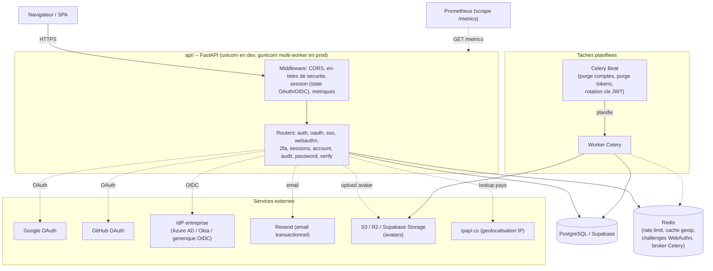

# Running api/ locally

The auth backend (Partie 1.1) needs several real services configured to
exercise every feature end-to-end. This documents what's needed and how
to run each layer -- see `.env.example` for the full variable list with
inline comments; nothing here duplicates the actual values (never commit
real secrets, including into this file).

**Deploying to production?** See `docs/DEPLOYMENT_GUIDE.md` instead --
reverse proxy/HTTPS setup, the `X-Forwarded-For` trusted-proxy
requirement, and a pre-deployment security checklist. This document
covers local development and the API's own architecture.

## Architecture (audit Categorie 5, item 31)

### Vue d'ensemble des composants



### Flux d'authentification (inscription -> connexion -> 2FA)


### Schéma de la base de données

Les tables `*_tokens`/`*_codes` (réinitialisation mot de passe, vérification
email, restauration de compte, réactivation du consentement) partagent
toutes la même forme -- `id`, `user_id` FK, un hash du token, `expires_at`,
`used_at` -- et sont regroupées ci-dessous sous une seule entité pour la
lisibilité; le détail exact de chacune est dans `api/models/`.


## Required for the API to start at all

- **PostgreSQL** (`DATABASE_URL`, `postgresql+asyncpg://...`) -- any
  Postgres works; Supabase's free tier is what this was built and tested
  against. Its direct connection (`db.<ref>.supabase.co`) is IPv6-only
  unless you pay for the IPv4 add-on -- use the **Session pooler**
  connection string instead (`aws-<n>-<region>.pooler.supabase.com:5432`,
  username `postgres.<project-ref>`) if you're on an IPv4-only network.
  Run migrations once: `python -m alembic upgrade head`.
- `JWT_SECRET_KEY`, `SESSION_MIDDLEWARE_SECRET` -- generate both with
  `python -c "import secrets; print(secrets.token_urlsafe(48))"`.

Start the server: `uvicorn api.main:app --reload`, then `http://localhost:8000/docs`.

**The server reads `.env` once at startup** -- restart it after changing
any environment variable, `--reload` only watches `.py` files.

## Optional layers, and what breaks without them

Every layer below fails gracefully if unconfigured (a clear error, not a
crash) -- the API stays usable for everything that doesn't need it.

### Resend (1.1.3 password reset, 1.1.4 email verification)

`RESEND_API_KEY` from resend.com/api-keys. Until your own sending domain
shows "Verified" under resend.com/domains, Resend's sandbox sender
(`onboarding@resend.dev`, the default in `.env.example`) only delivers to
*your own* Resend account email -- fine for solo dev/testing, not for
real users. Verify a domain (DNS records shown in the Resend dashboard)
and switch `EMAIL_FROM_ADDRESS` to that domain for real recipients.

Without a key configured: registration/reset/OTP requests still succeed
(HTTP-wise), the email send is skipped with a logged warning.

### Google / GitHub OAuth (1.1.5, 1.1.6)

Create credentials at Google Cloud Console (OAuth client, type "Web
application") and github.com/settings/developers ("New OAuth App"). In
both, the redirect URI must be exactly:
`{OAUTH_REDIRECT_BASE_URL}/auth/oauth/{provider}/callback`
(e.g. `http://localhost:8000/auth/oauth/google/callback`) -- a mismatch
here is the #1 cause of `redirect_uri_mismatch` errors.

Set `GOOGLE_OAUTH_CLIENT_ID`/`GOOGLE_OAUTH_CLIENT_SECRET` and/or
`GITHUB_OAUTH_CLIENT_ID`/`GITHUB_OAUTH_CLIENT_SECRET`. A provider with
either half unset is simply not registered -- its `/authorize` route
returns 503 instead of crashing the app.

Manual verification (no way to automate a real provider's consent screen):
open `http://localhost:8000/auth/oauth/google/authorize` (or `github`) in
a browser, sign in, approve -- you land on `{FRONTEND_URL}/oauth-callback`
(404 is expected with no frontend yet) with `#access_token=...` in the
URL fragment if it worked.

**2FA-enabled accounts get `#mfa_required=true&mfa_token=...` instead** --
Google/GitHub proving who the user is does not satisfy this app's own
2FA requirement (it's a separate credential the provider knows nothing
about), so the callback routes through the same MFA hand-off as a
password login: the frontend must follow up with `POST /auth/2fa/verify-login`
using that `mfa_token`, exactly as it would after `/auth/login` returns
`MFARequiredResponse`. Unlike the consent screen itself, this branch
*is* covered by the automated suite (`test_oauth_callback_requires_2fa_when_the_account_has_it_enabled`)
by faking the token-exchange step, not the browser.

### 2FA recovery codes (1.1.7)

`POST /auth/2fa/enable` (and later `POST /auth/2fa/recovery-codes/regenerate`)
returns 10 single-use codes in plaintext, exactly once -- only their
SHA-256 hash is stored. Alongside the JSON `recovery_codes` list, the
same response also includes `recovery_codes_file`: a ready-to-download
`data:text/plain;base64,...` URI with the same codes, meant for
`<a download="recovery-codes.txt" href="{recovery_codes_file}">` --
same technique `/auth/2fa/setup`'s `qr_code_data_uri` already uses for
the QR ``, so there's no separate "fetch the codes again" endpoint
that would undermine "shown exactly once."

They're the fallback for `POST /auth/2fa/verify-login` when the
authenticator device itself is lost: `POST /auth/2fa/verify-recovery-code`
takes the same `mfa_token` from `/auth/login` plus one recovery code
instead of a 6-digit TOTP code. Disabling 2FA (`POST /auth/2fa/disable`)
deletes any unused codes, and consuming one always emails the account a
"a recovery code was used" notice. Unlike TOTP itself, this whole flow is
fully covered by the automated suite -- no physical device involved.

**Every state change here is notified by email**, not just consuming a
code: enabling 2FA, disabling it, and regenerating recovery codes all
send one. Enabling is the highest-stakes case -- `/setup` hands the TOTP
secret back in plaintext (as the QR code) to anyone holding a valid
access token, and `/enable` only needs a code derived from that same
secret, so a stolen token alone could let an attacker turn 2FA on under
a secret only THEY control and lock the real owner out. Disabling and
regenerating both already require a valid *current* TOTP code to reach
(a much stronger bar), but get the same treatment anyway: a stolen
unlocked device with the authenticator app already open could still
pass that check, and both actions are exactly what someone in that
position would use to cut off the real owner's own fallback.

**Lost the device AND all 10 codes:** `POST /auth/2fa/lockout-recovery/request`
(email + password) starts a last-resort removal of 2FA that only becomes
confirmable (`POST /auth/2fa/lockout-recovery/confirm`) after
`TWO_FA_LOCKOUT_RECOVERY_DELAY_HOURS` (default 24h) -- the same
"we'll do this in N hours unless you stop us" pattern GitHub/Google use.
Logging in normally with the authenticator or a recovery code in the
meantime cancels any pending request automatically, so a compromised
mailbox + leaked password alone can't silently wipe 2FA while the real
owner is still actively using the account.

**Running low on codes:** `GET /auth/2fa/recovery-codes/status` returns
`{"total": 10, "remaining": N}` (counts only, never the codes themselves)
so the frontend can prompt "regenerate your codes" before the user is
down to zero, instead of them finding out only when `/verify-recovery-code`
starts failing.

**Adding a password as a fallback (OAuth-only accounts):** `POST /account/set-password`
(authenticated) lets a Google/GitHub-only account (`hashed_password` is
`None`) set one. Without this, losing access to the linked provider --
disabled account, revoked access, provider outage -- would mean losing
access to this app too, with no way back in at all. Rejected with 400 if
the account already has a password (use `/auth/password/forgot` to
change an existing one instead).

### S3-compatible storage (1.1.13 avatar upload)

Any S3-compatible bucket: AWS S3, Cloudflare R2 (needs a payment method
on file even for free-tier usage), or **Supabase Storage's own S3 API**
(no card needed, same project as `DATABASE_URL` --
Storage → create a bucket dedicated to avatars → Configuration → S3 →
New access key). `S3_BUCKET_NAME` must be a bucket dedicated to avatars:
the object key has no extra prefix of its own, so a shared bucket would
collide with other uploads.

Uploaded files are validated against their actual magic bytes (the real
leading signature of a PNG/JPEG/WEBP file), not the Content-Type header
the client declared -- see `_detect_image_content_type()` in
`api/services/storage.py`. Account purge (1.1.10) also deletes the
avatar object from the bucket, not just the database row, so a
hard-deleted account doesn't leave storage orphaned.

### RGPD consent withdrawal and account restore (1.1.10, 1.1.12)

`POST /account/consent/withdraw` (authenticated) deactivates the account
and revokes every session immediately, but -- unlike `DELETE /account/me`
-- schedules no purge: withdrawing consent (RGPD Art. 7(3)/21) and asking
for erasure (Art. 17) are different rights with different consequences
here.

`DELETE /account/me` itself is undoable during its `ACCOUNT_PURGE_DELAY_DAYS`
grace window: `POST /account/restore/request` (public, `{"email": "..."}`,
same silent/generic response either way as `/auth/password/forgot`) emails
a link if that account is still within its grace period; `POST /account/restore/confirm`
(`{"token": "..."}`) reactivates it. Restoring does not log the user in --
it clears `deleted_at`/`deletion_scheduled_at` and they log in normally
afterward, same as a password reset. `ACCOUNT_RESTORE_TOKEN_EXPIRE_MINUTES`
must stay below `ACCOUNT_PURGE_DELAY_DAYS` converted to minutes (`api/config.py`
validates this at startup, 5.7) -- the restore link's own expiry, not
`deletion_scheduled_at`, is what `/account/restore/confirm` checks, so it
must never still be valid after `api/tasks/account_purge.py` could
already have hard-deleted the row.

`consent_withdrawn_at` and `deleted_at` are never both set on the same
row: both `withdraw_consent()` and `delete_account()` require
`is_active=True` to be reached at all, and each sets it `False` as its
first effect, so triggering one locks the other out until its own
reactivation path restores `is_active=True` first.

**Consent withdrawal is undoable too, on purpose:** `POST /account/consent/reactivate/request`
(public, same silent/generic shape as the two above) + `POST /account/consent/reactivate/confirm`
(`{"token": "...", "accept_terms": true}`) reverses `/account/consent/withdraw`
-- `accept_terms` must be `true`, since consent has to be freely given
again, not silently restored to whatever it was before. This is
deliberately a separate flow from `/account/restore/*`: it only applies
to a consent-withdrawn account, never to one that's also fully deleted
(`is_deleted`) -- undoing a deletion is `/account/restore/*`'s job, not
this one's.

**Two warnings before permanent deletion, not one (4.6):**
`DELETE /account/me` sends an immediate confirmation email the moment
deletion is requested; a separate Celery task
(`api/tasks/account_deletion_reminder.py`, same daily-beat pattern as
account purge) sends a second, closer-to-the-deadline reminder once
`deletion_scheduled_at` falls within `ACCOUNT_DELETION_REMINDER_DAYS_BEFORE`
(default 3 days) -- a single email 30 days out is easy to forget by the
time it actually matters. Sent once per deletion cycle
(`User.deletion_reminder_sent_at`), cleared by
`POST /account/restore/confirm` so a later deletion is eligible for its
own fresh reminder.

### Data export in CSV, and profile/preferences change notifications (audit Categorie 3)

`GET /account/export-csv` returns the same data as `GET /account/export`
(RGPD Art. 20 portability), rendered as a two-column `field,value` CSV
instead of JSON -- CSV is inherently flat, so a nested structure (the
`sessions` list, e.g.) flattens to `sessions[0].device_info`,
`sessions[1].device_info`, etc. rather than needing a second file or a
zip archive. Both endpoints share `api/services/data_export.py`'s
`build_account_export_data()` so the two formats can never quietly drift
apart on which fields are actually included -- only how they're
rendered. An empty list (no linked OAuth accounts, e.g.) still gets a
`(none)` row rather than silently vanishing from the output.

`PATCH /account/profile` and `PATCH /account/preferences` each email the
account once the request actually changes a recognized field (RGPD Art.
12/13 transparency: the data subject should know when their own stored
data changes) -- never for a no-op PATCH with no recognized fields
present, which would otherwise describe a change that didn't happen.

### Forced re-consent when TERMS_VERSION changes (4.3)

`get_current_user` (`api/dependencies.py`) blocks a request with 403 if
`user.terms_version != settings.TERMS_VERSION` -- an account that
consented under an older version of the terms can't keep using the
service until it re-consents via `POST /account/consent/accept-updated-terms`
(`{"accept_terms": true}`).

**Not every route is behind this gate.** A small, deliberate set uses
`get_current_user_any_consent_status` instead (identity/active/blacklist
checks only, no terms-freshness check), because these can't be
conditioned on accepting NEW terms first without violating the very
rights they exist to serve: `GET /account/export` (RGPD Art. 15/20),
`DELETE /account/me` (Art. 17), `POST /account/consent/withdraw`
(Art. 7(3)/21), `GET`/`DELETE /sessions*` (basic account security --
you must always be able to see or kill your own sessions),
`POST /auth/2fa/setup`, `/enable`, `/disable`, `/recovery-codes/regenerate`,
and `GET /recovery-codes/status` (same reasoning as sessions -- each
already requires either no prior 2FA state or a valid current TOTP code,
so turning 2FA on/off or rotating recovery codes is basic account
security, not "ordinary use" that can wait on a new-terms prompt),
`GET /account/me` (so a frontend has something to show the "please
accept updated terms" prompt with), and
`POST /account/consent/accept-updated-terms` itself (it obviously can't
require the problem it fixes to already be fixed).

### "New sign-in" notifications (1.1.8, 1.1.9)

Every session-issuing endpoint (login, refresh, the OAuth callback,
2FA verify-login/verify-recovery-code) emails the account when a login
looks new. "New" requires BOTH the User-Agent AND the IP address to be
unrecognized together, not the User-Agent alone -- a stolen refresh
token replayed from a different network still triggers the email even
if the attacker sends a matching User-Agent string. Known, accepted
limitation: both signals are still just headers (attacker-influenceable
in principle), and a legitimate user roaming between networks will see
more of these emails than a User-Agent-only check would produce -- an
intentional trade favoring not missing a real hijack over minimizing
false positives. See `api/security/sessions.py`'s `issue_session()`
docstring.

### Access token revocation (1.1.15)

An access token is normally a stateless JWT -- valid until it expires,
nothing the server can do about it before then. `revoked_access_tokens`
(a real table, not Redis -- these rows need to survive as reliably as
the rest of this app's security-relevant data) is what makes it
revocable: every access token carries a `jti`, stored on the `Session`
row it's paired with, and `GET/POST` `Depends(get_current_user)` checks
that `jti` against this table on every request.

**Every place that already revoked a session now blacklists its access
token too** -- logout, refresh rotation (the pre-rotation token), a
specific "log out that device" call, and every "kill every session"
action: password reset, account deletion, consent withdrawal, 2FA
disable, 2FA lockout-recovery. This is `revoke_session()` /
`revoke_all_sessions_for_user()` (`api/security/sessions.py`), not
something each caller does separately -- a stolen access token dies
the moment ANY of those happen, not just at its own natural ~15-minute
expiry.

Cost: one extra indexed DB read on every authenticated request (see
`get_current_user`'s docstring in `api/dependencies.py`). Housekeeping:
`api/tasks/token_blacklist_cleanup.py` (same Celery Beat schedule as
account purge, offset by 15 minutes) deletes blacklist rows once their
underlying token would have expired anyway, so the table doesn't grow
forever.

### JWT key rotation (1.1.15)

`JWT_PREVIOUS_SECRET_KEYS` (comma-separated) holds keys still accepted
when *verifying* a token, never used to *sign* a new one. Two different
procedures, same mechanism:

- **Routine rotation**: generate a new `JWT_SECRET_KEY`, move the OLD
  value into `JWT_PREVIOUS_SECRET_KEYS`, redeploy. Already-issued access
  tokens keep working (verified against the previous key) until they
  naturally expire; remove the old key from the list once
  `ACCESS_TOKEN_EXPIRE_MINUTES` has comfortably passed.
- **Responding to a leak**: generate a new `JWT_SECRET_KEY` and leave
  `JWT_PREVIOUS_SECRET_KEYS` empty (do NOT list the leaked key). Every
  access token signed with the leaked key fails to verify immediately --
  correct, since a leaked signing key means an attacker could have
  forged arbitrary tokens for any user, so nothing signed with it can be
  trusted anymore. Refresh tokens are unaffected (random opaque values,
  hashed in the database, not JWTs), so real users get a fresh,
  correctly-signed access token via `POST /auth/refresh` without needing
  to log in again -- only actually-forged/stolen tokens die.

### CSRF protection on /auth/refresh and /auth/logout (1.1.16)

These are the only two endpoints that authenticate purely off a cookie,
no `Authorization` header required -- every other protected route needs
a Bearer token a cross-site attacker's forged request can't produce.
Double-submit: `issue_session()` sets a second, JS-readable `csrf_token`
cookie alongside the httpOnly refresh cookie; both routes require an
`X-CSRF-Token` header matching it (`api/security/csrf.py`). A frontend
reads `document.cookie` for `csrf_token` and echoes it back on every
call to these two endpoints. SameSite=lax on the refresh cookie already
blocks most cross-site cookie-riding in modern browsers -- this is
defense-in-depth on top of that, not a replacement for it.

### User.role (5.1 -- Partie 1.2's RBAC, item 1.2.1 Super Admin)

`users.role` is a Postgres `userrole` enum (`user` / `admin` / `superadmin`,
default `user` -- `api/models/user.py`'s `UserRole`), added by migration
`0010` in place of an old, unused `is_superadmin` boolean it was
originally reserved for.

Two dependencies gate on it (`api/dependencies.py`), stacked by strictness:

- `require_admin` -- `role` is `admin` **or** `superadmin`. Gates every
  existing `/admin/*` route (audit logs, failed-login dashboard, JWT key
  rotation history, SSO connection management). 404 on failure -- an
  admin-only route's existence isn't information a regular user needs.
- `require_superadmin` -- `role` must be exactly `superadmin`. Gates
  `PATCH /admin/users/{id}/role` (`api/routers/admin_users.py`), the
  first genuinely superadmin-exclusive capability: changing another
  account's role. Before this, a role change was only possible via
  direct database access. 403 on failure, not 404 -- unlike
  `require_admin`, everyone who can reach this dependency is already an
  admin or better, so a stricter tier existing above them isn't a
  meaningful information leak.

`PATCH /admin/users/{id}/role` refuses to demote the last remaining
superadmin (a hard lockout safety net -- otherwise a lone superadmin
could accidentally remove the only account able to undo the mistake),
and records every change in the tamper-evident audit log (audit finding
18) under `AuditAction.USER_ROLE_CHANGED`.

**Deliberately reuses this existing enum rather than adding a separate
`is_superadmin` boolean column** even though an early draft of this
step's spec asked for one -- migration 0010 already removed exactly that
boolean in favor of this enum, specifically because a boolean can only
ever represent two tiers. Reintroducing it would recreate two sources of
truth for the same fact (`role == "superadmin"` vs `is_superadmin ==
True`) with nothing stopping them from silently drifting apart.

1.2.3 through 1.2.6 (Admin/Manager/Member/Viewer as *organization-scoped*
roles, distinct from the global `User.role` above) and 1.2.8 (granular
per-resource permissions) remain open. 1.2.2 (Organization Owner) is
covered next.

### Organizations (Etape 1.2.2 -- first slice of Partie 1.3 multi-tenant)

The minimum structure needed for org-scoped roles to mean anything:
`organizations` (`api/models/organization.py`'s `Organization`) and
`organization_members` (`OrganizationMember`, an association object --
not a bare many-to-many table, since it carries its own data: `role`,
`invited_by`, `joined_at`). Workspaces, invitations, quotas, and
branding (the rest of Partie 1.3/1.4) are separate, later steps.

**Every new account gets a default organization automatically** --
`POST /auth/register` creates one named `"Organisation de {email}"` and
makes the new user its Owner, in the SAME database transaction as the
account itself (`api/security/organizations.py`'s
`create_organization_with_owner`, shared with `POST /organizations`
below) -- if organization creation fails, the whole registration rolls
back rather than leaving a real account with no organization at all.
**Not yet wired into OAuth or enterprise-SSO sign-up** (`api/routers/oauth.py`,
`api/routers/enterprise_sso.py`) -- a disclosed gap, not an oversight.

Endpoints (`api/routers/organizations.py`):

| Endpoint | Access |
|---|---|
| `POST /organizations` | Any authenticated user; creator becomes Owner |
| `GET /organizations` | Any authenticated user -- their own memberships only |
| `GET /organizations/{id}` | Any member (Owner/Admin/Manager/Member/Viewer) |
| `PATCH /organizations/{id}` | Owner only |
| `DELETE /organizations/{id}` | Owner only |

Three stacked dependencies (`api/security/organizations.py`, mirroring
`api/dependencies.py`'s `require_admin`/`require_superadmin` layering):
`require_org_member` (base layer -- resolves `org_id` from the URL path
automatically, same FastAPI mechanism a route handler's own path
parameters use; 404s a non-member so they can't probe which
organization IDs exist), `require_org_admin` (Owner or Admin, 403 for
anyone below that), `require_org_owner` (Owner only). A get-only helper,
`get_user_org_role(db, user_id, org_id)`, returns `None` for "not a
member" rather than raising, for call sites that want to branch on role
without a hard failure.

`DELETE /organizations/{id}` is a plain Core `DELETE`, not
`session.delete()` -- cleanup of `organization_members` rows relies
entirely on the database's own `ON DELETE CASCADE` (the Alembic
migration), same "trust the FK, not an ORM cascade walk" pattern as
`api/tasks/account_purge.py` and `api/routers/enterprise_sso.py`'s
connection deletion. **This is exactly why that specific behavior is
tested against real Postgres** (`tests/test_postgres_integration.py`),
not the fast SQLite suite -- SQLite does not enforce foreign keys by
default, so a cascade test against it would pass or fail by accident,
proving nothing about the real database.

`User.organizations` / `User.owned_organizations` (properties) and
`Organization.owner` (property) exist as the model asks for, but --
like `User.oauth_accounts`/`User.sessions` before them -- this codebase
never lazy-loads an ORM relationship from an async request handler (SQLAlchemy's
async lazy-loading needs a greenlet bridge that isn't always available
where you'd expect, and fails loudly rather than silently when it
isn't). Every real call site either queries `OrganizationMember`
directly or eager-loads first (`selectinload(User.organization_memberships)
.selectinload(OrganizationMember.organization)`) before touching these
properties.

### Organization Admin (Etape 1.2.3)

Member management, gated by `require_org_admin` (Owner **or** Admin) --
distinct from `require_org_owner`, which stays reserved for
renaming/deleting the organization itself:

| Endpoint | Access |
|---|---|
| `GET /organizations/{org_id}/members` | Manager+ (widened by Etape 1.2.4, see below) |
| `POST /organizations/{org_id}/members/invite` | Manager+, with restrictions (widened by Etape 1.2.4, see below) |
| `PATCH /organizations/{org_id}/members/{user_id}/role` | Admin+ (unchanged) |
| `DELETE /organizations/{org_id}/members/{user_id}` | Admin+ (unchanged) |

`require_org_admin_or_owner` also exists (`api/security/organizations.py`)
as a literal alias of `require_org_admin` -- there has never been an
"Admin excluding Owner" tier in this permission model, so the two names
check exactly the same thing.

**"Invite" is an immediate add, not an email link someone has to
accept** -- this app has no invitation-token flow yet (item 1.3.4).
`POST .../members/invite` looks up an EXISTING account by email and
adds them directly; an email with no matching account gets a clean 404
("they must register first"), not an invitation to sign up. When 1.3.4
is built, it's a separate, additive flow (a pending-invite table +
email link), not a replacement for this endpoint.

**An Owner can't be touched through these endpoints, by anyone** --
stricter than the spec's literal "an Admin can't do this" (which would
still let the Owner demote/remove themselves): `reject_if_target_is_owner`
(`api/security/organizations.py`) blocks the role-update and remove
endpoints regardless of the caller's own role, since an organization
has exactly one Owner (enforced at creation) and there is no ownership-transfer
endpoint yet for anyone to fix an accidental self-demotion with -- a
deliberately stronger rule than asked for, not a narrower one. Trying
to grant the Owner role through `invite` or the role-update endpoint is
rejected at the Pydantic validation layer (422), before either handler
even runs.

### Organization Manager / Workspaces (Etape 1.2.4)

The Manager tier sits strictly **between** Member and Admin
(`require_org_manager`, `api/security/organizations.py`: Owner, Admin,
or Manager) and gets two capabilities, both scoped so it never widens
what an Admin-gated endpoint already accepted:

**1. Inviting members** -- `GET /organizations/{org_id}/members` and
`POST /organizations/{org_id}/members/invite` (`api/routers/organization_members.py`)
were widened from `require_org_admin` to `require_org_manager`.
Role-update and remove **stayed Admin-only, unchanged** -- "Manager
cannot manage roles" is this step's spec, applied literally.

Opening `invite` to Manager creates a privilege-escalation path if left
unchecked: a Manager could otherwise invite a brand-new account
directly as `admin` or `manager`, handing out a role tier they
themselves have no way to grant through role-update. `invite_organization_member`
now rejects that in-handler (403) whenever the caller's own role is
`manager` and the requested role is `admin` or `manager` -- Managers
may only invite people in as `member` or `viewer`. This restriction
does not apply to Admin/Owner-issued invites.

**2. Managing workspaces** -- a new, deliberately minimal `workspaces`
table (`api/models/workspace.py`: `id`, `organization_id`, `name`,
`created_by`, timestamps; no knowledge-base or agent linkage yet --
that's Partie 1.3.2's fuller scope once those things exist) and four
endpoints (`api/routers/workspaces.py`):

| Endpoint | Access |
|---|---|
| `GET /organizations/{org_id}/workspaces` | Any member (Owner/Admin/Manager/Member/Viewer) |
| `POST /organizations/{org_id}/workspaces` | Manager+ |
| `PATCH /workspaces/{workspace_id}` | Manager+ |
| `DELETE /workspaces/{workspace_id}` | Manager+ |

Listing is deliberately open to every member, not just Manager+ -- the
spec named permissions for the mutating verbs only; a Member or Viewer
has no reason to be hidden from what workspaces exist in their own
organization, they just can't create, rename, or delete one.

The two endpoints addressed by workspace id rather than org id
(`PATCH`/`DELETE /workspaces/{workspace_id}`) have no `org_id` path
parameter for `require_org_manager` to resolve automatically, so a
dedicated dependency, `require_workspace_permission(action)`
(`api/security/workspaces.py`), looks the organization up **from** the
workspace first, then applies the same Owner/Admin/Manager check -- 404
(not 403) for both "no such workspace" and "you're not a member of its
organization," the same anti-enumeration reasoning as
`require_org_member`. (Etape 1.2.8 renamed this from the original
`require_workspace_manager` and added a granular-permission check in
front of the same role logic -- see that step's own section below.)

Deleting an organization cascades to its workspaces the same way it
cascades to memberships -- database-level `ON DELETE CASCADE`
(`api/alembic/versions/0015_workspaces.py`), verified against real
Postgres (`tests/test_postgres_integration.py`), since SQLite doesn't
enforce foreign keys by default.

Organization-settings management (`organization_settings`, 1.3.9) has no
endpoints yet -- it doesn't exist. When it does, it should reuse
`require_org_admin` the same way the endpoints above do, not invent a
parallel permission check.

### Member (Etape 1.2.5)

Member has no dedicated permission function of its own -- it's the
absence of Manager/Admin/Owner on checks that already exist. What it
CAN do is exactly what `require_org_member` already grants (any
membership at all, the same tier Viewer also sits at): view organization
details (`GET /organizations/{id}`) and list workspaces
(`GET /organizations/{id}/workspaces`). What it CANNOT do is everything
gated by `require_org_manager`/`require_org_admin`/`require_org_owner`
above -- invite or manage members, create/rename/delete workspaces,
rename/delete the organization.

`require_org_member_or_higher` (`api/security/organizations.py`) exists
as a literal alias of `require_org_member` -- this step's spec asks for
it by that name explicitly, the same reasoning as
`require_org_admin_or_owner` above. **Despite the name, it is not
"Member-tier or above, excluding Viewer"** -- it is the exact same
membership check, since Viewer legitimately needs the same read access
(nothing in this codebase has ever needed a check that admits Member but
rejects Viewer; if one is needed later, e.g. for a write endpoint Viewer
specifically shouldn't reach that isn't already covered by
`require_org_manager`, it should be its own function, not silently
folded into this alias).

**No `documents` or `conversations` endpoints were added.** The spec for
this step asked for basic CRUD on both as a way to exercise Member's
"can create/edit own resources" capability, but neither table exists,
and building one now would be throwaway: both belong to later Parties
of the cahier des charges (2 -- Knowledge Base, 3 -- RAG pipeline /
conversations) where their real shape depends on decisions not made yet
(embeddings, workspace linkage, LLM provider, citation tracking). A
`documents` table built today to satisfy this permission test would
either be abandoned when the real one is designed, or -- worse --
quietly become the real one by default, missing everything Partie 2
actually specifies. `Workspace` (Etape 1.2.4) took the same stance
explicitly (deliberately minimal, no KB/agent linkage yet) -- this is
that same boundary, held one step further. Member/Viewer's read vs.
write distinction is proven instead on the two org-scoped resources that
DO exist today (organizations, workspaces) -- see
`tests/test_workspaces.py`'s Etape 1.2.5 tests, including an explicit
cross-org isolation check standing in for "a Member can't reach another
Member's resources" until a personal resource exists to test that
against directly.

### RBAC policy engine -- Casbin (Etape 1.2.7)

A data-driven `(role, resource, action)` policy table (`casbin_rule`,
migration `0016`), loaded once into memory at startup
(`api/security/rbac.py`'s `init_rbac()`, called from `api/main.py`'s
`lifespan`). **This is additive, not a replacement** -- see the sections
below for exactly what it does and does not touch, and why.

**Domain-scoped, not the spec's literal flat model.** Casbin requests
here are `(sub, dom, obj, act)` with `dom` = organization id --
`api/casbin_model.conf` uses Casbin's documented "RBAC with domains"
pattern, plus an explicit
`enforcer.add_named_domain_matching_func("g", casbin.util.key_match)`
call (undocumented as a *requirement* in most Casbin RBAC-with-domains
examples, but empirically necessary here: role-to-role inheritance edges
are seeded with a wildcard domain, `"*"`, so a real per-org role
assignment like `("dana", "manager", "org-A")` can chain through them --
verified against real Postgres in
`tests/test_rbac_integration.py::test_the_same_user_can_hold_different_roles_in_different_organizations`).
The step's literal model (`p, role, resource, action` + `g, user, role`,
no domain) was rejected: it stores one role per user, globally, which
cannot represent "Dana is Manager in org A but only Member in org B" --
exactly how `OrganizationMember.role` has worked since Etape 1.2.2. That
would have been a real cross-tenant correctness regression, caught
before writing any of the seeding code, not after.

**What Casbin does NOT touch, and why -- read this before wiring it into
anything else.** `api/security/organizations.py`'s
`require_org_manager`/`require_org_admin`/`require_org_owner` are
**unchanged**, still the hardcoded role-tuple checks they always were.
Rewiring them onto Casbin was implemented and verified to produce an
identical truth table for every role (`tests/test_rbac_integration.py`'s
`org_tier` policies exist for exactly this reason) -- then reverted,
after finding that `tests/conftest.py`'s `client` fixture
(`ASGITransport` + `AsyncClient`, no `LifespanManager`) never actually
runs `api/main.py`'s `lifespan`. Confirmed empirically: a minimal
FastAPI app with a lifespan that appends to a list, driven through the
exact same `ASGITransport` pattern this codebase's fixtures use,
recorded zero startup/shutdown events. `init_rbac()` would therefore
never run during the ~450-test fast suite, so any function hard-depending
on `get_enforcer()` would 500 on every test that reaches it -- a
regression across effectively the whole permission test suite, in
service of a step whose own validation criterion is "existing tests
still pass." A silent fallback to the old hardcoded check when
uninitialized was considered and rejected too: that would make "verified
against 447 tests" actually mean "the fallback got exercised, Casbin
never did" -- worse than not claiming the migration at all.

Also unchanged, for a different reason: `invite_organization_member`'s
Manager-cannot-invite-as-admin/manager guard
(`api/routers/organization_members.py`) and
`reject_if_target_is_owner` (`api/security/organizations.py`). Both are
payload- or target-dependent -- a static `(role, resource, action)`
triple has no way to see request body content or compare against a
specific target row, and a bespoke Casbin matcher function per such rule
would defeat the point of one shared policy table. These stay exactly
where they are; Casbin is not the right tool for them.

**What it's actually for, today**: `require_permission(resource,
action)` is a new, additive FastAPI dependency for resource types that
have no `require_*` of their own -- concretely, `documents` and
`conversations` (Parties 2/3), deliberately not built yet (see Etape
1.2.5's own reasoning above). It is not used by any route right now.
When those resources exist, a route can do
`Depends(require_permission("documents", "create"))` -- it layers on
top of `require_org_member` for the exact same membership lookup and
404 anti-enumeration behavior every other org-scoped dependency already
has; the Casbin check is the only new logic.

**Default policies** (`api/security/rbac.py`'s `TIER_POLICIES` +
`RESOURCE_POLICIES` + `ROLE_HIERARCHY`) mirror this step's own spec
table, restated with inheritance instead of repetition: viewer's grants
(`workspaces:read`, `documents:read`, `conversations:read`,
`organization:read`) are the floor; member/manager/admin/owner each add
only what THEY newly grant, and inherit everything below via
`ROLE_HIERARCHY`'s chain (`admin -> manager -> member -> viewer`,
`owner -> admin`). `superadmin: * / *` is seeded exactly as the spec's
table names it, but is **inert** -- nothing calls `enforce()` with a
superadmin-domain check today, so this is stored default data, not a
live bypass of org-membership checks. Wiring it up is a separate,
deliberate decision: today a superadmin's real power
(`api/dependencies.py`'s `require_superadmin`) is a completely separate,
global axis from organization membership -- a superadmin is NOT
automatically a member of every organization, and silently making this
policy live would grant that for the first time.

**Performance**: `enforce()` is synchronous and never touches the
database -- only `load_policy()`/`add_policy()` (async) do, and both
run exactly once, at startup. Editing `casbin_rule` by hand takes effect
only on the next restart; there is no runtime-reload endpoint, since
every real policy is seeded in code, not hand-edited, today.

**Debugging**: `api/security/rbac.py`'s `init_rbac()` logs
`"RBAC (Casbin) initialized: %d policies, %d role edges"` at startup --
a count of 0 policies means the migration hasn't been applied or
`casbin_rule` is empty for a reason worth investigating, not "nothing to
worry about." To inspect policies directly:
`SELECT ptype, v0, v1, v2, v3 FROM casbin_rule ORDER BY ptype, v0;` --
`ptype='g'` rows are role-to-role edges (`v0` inherits `v1`, in domain
`v2`), `ptype='p'` rows are grants (`v0` role, `v1` domain, `v2`
resource, `v3` action). To add a new default policy, edit
`RESOURCE_POLICIES` in `api/security/rbac.py` and restart -- `init_rbac()`
adds only what's missing (`has_policy` checked first), so this is safe
to do repeatedly without duplicating rows.

**Migrating the existing org hierarchy onto Casbin is real future
work**, gated on first fixing `tests/conftest.py`'s `client` fixture to
actually run the app's lifespan (e.g. via `asgi-lifespan`'s
`LifespanManager`) -- a change to a fixture roughly 450 tests share,
deliberately not bundled into this step. Once that's fixed, the
`org_tier` policies already seeded and verified above
(`tests/test_rbac_integration.py`) are ready to be the actual
implementation behind `require_org_manager`/`admin`/`owner`, one
function at a time, each re-verified against its own existing test file
before moving to the next.

### Granular per-resource permissions (Etape 1.2.8)

**What this adds on top of roles, in one sentence**: "this one Viewer
can also `update` this one workspace" -- a per-(organization, resource,
user, action) override, without changing that user's role or anyone
else's access. Table: `resource_permissions` (migration `0017`),
functions: `api/security/resource_permissions.py`'s
`grant_resource_permission`/`revoke_resource_permission`/
`check_resource_permission`/`get_user_resource_permissions`.

**Priority order, exactly**: a matching, non-expired
`resource_permissions` row **beats** the caller's organization role,
which beats an outright deny. Checked in that order everywhere this
step wires it in -- the granular layer is consulted FIRST; its absence
is not itself a decision, it just falls through to the unchanged role
check. This is purely additive: an Owner/Admin/Manager who already
passes the role check is never blocked by the absence of a granular
row, and Etape 1.2.2/1.2.3's stricter-than-asked Owner-protection rules
are completely unaffected (see below for exactly what is, and isn't,
wired up).

**Not built on Casbin.** Etape 1.2.7's engine works entirely off an
in-memory policy set loaded once at startup -- fine for role-tier
policies that rarely change, wrong for a grant that an Admin can create
and REVOKE in real time: a production deployment realistically runs
several worker processes, each with its own separate in-memory Casbin
enforcer, so a revoked grant could stay silently active on other workers
until each happens to restart. `check_resource_permission` instead reads
straight from Postgres on every call -- one indexed lookup (the unique
constraint's own composite index), always consistent across every
process, nothing to cache or go stale. Same performance category as
every other `require_*` dependency in this codebase (`require_org_member`,
`get_user_org_role`, ...), all of which already do one query per
request; no caching layer was added, on purpose.

**What's actually enforced today, live, on a real endpoint**:
`PATCH`/`DELETE /workspaces/{id}` now use
`require_workspace_permission("update"/"delete")`
(`api/security/workspaces.py`) instead of the original
`require_workspace_manager` -- a granted, non-expired permission for
THAT specific workspace + action passes immediately; its absence falls
through to the exact same Owner/Admin/Manager check as before (every
pre-existing test in `tests/test_workspaces.py`, none of which ever
grant a `resource_permissions` row, exercises that unchanged fallback
path -- 62/62 still pass unchanged). `create_workspace` is untouched: a
workspace has no id to grant a permission against before it exists.

**What's stored but NOT wired into a live endpoint, and why**:
`organization` (`read`/`update`/`delete`/`manage_members`) grants are
fully functional through the management endpoints below (grantable,
listable, revocable, checkable), but `api/routers/organizations.py`'s
`require_org_owner`-gated `PATCH`/`DELETE /organizations/{id}` were
deliberately left untouched. Renaming/deleting an entire organization is
this system's highest blast-radius action, and Etape 1.2.2/1.2.3 already
chose a stricter-than-asked stance there (Owner-only, no exceptions --
not even for Admin). Punching a granular-override hole into that in this
same step was judged not worth the risk; workspace update/delete (one
workspace, not the whole organization) is the lower-risk live wiring
this step ships instead.

**Which (resource_type, action) pairs can even be granted**:
`api/security/resource_permissions.py`'s `SUPPORTED_RESOURCE_ACTIONS` --
`workspace: {read, update, delete}`, `organization: {read, update,
delete, manage_members}`. The spec's fuller resource table (document,
conversation, agent, workspace, knowledge_base, organization x create,
read, update, delete, share, export, execute, configure) names several
resource types with no real table yet (Parties 2/3, same reasoning as
Etape 1.2.5) and several actions (`configure`/`share`/`export`/`execute`)
with no enforcement point on ANY existing endpoint. `grant_resource_permission`
rejects both (400) rather than silently accepting a grant nothing would
ever check -- the columns themselves are plain strings, not DB enums
(same "a new value should never need a migration" reasoning as
`api/models/audit_log.py`'s `AuditAction`), so widening this set as real
endpoints get built needs no schema change, just adding an entry here.

**Management endpoints** (`api/routers/resource_permissions.py`), all
Admin+ of the organization that owns the resource except the last:

| Endpoint | Access |
|---|---|
| `GET /resources/{type}/{id}/permissions` | Admin+ of the resource's organization |
| `POST /resources/{type}/{id}/permissions` | Admin+, AND the caller must already have the action themselves (see below) |
| `DELETE /resources/{type}/{id}/permissions/{user_id}/{action}` | Admin+ of the resource's organization |
| `GET /users/me/permissions` | Any authenticated user -- their own grants only |

An unsupported `resource_type` gets 400 (the type itself has no
supported context to resolve an organization from, true regardless of
the id); a resource id that doesn't exist (for a supported type) gets
404; an Admin+ member who doesn't own this specific resource's
organization also gets 404, not 403 -- same anti-enumeration shape as
`require_org_member` everywhere else.

**"A user cannot grant a permission they don't have themselves"** --
checked at grant time (`api/routers/resource_permissions.py`'s
`_caller_can_perform`), restating the SAME role semantics already live
elsewhere (`require_org_manager`/`admin`/`owner`,
`require_workspace_permission`) for whichever action is being granted.
Concretely: an Admin passes this endpoint's own Admin+ gate, but
`organization:delete` is Owner-only (unchanged since Etape 1.2.2) -- an
Admin who doesn't ALSO hold a granular `organization:delete` grant of
their own gets a 403 trying to grant it to someone else, even though
they cleared the endpoint's outer gate.

**Two more grant-time rules**: the target user must already be a member
of the resource's organization (400 otherwise -- granting access to a
total outsider is a different, bigger hole than this step opens), and a
user cannot grant a permission to themselves (400) -- both checked
before the row is ever written, not just documented as expected
behavior.

**Debugging**: `GET /resources/{type}/{id}/permissions` and
`GET /users/me/permissions` both return an `is_expired` flag per row
rather than silently hiding expired grants -- a revoked-by-expiry
permission stays visible (for audit purposes) instead of disappearing,
distinct from an explicitly revoked one (`DELETE`), which really is
gone. Every grant/revoke is journalled to the audit log
(`RESOURCE_PERMISSION_GRANTED`/`_REVOKED`, `api/models/audit_log.py`) --
`check_resource_permission` itself is not (it runs on every request; see
`api/security/audit_log.py`'s own reasoning for why only state CHANGES
get audited, not every read-check).

### Teams (Partie 1.3.3)

A logical grouping of users WITHIN an organization (e.g. "Support",
"Engineering") -- orthogonal to the organization role hierarchy (Etape
1.2.2-1.2.6), not a replacement for it. A user's org role (Member,
Manager, ...) governs what they can do across the whole organization;
team membership is a separate axis (who they work with day to day), and
a user can belong to several teams at once. Tables: `teams`,
`team_members` (migration `0018`); `TeamMember.role` is its own small
`admin`/`member` axis, scoped to ONE team.

**How the two axes combine** (`api/security/teams.py`): org
Owner/Admin/Manager can always view or manage ANY team in their
organization, even one they were never personally added to -- an
administrative override, the same "higher org tiers can always reach
into org-scoped resources" pattern `require_org_admin`/`owner` already
establish; without it, a team whose only team-admin left the company
would become permanently unmanageable. A team's own `admin` role, in
the other direction, only grants membership-management power WITHIN
that one team -- it never surpasses org-level roles, and a plain org
Member made a team's admin gains nothing outside that team.

| Endpoint | Access |
|---|---|
| `GET /organizations/{org_id}/teams` | Manager+ (org-level) |
| `POST /organizations/{org_id}/teams` | Manager+ (org-level); creator becomes the team's own admin |
| `GET /teams/{team_id}` | Team member, OR org Manager+ |
| `PATCH /teams/{team_id}` | Manager+ (org-level) -- NOT the team's own admin, see below |
| `DELETE /teams/{team_id}` | Manager+ (org-level) |
| `GET /teams/{team_id}/members` | Team member, OR org Manager+ |
| `POST /teams/{team_id}/members` | Team admin, OR org Manager+ |
| `PATCH /teams/{team_id}/members/{user_id}` | Team admin, OR org Manager+ |
| `DELETE /teams/{team_id}/members/{user_id}` | Team admin, OR org Manager+ |

**Why renaming/deleting a team is Manager+ (org-level) and not
`require_team_admin`**: a team's own admin manages who's ON the team;
whether the team exists at all is judged an organization-level
administrative concern, the same boundary `api/security/workspaces.py`
draws between workspace membership (implicit, anyone in the org can
read) and workspace CRUD (Manager+). Confirmed by
`tests/test_teams.py::test_team_admin_who_is_a_plain_org_member_cannot_rename_the_team`.

**No "last team admin" protection** -- unlike the org-level "last
superadmin" rule (`api/routers/admin_users.py`) or the Owner-untouchable
rule (`api/security/organizations.py`'s `reject_if_target_is_owner`): a
team with zero admins is not a lockout, since org Manager+ can always
still reach and fix it (the override above). Those other two rules
exist specifically because no equivalent escape hatch exists at the
organization or superadmin level.

**Adding a member requires an existing account that's already a member
of the team's organization** (400 otherwise) -- same "no email-invite
flow yet" and "target must already belong here" reasoning as
`api/routers/organization_members.py`'s `invite_organization_member` and
`api/routers/resource_permissions.py`'s grant endpoint.

**Removing a user from the organization also removes them from its
teams** -- `api/routers/organization_members.py`'s
`remove_organization_member` now deletes any `team_members` rows for
that user across the organization's teams, so `GET /teams/{id}/members`
never shows a phantom member who left. This is hygiene, not the only
line of defense: `require_team_member`/`require_team_admin` independently
re-verify the caller is still a member of the team's organization at
every request, so a missed cleanup elsewhere would never grant access
on its own.

**Not yet wired in**: Teams do not (yet) carry `resource_permissions`
(Etape 1.2.8) of their own -- that table is per-USER only today
(`resource_permissions.user_id`, not nullable). Extending it to grant a
permission to an entire team (every member inheriting it) would need a
nullable `team_id` column (mutually exclusive with `user_id` via a CHECK
constraint) and a `check_resource_permission` that also checks "is this
user on any team granted this permission" -- a real, well-scoped follow-up,
deliberately not bundled into this step since it wasn't asked for and
doubles the surface area of an already-shipped, tested table.

### Invitations (Partie 1.3.4)

Email-based invitations: an org Manager+ invites an email address (not
necessarily an existing account) to join with a proposed role; the
recipient accepts via a link containing a one-time token. Table:
`invitations` (migration `0020`). This is a SEPARATE, additive path
alongside `api/routers/organization_members.py`'s
`invite_organization_member` (Etape 1.2.3/1.2.4, unchanged) -- that one
adds an EXISTING account immediately, no acceptance step; this one
creates a pending invitation an email address accepts on its own time,
existing account or not. `send_organization_member_added_email`'s own
docstring already named this exact gap before it was closed.

| Endpoint | Access |
|---|---|
| `POST /organizations/{org_id}/invitations` | Manager+ |
| `GET /organizations/{org_id}/invitations` | Manager+ |
| `DELETE /organizations/{org_id}/invitations/{id}` | Manager+ |
| `POST /invitations/accept` | Public -- the token itself is the proof of authorization |

**Token security**: `token_hash`, not the raw token, is what's stored --
same convention as `PasswordResetToken`/`EmailVerificationToken`
(`api/models/token.py`): a DB leak or backup must not directly hand out
usable invitation links. The raw token is `generate_raw_token()`
(`secrets.token_urlsafe(48)`, ~384 bits of entropy) -- the exact same
generator password-reset links already use, hashed with the same
SHA-256 `hash_token()`. Expiry defaults to `INVITATION_EXPIRE_DAYS`
(7) -- deliberately longer than a password-reset link's window, since
an org invitation is lower-urgency and the recipient may not check
their inbox for days.

**One row per (organization, email)**: re-inviting an address that
already has a row (pending, expired, or previously accepted and since
removed from the org) reissues that SAME row in place -- fresh token,
fresh expiry, `accepted_at` cleared -- via
`api/security/invitations.py`'s `create_or_reissue_invitation`, rather
than erroring on the unique constraint or leaving stale rows to
accumulate.

**The Etape 1.2.4 privilege-escalation guard carries over**: this
endpoint is Manager+, the same tier as the immediate-add path, so a
Manager inviting via email is restricted the exact same way --
`reject_if_manager_exceeds_own_role` rejects (403) a Manager trying to
invite someone in as `admin` or `manager`. Inviting someone already a
member of the organization is rejected too (409), checked before a row
is ever written.

**Accepting an invitation, the two branches**
(`api/routers/invitations.py`'s `accept_invitation`):
- **The invited email already has an account**: added to the
  organization immediately with the invitation's role. **Not** logged
  in automatically -- same posture as `POST /auth/password/reset` not
  auto-logging in either (it explicitly revokes every session and tells
  the user to log in again): an emailed token isn't treated as strong
  enough proof to hand out a session for an EXISTING, potentially
  higher-value account. The confirmation email reuses
  `send_organization_member_added_email` -- from the recipient's point
  of view the outcome is identical to being added directly.
- **No account exists for that email yet**: one is created --
  `password`/`accept_terms` become required in the body, and the SAME
  validation `POST /auth/register` runs (breach check, similarity
  check, password-history seeding) applies here too. Logged in
  immediately afterward (`issue_session`), same as `/auth/register`
  itself -- there is no prior session to protect. Does **not** get the
  auto-created default organization every fresh registration gets
  (Etape 1.2.2) -- they're joining the INVITING organization instead; a
  redundant personal one would be surprising here, not helpful (the
  same disclosed-gap reasoning `register()`'s own comment already gives
  for why OAuth/SSO sign-up don't get one either).

**Rate limiting**: `POST /invitations/accept` is public and unauthenticated,
so it's IP-rate-limited (`INVITATION_ACCEPT_RATE_LIMIT_MAX_ATTEMPTS`/
`_WINDOW_SECONDS`) against token brute-forcing -- by IP, not email
(there is no email in this request, only a token), the same shape
`REGISTER_RATE_LIMIT` already uses. Creating an invitation is NOT
rate-limited -- it already requires authentication and Manager+
authorization, matching every other authenticated org-management
endpoint in this codebase.

**A used token never works twice**: `accepted_at` is set the moment an
invitation is accepted; `resolve_valid_invitation` treats an
already-accepted invitation exactly like an unknown one (one generic
400, no distinction) -- covers the spec's "accepted by someone else"
case, since a second attempt with the same link fails identically
whether it's the original recipient double-clicking or someone else
who obtained the link afterward.

### Row Level Security (Partie 1.3.5)

**The honest headline first**: Postgres Row Level Security is enabled
on every table this app has (24/24, verified against the real database
below), but it currently changes **nothing** about how this application
isolates data between organizations. Real, functional isolation is
**100% application-layer** -- `require_org_member` and the whole family
built on it (`api/security/organizations.py` onward), enforced by
explicit `WHERE organization_id = ...` clauses in every query, verified
by the extensive per-role test suites built across Etape 1.2.2 through
Partie 1.3.4. This section exists to make that fact explicit and
permanent, not to claim RLS provides isolation it doesn't.

**Why RLS is a no-op for this app specifically**: this backend connects
to Postgres as the `postgres` role, confirmed to have `rolbypassrls =
true`. Postgres skips row-security checks entirely for a role with that
attribute, regardless of how many policies exist. Verified directly:

```sql
SELECT rolbypassrls FROM pg_roles WHERE rolname = current_user;
-- postgres | t
```

**What RLS being enabled DOES still do**: this project's very first
migration to touch it, `0002_enable_row_level_security.py`, already
stated the real reason plainly: "Supabase's own Advisor flags every
table with RLS disabled as a critical finding, because its
PostgREST/Data API layer -- if ever turned on, even by accident later
-- respects RLS and would otherwise expose these tables to anyone
holding an anon/authenticated key." With RLS enabled and zero policies,
Postgres denies ALL rows to any role that does NOT bypass RLS --
turning "wide open" into "deny by default" for a threat that doesn't
exist today (this app never uses PostgREST or a client-side Supabase
SDK) but costs nothing to guard against now, before it might.

**État des lieux, verified against the real database**
(`tests/test_postgres_integration.py`'s
`test_every_application_table_has_row_level_security_enabled`,
`test_no_rls_policies_exist_because_none_are_needed_yet`, and
`test_the_apps_own_role_bypasses_rls` -- run these directly for the
current, authoritative answer, not this table if enough time has
passed):

| Table | RLS enabled? | Policies? |
|---|---|---|
| users, organizations, organization_members, workspaces, teams, team_members, invitations, resource_permissions, casbin_rule, audit_logs, sessions, oauth_accounts, password_reset_tokens, email_verification_tokens, two_factor_recovery_codes, account_restore_tokens, two_factor_lockout_recovery_tokens, consent_reactivation_tokens, revoked_access_tokens, password_history, jwt_signing_keys, webauthn_credentials, enterprise_sso_connections, enterprise_sso_accounts | ✅ all 24/24 | ⬜ 0 (none, anywhere) |

**What "real RLS" would actually require, if ever wanted**: a
restricted Postgres role for the app's own connection (dropping
BYPASSRLS -- a global, blast-radius-everything change, not a contained
feature), a mechanism to set the current user/organization on every
request's database session (Postgres RLS policies read session-local
state, e.g. `current_setting('app.current_org_id')`, which has to be
set inside the SAME transaction as every query -- non-trivial with a
pooled async engine and FastAPI's per-request session pattern), and a
full set of SQL policies mirroring the authorization rules already
living in Python -- maintained twice, in two languages, forever in
sync. Considered and deliberately not built: the risk (a wrong or
missing policy silently changes what a legitimate query returns,
compared to today's exceptions being loud 403/404s) outweighs the
benefit given this app has no untrusted direct-to-Postgres access path
today. If that ever changes (a client-side Supabase SDK, a BI tool with
its own restricted role, PostgREST turned on), this is the point where
real policies would stop being optional.

### Organization quotas (Partie 1.3.6)

Per-organization resource limits, ten dimensions, one row per
organization (`organization_quotas`, migration `0021`) -- created
alongside the organization itself
(`api/security/organizations.py`'s `create_organization_with_owner`,
the same "never without each other" transaction as the founding Owner
membership). Default limits come from ten `QUOTA_DEFAULT_MAX_*` settings
(`api/config.py`), each independently overridable via `.env` -- changing
one only affects organizations created AFTERWARD, never retroactively
rewriting an existing org's own row.

**Only three of the ten dimensions are enforced today**: `users`
(`organization_members`), `workspaces` (`workspaces`), `teams` (`teams`)
-- the only three with a real, countable table. The other seven --
documents, storage, requests per day/month, API calls, agents, KB size
-- have no corresponding table or endpoint yet (documents/KB: Partie 2,
agents: Partie 5, requests/API calls: Partie 9's public API, none
built). `check_quota` returns `True` (not enforced) and
`get_quota_usage` reports `None` (not measured -- deliberately not `0`,
which would falsely claim "nothing used") for those seven. They are
stored as configuration only, ready the moment the resource they gate
actually exists.

**Usage is a LIVE COUNT, never a maintained counter**, for the three
enforced dimensions: `check_quota`/`get_quota_usage`
(`api/security/quotas.py`) run `SELECT COUNT(*)` against the real table
every time, rather than incrementing/decrementing a stored number. A
live count can't drift from reality the way an increment/decrement pair
can (a missed decrement on delete, a bug at one of several increment
call sites) -- this is why `increment_usage` (the fourth function this
step's spec names) is a genuine no-op for all ten dimensions: for the
three live-counted ones, the INSERT that creates the row already IS the
increment, reflected the next time usage is counted; for the other
seven, there is no counter storage to increment into yet.

**Wired into three real endpoints**, checked via `require_quota_available`
(raises `402 Payment Required` -- not 403/429: this is neither a
permissions failure nor a rate throttle, it's "your plan's limit for
this resource has been reached," the status code already carrying that
exact meaning by convention):

| Endpoint | Checked against |
|---|---|
| `POST /organizations/{org_id}/members/invite` | `max_users` |
| `POST /invitations/accept` (both branches -- existing account AND new account) | `max_users` |
| `POST /organizations/{org_id}/workspaces` | `max_workspaces` |
| `POST /organizations/{org_id}/teams` | `max_teams` |

The invitation-ACCEPTANCE path (Partie 1.3.4) was added beyond this
step's own literal endpoint list -- both its branches create an
`OrganizationMember` row exactly like the immediate-add path does, so
checking `max_users` only on the immediate-add endpoint would have left
a real loophole: an org at its limit could still let a pending
invitation be accepted past it. `POST /organizations/{org_id}/invitations`
(creating the pending invitation itself) is deliberately NOT
quota-checked -- only acceptance actually creates a membership row, so
an org can queue more invitations than it has remaining slots (a minor,
accepted UX quirk, not a correctness gap: none can ever be accepted past
the limit). `POST /documents`, `POST /v1/chat`, `POST /v1/agents/run`
named in this step's spec don't exist yet (Parties 2, 5, 9) -- nothing
to wire quota checks into.

**Endpoints**:

| Endpoint | Access |
|---|---|
| `GET /organizations/{org_id}/quotas` | Admin+ -- real visibility into how close an org is to its limits |
| `PATCH /organizations/{org_id}/quotas` | Owner only -- a plan-level decision, same boundary as renaming/deleting the organization itself |

`PATCH` is a partial update (only fields actually sent are changed) and
allows `0` as a valid limit -- a deliberate way to hard-block a resource
type entirely (e.g. suspending an organization), not rejected as
invalid.

**Known, accepted race**: check-then-insert (the quota check, then the
caller's own `INSERT`) is not wrapped in one atomic operation --
two requests racing to fill the LAST available slot could both pass the
check and both succeed, one over the limit by one. This mirrors every
other check-then-act authorization pattern already in this codebase
(permission checks aren't serialized against concurrent writes either)
and is the accepted tradeoff for a SOFT usage limit, not a hard
financial/security invariant like a unique email -- closing it
completely would need a `SELECT ... FOR UPDATE` or a DB-level
constraint per dimension, not attempted here.

**No cache**: each check is one indexed `COUNT(*)` query, same
performance category as every other per-request check in this codebase
(`require_org_member`, `get_user_org_role`, ...) -- a cache would risk
serving a stale "quota available" answer past the real limit, which
matters more here than the cost of one more indexed count per
request. **No automatic monthly/daily reset either**: the two
time-windowed dimensions this step names (`max_requests_per_month`/
`_per_day`) have no counter to reset in the first place (see above) --
resetting is real, well-scoped future work bundled with whatever builds
the actual request-metering infrastructure (Partie 9), not something to
build in isolation now with nothing to reset.

### Per-member limits (Partie 1.3.7)

Six columns directly on `organization_members` (migration `0022`), not
a separate table -- every one of them is inherently scoped to a single
(user, organization) membership, exactly like `role` already is.

**The three numeric limits** (`daily_request_limit`, `max_documents`,
`max_conversations`) mirror Etape 1.3.6's quotas exactly: no real table
or endpoint exists yet for requests, documents, or conversations
(Parties 2/3/8/9), so `check_user_limit` (`api/security/user_limits.py`)
returns `True` unconditionally and `get_user_usage` reports `None` (not
`0`) for all three. Stored as configuration, ready the moment the
resource they'd gate exists.

**The three booleans are NOT symmetric -- this is the part worth reading
carefully before touching any of them.** Two are RESTRICTIVE AND-gates
layered on top of an EXISTING role check; one is an ADDITIVE OR-gate
granting a capability role alone wouldn't:

- `can_create_workspaces` / `can_create_teams` (default `True`): checked
  ONLY for a caller who already passes `require_org_manager`
  (Owner/Admin/Manager). An Owner/Admin can flip one to `False` to strip
  workspace- or team-creation from ONE specific Manager without
  demoting them. For a Member or Viewer, the column is never even
  consulted -- `require_org_manager` already blocks them first, exactly
  as before this step (proven by
  `tests/test_user_limits.py::test_a_plain_member_still_cannot_create_workspaces_regardless_of_the_flag`,
  which sets the flag to its default `True` on a plain Member and
  confirms they're still blocked).
- `can_invite_members` (default `False`): checked ONLY for a caller who
  does NOT already pass `require_org_manager`. An Owner/Admin can flip
  it to `True` for a specific, trusted Member or Viewer, letting them
  invite without promoting them to Manager. For Owner/Admin/Manager,
  the column is never consulted -- their role already grants it
  unconditionally, exactly as before this step.

Picking the SAME direction for all three would have silently broken
already-shipped, already-tested behavior one way or the other: an
all-restrictive `can_invite_members` defaulting `False` would fail
every existing "Manager can invite" test from Etape 1.2.4/1.3.4; an
all-additive `can_create_workspaces` defaulting `True` would let every
plain Member create workspaces, failing Etape 1.2.4's tests the other
way. The direction chosen per column is whichever one is consistent
with what already ships.

**The invite privilege-escalation guard was widened, not just
reused**: `invite_organization_member`
(`api/routers/organization_members.py`) used to check
`caller.role == manager`; a Member now reaching that endpoint via the
additive `can_invite_members` grant has `caller.role == member`, which
that check would have missed entirely, letting them invite someone in
as `admin`. The condition is now `caller.role not in (owner, admin)` --
covers Manager (role-based) and Member/Viewer (grant-based) with one
check, while leaving Owner/Admin (who reach the endpoint via role alone)
unrestricted, exactly as before.

**Listing and inviting share one gate** (`require_can_invite_members`,
covering both `GET` and `POST /invite`) -- unchanged from Etape 1.2.4,
where they were already tied to the same tier: someone allowed to
invite but not to see who's already a member would be invite-blind,
unable to check for an existing member before sending a duplicate
invite.

**Endpoints**:

| Endpoint | Access |
|---|---|
| `GET /users/me/limits` | Any authenticated user -- own data only, across EVERY organization they belong to (a list, not a single object -- see below) |
| `GET /organizations/{org_id}/members/{user_id}/limits` | Admin+ |
| `PATCH /organizations/{org_id}/members/{user_id}/limits` | Admin+, and rejects targeting the Owner (`reject_if_target_is_owner`) -- same boundary as role-update/removal in `api/routers/organization_members.py` |

`GET /users/me/limits` returns a LIST because a bare per-user response
doesn't fit this system: the caller may belong to several organizations
(the normal case, since every account gets a default one at
registration), each with its own independent limits on this same user's
membership row -- there is no single "the" limits object for a user in
isolation. `PATCH` is a partial update; sending a numeric field as JSON
`null` explicitly clears it back to "no personal limit set," distinct
from omitting the field (leaves it untouched).

**Design intent for how a personal limit relates to the org-level quota
(Etape 1.3.6), once either is ever enforced against a real resource**:
a member's personal limit is a ceiling on THEIR OWN share, never a way
to grant the organization MORE capacity collectively than its own
quota allows -- the org-level quota remains the hard, collective
ceiling regardless of what any individual member's personal limit says.
Nothing enforces this relationship in code today, since neither side of
it (personal limit, org quota) gates a real resource yet for the three
numeric dimensions -- this is the intended design once one does, not a
claim about current behavior.

### Usage tracking (Partie 1.3.8)

Two tables (migration `0023`):

- `organization_usage`: one row per (organization, calendar day,
  metric), a running daily total -- what
  `GET /organizations/{org_id}/usage` reads.
- `organization_usage_details`: one row PER EVENT, never aggregated --
  who did what, when, with what free-form JSON context. What
  `GET /organizations/{org_id}/usage/details` reads.

**Same honest-scope pattern as Etape 1.3.6/1.3.7, verified before
writing a line of code**: this step's own spec names metrics
(`requetes`, `tokens_input`, `tokens_output`) that belong to `/v1/chat`
and `/v1/agents/run`, plus `documents_processed`/`storage_mb` from
`POST /documents` -- a repo-wide search confirms zero references to any
`/v1/*` route, an agent-run endpoint, or a documents router anywhere in
this codebase (Partie 9 -- API publique -- and Partie 2.2.1 are both 0%
built). `record_usage`/`get_usage`/`get_usage_summary`
(`api/security/usage.py`) are fully generic and metric-agnostic -- any
caller can record any string metric under any name; nothing here
validates metric names against a fixed list. What's real TODAY is which
call sites actually invoke `record_usage`:

| Call site | Metric |
|---|---|
| `create_workspace` (`api/routers/workspaces.py`) | `workspaces_created` |
| `create_team` (`api/routers/teams.py`) | `teams_created` |
| `invite_organization_member` (`api/routers/organization_members.py`) | `members_invited` |
| `accept_invitation`, both branches (`api/routers/invitations.py`) | `members_invited` |
| `require_quota_available` denying a request (`api/security/quotas.py`) | `quota_exceeded` (metadata: `resource_type`, `limit`) |

The last row is this step's concrete answer to "should usage be linked
to quotas" -- an organization repeatedly hitting its ceiling is now a
queryable usage event, not just a stream of 402 responses nobody is
necessarily watching.

**No Celery/async dispatch** -- considered and deliberately rejected for
now, not overlooked: every call site above is an infrequent,
org-admin-triggered write (workspace/team creation, an invite), nowhere
near a request volume where one extra indexed read + upsert-shaped write
is a bottleneck. `record_usage`'s signature is already decoupled enough
that swapping its body for "enqueue a Celery task doing the same two
writes" would touch only `api/security/usage.py`, zero call sites --
worth doing the day a genuinely high-QPS caller exists (a real
`/v1/chat`, charged per message), not before.

**Aggregation is real-time, not batch**: `record_usage` reads then
writes today's `(organization_id, date, metric)` row on every call --
`GET /organizations/{org_id}/usage` never has to scan or sum the
detail log to answer. This is a read-then-write, not a
dialect-specific `ON CONFLICT` upsert, to stay portable across the
SQLite fast suite and real Postgres -- same accepted-race tradeoff as
`api/security/quotas.py`'s check-then-insert (see that module's
docstring): a narrow race under heavy concurrent writes to the exact
same key losing at most one increment is acceptable for a daily total
meant for human/billing review, not a hard limit enforced in real time.

**No retention policy is implemented** -- this step's spec doesn't ask
for one, so none was built (the same restraint as not inventing a purge
job Partie 1.3.6 never asked for either). Recommendation for when one is
needed: keep `organization_usage` (small, one row per org/day/metric)
indefinitely; purge `organization_usage_details` (unbounded, one row per
event) after some window, mirroring `api/tasks/account_purge.py`'s
existing daily-Celery-beat shape once the detail table's real size in
production justifies it.

**Security**: all three GET endpoints are Admin+ (`require_org_admin`,
same tier as `GET /organizations/{org_id}/quotas`) -- cross-organization
access is blocked the same way as every other `/organizations/{org_id}/...`
route, via `require_org_member`'s 404-for-non-members underneath
`require_org_admin` (anti-enumeration: a non-member can't distinguish
"no such organization" from "not your organization"). `metadata_json`
can carry arbitrary caller-supplied context (e.g. a `workspace_id`,
`team_id`, or `resource_type`) -- never a password, token, or other
secret at any current call site, but the column itself is a generic
`dict`, so a future call site adding one would be a code-review
concern, not something this schema prevents by itself.

**Scalability**: `organization_usage_details` has no natural upper
bound, unlike every other table this project has added so far --
`GET .../usage/details` is paginated (`limit`/`offset`, same convention
as `GET /admin/audit-logs`, capped at 200/page) and indexed on
`(organization_id, metric, timestamp)`, the only access pattern this
table serves. `GET .../usage/export` deliberately exports the
daily-aggregate table, never the detail log, for the same reason --
"download everything" against an unbounded table would be the one
endpoint in this step most likely to hurt its own performance goal.

### Configuration par organisation (Partie 1.3.9)

One table (migration `0024`), `organization_settings`: `id`,
`organization_id` (FK → `organizations`, `UNIQUE`), `settings` (a
generic `sa.JSON` column, not `postgresql.JSONB` -- same SQLite
fast-suite-compatibility reasoning as `organization_usage_details.metadata_json`,
Partie 1.3.8), `created_at`/`updated_at`.

**A row stores ONLY overrides, never a full snapshot**. The 14 settings
this step names, with their defaults, live in exactly one place --
`api/security/organization_settings.py`'s `DEFAULT_SETTINGS` dict:

| Setting | Type | Default |
|---|---|---|
| `chunk_size` | int | `512` |
| `chunk_overlap` | int | `50` |
| `embedding_model` | str | `sentence-transformers/all-MiniLM-L6-v2` |
| `llm_provider` | `"anthropic" \| "openai" \| "gemini"` | `anthropic` |
| `llm_model` | str | `claude-3-sonnet-20240229` |
| `temperature` | float (`0.0`-`2.0`) | `0.7` |
| `top_k` | int | `5` |
| `reranker_model` | str | `cross-encoder/ms-marco-MiniLM-L-6-v2` |
| `system_prompt` | str (≤10,000 chars) | `You are a helpful assistant.` |
| `retrieval_strategy` | `"hybrid" \| "vector_only" \| "bm25_only"` | `hybrid` |
| `max_tokens` | int | `4096` |
| `citation_required` | bool | `true` |
| `language` | str (`xx` or `xx-XX`) | `en` |
| `timezone` | IANA name | `UTC` |

`get_org_settings(db, organization_id)` merges `DEFAULT_SETTINGS` with
this organization's row (`{**DEFAULT_SETTINGS, **row.settings}`) --
a fresh organization's row is a bare `{}`, and stays that way until an
Owner changes something. This is why a new default, or a changed
default, applies retroactively to every organization that never
overrode it -- there is no 14-key snapshot anywhere to go stale.

**Cohérence -- exactly where each setting is (and isn't) actually
used today**, verified by reading the real code, not assumed: every one
of these 14 values is independently hardcoded in `src/` (the RAG
pipeline), which has ZERO import dependency on `api/` and zero concept
of "organization" at all --

| Setting | Where it's hardcoded today |
|---|---|
| `chunk_size` / `chunk_overlap` | `CHUNK_SIZE_TOKENS = 512` / `CHUNK_OVERLAP_TOKENS` in `src/indexing.py` |
| `embedding_model` | `EMBEDDING_MODEL_NAME` in `src/indexing.py` AND `src/retrieval.py` (two independent copies of the same literal) |
| `reranker_model` | `CROSS_ENCODER_MODEL_NAME` in `src/retrieval.py` |
| `top_k` | `FINAL_TOP_K = 5` in `src/retrieval.py` |
| `llm_provider` | implicit -- `src/generation.py` imports `anthropic.Anthropic` directly, no provider abstraction exists |
| `llm_model` | `MODEL_NAME` in `src/generation.py`, currently `claude-sonnet-5` (read from a `RAG_GENERATION_MODEL` env var) -- **differs from this table's own default** of `claude-3-sonnet-20240229` |
| `max_tokens` | `MAX_TOKENS = 1024` (`src/generation.py`) and `AGENT_MAX_TOKENS = 1024` (`src/agent.py`) -- two independent constants, both different from this table's default of `4096` |
| `system_prompt` | `SYSTEM_PROMPT` / `AGENT_SYSTEM_PROMPT` -- long, FastAPI-documentation-specific prompts, nothing like the generic default here |
| `temperature` / `retrieval_strategy` / `citation_required` / `language` | no corresponding toggle exists in `src/` at all |

Wiring any of this for real means making `src/` organization-aware for
the first time -- real work for Parties 3/4/9 once those pipelines are
actually exposed through `api/`, not a side effect of adding a settings
table to the multi-tenant SaaS backend. This is the same honest-scope
posture as Partie 1.3.6/1.3.7/1.3.8, just inverted: there, some
dimensions had no table to enforce against; here, every dimension IS
fully stored and served, but nothing downstream reads it yet.

**Sécurité**: `GET /organizations/{org_id}/settings` is Admin+
(`require_org_admin`); `PATCH` is Owner-only (`require_org_owner`),
same split as `GET`/`PATCH /organizations/{org_id}/quotas`.
`OrganizationSettingsUpdateRequest` validates every field for real, not
just its type: `llm_provider`/`retrieval_strategy` are closed enums
(`Literal[...]`, not a free string a future integration could
mis-branch on), `temperature` is bounded `[0.0, 2.0]`, `timezone` is
checked against Python's own `zoneinfo.available_timezones()` (the
same database `ZoneInfo` resolves against at runtime, not a
hand-maintained list), `language` must match `xx` or `xx-XX`, and a
cross-field check in the router rejects `chunk_overlap >= chunk_size`
regardless of which of the two the PATCH actually touched (computed
against the RESULTING effective pair, since a partial update might
change only one side).

**Performance**: settings are read fresh from Postgres on every `GET`
-- no Redis cache. Deliberate for now: nothing in `api/` calls
`get_org_settings` from a hot path (the only two call sites are the GET
endpoint itself and the PATCH endpoint's own cross-field check), so
there is no per-request cost to amortize yet. Once Parties 3/4/9
actually consult these settings on every RAG query, revisit -- at that
point a short-TTL cache keyed by `organization_id`, invalidated on
`PATCH`, would be the natural next step (same shape as `api/security/jwt.py`'s
signing-key cache, refreshed on a timer rather than trusted forever).

**Migration**: every NEW organization gets a settings row atomically
with its Owner membership and quota
(`api/security/organizations.py`'s `create_organization_with_owner`,
Partie 1.3.6's `create_default_quota` call site, extended). No backfill
migration was written for organizations that predate this step --
`get_org_settings`/`update_org_settings` both degrade gracefully when
no row exists (pure defaults on read; a fresh `{}` row created on first
write, same "create it now rather than 404ing an Owner who's allowed to
be here" reasoning as `api/routers/quotas.py`'s `update_organization_quotas`),
so a pre-existing organization is never broken, only briefly rowless
until it reads or writes its settings for the first time.

### Branding par organisation (Partie 1.3.10)

One table (migration `0025`), `organization_branding`: `id`,
`organization_id` (FK → `organizations`, `UNIQUE`), `logo_url`/
`favicon_url` (nullable `TEXT`), `primary_color`/`secondary_color`/
`accent_color` (hex, defaulted `#2563eb`/`#1e293b`/`#f59e0b`),
`font_family` (defaulted `Inter`), `brand_name` (nullable), `custom_css`
(nullable `TEXT`), `created_at`/`updated_at`. Unlike Partie 1.3.9's
`organization_settings` (an open-ended JSON blob of overrides merged
with defaults at read time), this is a small, fixed set of real, typed
columns with real defaults on the row itself -- the same shape as
`OrganizationQuota`, since branding is a closed set of 8 fields this
step names explicitly, not something expected to grow the way
configuration keys might.

**`GET` is deliberately PUBLIC** -- the one exception in this entire
codebase to every other `/organizations/{org_id}/...` route requiring
at least `require_org_member`. Branding exists to be shown on a page a
VISITOR reaches before they're a member of anything, or even
authenticated at all (a login screen, an embeddable widget) -- gating
it behind membership would defeat its own purpose. This accepts a
narrow tradeoff every other endpoint in this codebase avoids: `GET
.../branding` for ANY valid `organization_id` returns 200, revealing
that the id exists (weak enumeration) -- the anti-enumeration 404
`require_org_member`-gated routes use does not apply to something
meant to be public by design. Only a genuinely non-existent
`organization_id` gets a 404. `PATCH` and the upload/delete endpoints
stay Owner-only, same boundary as quotas'/settings' `PATCH`.

**Upload security -- real validation, not a placeholder** (`api/services/storage.py`):
size limit (2MB logo / 512KB favicon, independently smaller than
avatars' 5MB -- these are displayed small), real image-format detection
from the file's own magic bytes (never the client-declared
Content-Type, same as avatar upload), AND a real Pillow decode +
pixel-dimension check (2000×2000px logo / 512×512px favicon) --
`Pillow` is now a direct dependency (`requirements-api.txt`; it was
already present transitively via `qrcode[pil]`). A file that matches an
image's magic-byte signature but Pillow itself can't decode (truncated,
corrupted, or a signature-spoofing attempt) is rejected too, not just
one with the wrong signature outright.

**Storage**: reuses the SAME S3-compatible bucket as avatars
(`S3_BUCKET_NAME`) under a `branding/{organization_id}/` key prefix --
no second bucket, no new `S3_*` setting, no CI service-container
change. A fresh random key per upload (never a fixed name) so old
CDN/browser caches never serve a stale asset under a reused URL, same
reasoning as avatar upload; the previous logo/favicon object is
explicitly deleted from storage (best-effort, never blocks the
response) whenever a new one replaces it or `DELETE` removes it, so
replacing/removing a logo doesn't leave the old object orphaned in the
bucket forever. URLs are plain public (`ACL="public-read"`, same as
avatars) -- not signed, since this is public-facing branding content by
design, not a private file.

**`custom_css` -- a real, tested mitigation, not "it's just CSS"**:
Owner-controlled but served to every anonymous visitor of that
organization's public branded page. CSS can't run arbitrary JS in a
modern browser, but historically-exploitable constructs
(`expression()` on old IE, `-moz-binding`/`behavior:` binding a
stylesheet to script, `@import` silently fetching a third-party
stylesheet that could fingerprint or track a visitor) are rejected
outright by `api/security/organization_branding.py`'s
`validate_custom_css`, plus a length cap (20,000 chars).

**Performance**: no Redis cache, same reasoning as Partie 1.3.9's
settings -- nothing calls `get_org_branding` from a hot path yet (the
GET endpoint itself is the only real caller). Once a real frontend
actually renders a branded page on every request, a short-TTL cache
keyed by `organization_id`, invalidated on `PATCH`/upload/delete, is
the natural next step.

**Intégration frontend**: **does not exist to integrate into** -- this
codebase has NO Next.js/React project at all (verified: no
`package.json`, no `.tsx`/`.jsx` file anywhere in the repository); the
only UI is `dashboard/app.py`, a single-user Streamlit dashboard for
the RAG pipeline, unrelated to organizations or multi-tenancy (Partie
8 -- Interface Utilisateur -- is 0% built, see
`docs/CAHIER_DES_CHARGES.md`). Injecting `--primary-color`/etc. CSS
variables into a layout, using `brand_name` in a header/`<title>`, and
`favicon_url` in a `<head>` are real frontend work that has nowhere to
go in this repository yet -- the API this step builds (`GET
.../branding`, public, exactly so a frontend CAN fetch it before
authenticating) is what a real frontend would consume once Partie 8
exists, not something this step can wire into code that isn't there.

**Migration**: every NEW organization gets a branding row atomically
with its Owner membership, quota, and settings
(`api/security/organizations.py`'s `create_organization_with_owner`).
No backfill for organizations that predate this step --
`get_org_branding`/`update_org_branding` both degrade gracefully when
no row exists (pure defaults on read; a fresh default row created on
first write), same pattern as quotas/settings.

### Custom domains (Partie 1.4.1)

One table (migration `0026`), `custom_domains`: `id`, `organization_id`
(FK → `organizations`), `domain` (`UNIQUE` across the whole platform,
not just per-org -- two organizations can never claim the same
hostname), `status` (`pending`/`verified`/`active`/`failed`, a plain
`String`, not a native Postgres enum -- same reasoning as
`AuditLog.action`: a new status never needs a migration), `verification_token`,
`ssl_cert`/`ssl_key` (nullable, unused placeholders -- see below),
`created_at`/`updated_at`. **NOT auto-created at organization creation**,
unlike quotas/settings/branding -- a domain is an explicit action an
Owner takes when they actually have one.

**Honest scope, verified before writing a line of code**: this
deployment has NO reverse-proxy that routes traffic by Host header --
`render.yaml` deploys a single Streamlit container (`healthCheckPath:
/_stcore/health`), `docker-compose.yml` is local-dev only, no
Traefik/Caddy config exists anywhere in this repository. So a domain
reaching `status="active"` does **not** make `app.ma-boite.com` actually
serve this application -- that requires real infrastructure (a reverse
proxy dynamically routing by Host header, Partie 1.4.3's SSL
automation), not something an API-layer table can do by itself. What
IS real: a genuine database record of intent, a cryptographically
random verification token, and a real DNS TXT lookup that proves the
caller controls the domain's DNS zone before anything is marked verified.

**`ssl_cert`/`ssl_key` are schema placeholders for Partie 1.4.3, not
used by anything in this step** -- no code path here ever writes to
them. Flagged deliberately: storing a real private key in plaintext
`TEXT` would be a genuine vulnerability the moment something DOES
populate them. When Partie 1.4.3 is built, these values MUST go
through `api/security/secret_encryption.py` (the same module already
protecting `JWTSigningKey`/`EnterpriseSSOConnection` secrets, audit
Categorie 4 items 27/28) before ever being written -- never stored raw.

**DNS verification, real and asynchronous** (`api/security/custom_domains.py`):
a dedicated verification subdomain (`_rag-saas-verify.<domain>`, same
shape as Vercel's `_vercel.<domain>` / Netlify's
`netlify-challenge.<domain>`) carries the TXT challenge, rather than
the bare domain -- so it never collides with a domain's own existing
TXT records (SPF/DKIM/etc. commonly live there). The lookup uses
`dnspython`'s **async** resolver (`dns.asyncresolver`, promoted from a
transitive dependency of `email-validator` to a direct one) so a real
network round-trip (bounded by `CUSTOM_DOMAIN_DNS_LOOKUP_TIMEOUT_SECONDS`,
default 5s) never blocks the event loop. A verification token is
`secrets.token_urlsafe(32)` -- same generator as password-reset and
invitation tokens -- but stored in **plaintext**, unlike invitation
tokens: an invitation token is a bearer credential mailed out and never
re-displayed, while this token must be shown again on every `GET` so
the Owner can (re-)copy it into their DNS provider; its security comes
from controlling the domain's DNS zone, not from the token being secret.

**What happens when verification fails** (vision critique): a normal
`200` response with `status="failed"` and the same DNS instructions --
not a server error, since "DNS hasn't propagated yet" or "a typo in the
TXT record" are the expected common cases, not exceptions. The Owner
fixes their DNS and requests the exact same verification link again;
`verify_domain`/the verify endpoint are safe to call repeatedly and
have no side effect on a failed attempt beyond recording `status="failed"`.

**Endpoints**: `POST`/`GET`/`DELETE /organizations/{org_id}/domains[/{domain_id}]`
are Owner-only. `GET /organizations/{org_id}/domains/verify/{token}` is
**deliberately public** (same posture as Partie 1.3.10's `GET
.../branding` and `POST /auth/password/reset`) -- the 32-byte token
itself is the proof of authorization, looked up by `(org_id, token)`
together (never `token` alone) so a wrong/guessed token can't be used
as an arbitrary DNS-lookup probe against a domain of the caller's
choosing; a non-matching pair 404s before any DNS lookup happens. On a
successful match, the domain is immediately activated too (nothing
else currently gates that second step -- see
`api/security/custom_domains.py`'s `activate_domain` docstring).

**Scalability** (vision critique): `domain` is `UNIQUE` and indexed;
`organization_id` is indexed for `list`/`get_org_domain`'s access
pattern. Nothing here would need to change shape at "thousands of
domains" -- the real scalability question for custom domains at that
scale is entirely on the infrastructure side this step deliberately
doesn't build (a reverse proxy holding thousands of routes, ACME rate
limits for automated certificate issuance), not the database layer.

**Performance**: no Celery dispatch for the DNS check itself in THIS
step -- it's a bounded, real async network call already off the
blocking path, and this step's own spec has no periodic
re-verification requirement (that belongs to the master cahier's
Partie 1.4.4, built separately -- see below).

### Instructions DNS (Partie 1.4.2)

Extension de Partie 1.4.1 : chaque `DnsRecordEntry` (`type`/`name`/`value`)
porte désormais un champ `instructions` (`{"fr": "...", "en": "..."}`),
et chaque réponse de domaine porte un `setup_steps` -- une liste
ordonnée d'étapes, elle aussi bilingue -- pensée pour un non-technicien
(`api/security/custom_domains.py`'s `dns_records_for`/`setup_steps`).
Rien n'est stocké : tout est recalculé à la volée à chaque réponse à
partir du domaine, de son token, et de `CUSTOM_DOMAIN_CNAME_TARGET`.

**Clarté pour un non-technicien** (vision critique) : `setup_steps` ne
se contente pas de lister les enregistrements -- il explique, dans
l'ordre, où aller ("connectez-vous à l'interface de votre fournisseur
de domaine"), quoi chercher ("la section Zone DNS"), quoi faire
("ajoutez les deux enregistrements ci-dessous"), et quoi attendre
("la propagation prend de quelques minutes à quelques heures"), avant
de renvoyer vers la vérification. Chaque enregistrement porte en plus
sa propre explication contextuelle (pourquoi ce CNAME, pourquoi ce TXT),
pas seulement des valeurs brutes à copier-coller sans contexte.

**Bilingue, réellement testé, pas juste déclaré** : `fr` et `en` sont
toujours les deux présents (jamais l'un sans l'autre), et les tests
vérifient explicitement qu'ils diffèrent (`fr != en`) -- pas une simple
copie d'une langue vers l'autre qui passerait un test moins strict.

**Cohérence avec la configuration réelle du reverse-proxy** (vision
critique) : le texte des instructions décrit uniquement l'action DNS
elle-même ("ce CNAME relie votre domaine à notre plateforme", "ce TXT
prouve que vous contrôlez ce domaine") -- jamais une affirmation comme
"votre site est maintenant en ligne sur ce domaine". C'est un choix de
formulation délibéré : aucun reverse-proxy ne route encore le trafic
par Host header (voir la section Custom domains ci-dessus), donc
promettre un routage fonctionnel dans un texte visible par l'Owner
serait faux. Ce qui reste vrai indépendamment de cette limite --
l'enregistrement DNS prouve le contrôle du domaine, pointe le hostname
vers la plateforme -- est ce qui est dit, ni plus ni moins.

### SSL auto -- Let's Encrypt (Partie 1.4.3)

Two tables (migration `0027`): `acme_accounts` (one row per
`ACME_DIRECTORY_URL`, the deployment's own persisted ACME account key
and account URL) and `ssl_certificates` (one row per custom domain,
`UNIQUE(domain)`, FK to `custom_domains.domain`). A real ACME v2 (RFC
8555) client -- the same `acme`/`josepy` libraries certbot itself uses,
not a hand-rolled reimplementation of JWS signing/nonce handling.

**Verdict: 🟡, not ✅ -- and why, precisely.** Every piece of this
implementation that this application actually controls is real:
account registration, order creation, DNS-01 challenge computation,
completion polling, certificate storage, encryption, and revocation are
all genuine ACME protocol operations, verified against Let's Encrypt's
real STAGING server (see "Real verification" below) -- nothing here is
mocked, faked, or self-signed. What keeps this short of ✅ is the word
"auto" in this step's own title: **DNS-01 challenge completion needs a
human to publish a DNS TXT record, every single time -- for the first
issuance AND for every renewal**, since this deployment has no
DNS-provider API integration to publish that record on the Owner's
behalf. That is not a corner cut carelessly; it's the honest
consequence of choosing DNS-01 (the only challenge type this deployment
can support at all -- see below) without also building a DNS-provider
integration, which this step's spec never asked for.

**Why DNS-01 and not HTTP-01** (vision critique): HTTP-01 requires a
live web server answering `http://<domain>/.well-known/acme-challenge/<token>`
on the domain's own IP, port 80. This deployment has no reverse-proxy
that routes custom-domain traffic anywhere at all (verified in Partie
1.4.1: `render.yaml` deploys a single Streamlit container, no
Traefik/Caddy config exists anywhere in this repo) -- HTTP-01 could
never work here regardless of any manual step. DNS-01 is the only
challenge type where a human CAN complete the missing piece manually,
using the exact same "the Owner adds a DNS record, this app verifies
it" shape Partie 1.4.1's own domain verification already established.

**The real, two-phase flow** (api/security/ssl_certificates.py):

1. `POST .../ssl/generate` (first call): verifies the custom domain is
   `active`, opens a real ACME order, computes the real DNS-01
   challenge (`_acme-challenge.<domain>` TXT record + a value Let's
   Encrypt itself will check), and returns bilingual instructions
   (same shape as Partie 1.4.2's `dns_records_for`). Deliberately does
   **not** call `answer_challenge` yet -- doing so before the record is
   actually published would make Let's Encrypt check immediately, fail,
   and permanently invalidate that challenge (ACME challenges are
   effectively single-shot once answered).
2. The Owner publishes the TXT record with their DNS provider.
3. `POST .../ssl/generate` again (same endpoint, safe to call
   repeatedly): answers the challenge for real, polls briefly (10s) for
   Let's Encrypt's real validation, and on success downloads and stores
   the real issued certificate. A still-pending validation (DNS not
   propagated yet) leaves the row untouched and returns the same
   instructions again -- exactly like Partie 1.4.1's domain
   verification retry story. A validation Let's Encrypt genuinely
   rejects (checked for real against staging, see below) is stored as
   `status=failed`; calling `generate` again after a failure starts a
   **brand new** order (a failed/invalid order cannot be resurrected by
   polling it again).

**Key security** (vision critique): the certificate's own private key
is Fernet-encrypted via `api/security/secret_encryption.py` -- the same
module already protecting `JWTSigningKey`/`EnterpriseSSOConnection`
secrets (audit Categorie 4, items 27/28), not a new, unreviewed
mechanism. It is generated fresh per order (never reused across
issuance attempts) and is **never** returned by any API response, at
any role, encrypted or not -- `SSLCertificateResponse` has no field for
it at all. The ACME account key (which can request/revoke every
certificate this deployment has ever issued) is encrypted the same way.
`cert_pem`/`chain_pem` ARE returned once issued -- a certificate is
public information by definition (visible to any TLS client during a
real handshake), unlike its key.

**Renewal** (vision critique): Let's Encrypt certificates are never
renewed in place -- "renewal" is a fresh order for the same domain.
Two Celery Beat tasks (`api/tasks/ssl_certificate_renewal.py`, item 5):
`check_ssl_renewals` (daily) starts a real renewal order for every
`issued` certificate within `SSL_RENEWAL_WINDOW_DAYS` (default 30) of
`expires_at`, and `check_ssl_expirations` (daily, offset) is a safety
net that only logs any `issued` certificate whose `expires_at` has
already passed (meaning a renewal silently failed, or the Owner never
completed a prior renewal's new DNS-01 step). **Renewal is not silent
or unattended** -- same "Owner must publish a new TXT record" real
limitation as first issuance, since renewal challenges are just as
single-use as the original.

**Why these tasks bridge into async code via `asyncio.run()`**,
unlike every other Celery task in this codebase (`account_purge.py`,
`jwt_key_rotation.py`, `token_blacklist_cleanup.py`, all plain sync
SQLAlchemy): those tasks are simple enough that a sync-engine
duplicate of their tiny query logic costs nothing. The certificate
logic is substantial, real ACME-protocol code that must stay async
anyway for the FastAPI routes that also call it (so a real,
possibly-multi-second Let's Encrypt round trip never blocks the event
loop) -- maintaining a second, parallel sync implementation of that
logic just for two Celery tasks would be significant, error-prone
duplication of cryptographic protocol code for no real benefit.
`asyncio.run()` from a plain synchronous Celery task body is the
standard, correct way to bridge into it.

**Error handling** (vision critique -- "que se passe-t-il si Let's
Encrypt est injoignable, ou si la validation échoue"): every ACME call
is wrapped to translate `acme.errors.Error` (a real protocol-level
rejection) and any other exception (real connectivity failure) into a
`RuntimeError` the router turns into `502` -- never a raw stack trace.
A validation failure (`errors.ValidationError`, confirmed for real
against Let's Encrypt staging -- see below) is stored as
`status=failed`, a normal, expected outcome, not a crash. A still-
pending check (`errors.TimeoutError`, Let's Encrypt hasn't finished
checking, or DNS hasn't propagated) leaves the certificate `pending_dns01`
and is always safe to retry.

**Real verification, not just code review**: `tests/test_acme_integration.py`
runs real account registration, real order creation, and real DNS-01
challenge computation against Let's Encrypt's actual staging server
(`ACME_DIRECTORY_URL`'s default) -- including proving that answering a
challenge WITHOUT ever publishing the real DNS record is reported by
the real server as a validation failure, exactly matching this
module's own `_resume_order` error handling. `ACME_DIRECTORY_URL`
defaults to staging, never production, specifically so this kind of
real-network testing (and any misconfigured dev/CI environment) can
never burn through Let's Encrypt's production rate limits.

### Vérification domaine périodique (Partie 1.4.4)

Two new columns on the existing `custom_domains` table (migration
`0028`), not a new table: `verification_attempts` (`Integer`, default
`0`) and `last_verification_attempt_at` (nullable). `created_at`
(already on the row) is reused as the wall-clock timeout anchor -- no
separate "first pending at" column needed, since a domain is created
directly into `pending` and this project never resets one back to
`pending` afterward.

**Three verification paths, deliberately kept separate, not unified
under one attempt-counting scheme** (a design decision, not an
oversight): Partie 1.4.1's public token link (`verify_domain`) and this
step's new Owner-authenticated "verify now" endpoint
(`trigger_manual_verification`) both check immediately and fail on the
very first DNS mismatch, exactly as 1.4.1 already shipped and tested --
unifying them with attempt-counting would have changed that endpoint's
existing, tested behavior into "tolerates several failures before
failing," a real regression risk against an already-shipped contract.
Only the genuinely new AUTOMATIC paths --
`poll_domain_verification`/`check_all_pending_domains`, and by
extension the two Celery tasks below -- go through the counted
`apply_verification_check`, which increments `verification_attempts`/
`last_verification_attempt_at` on every automatic attempt and decides
`active`/`pending`/`failed` from there. A human clicking "verify now"
is not punished by a limit meant to bound unattended background
retrying.

**The periodic sweep** (`api/tasks/domain_verification.py`'s
`check_pending_domain_verifications`, Celery Beat, every
`DOMAIN_VERIFICATION_INTERVAL_SECONDS`, default 5 minutes): calls
`check_all_pending_domains`, which activates matches, leaves
still-unmatched-but-not-exhausted domains `pending` for the next sweep,
and marks `failed` any domain that has hit either limit below.
Idempotent and safe on any schedule -- a domain already
`active`/`failed` is never selected by its own query.

**A one-off head start** (`schedule_domain_verification`, wired into
`add_custom_domain` right after the row is created): dispatches a real,
one-off Celery task (`poll_one_domain`) with a short countdown (default:
the same `DOMAIN_VERIFICATION_INTERVAL_SECONDS`) so a newly-added
domain gets an early check instead of waiting for the next periodic
sweep to happen to land on it. This is a best-effort convenience, never
a substitute for the periodic sweep's own guarantee -- its dispatch is
wrapped in a broad `try/except`, so a broker hiccup at domain-creation
time never breaks `add_custom_domain` itself.

**Two independent exhaustion limits** (vision critique -- "que se
passe-t-il si le DNS est injoignable"), either one triggers `failed`:
`DOMAIN_VERIFICATION_MAX_ATTEMPTS` (default 12) counts real automatic
attempts; `DOMAIN_VERIFICATION_TIMEOUT_MINUTES` (default 60) is a
wall-clock limit from `created_at`. At the defaults the two are
numerically equivalent under normal operation (12 x 5 minutes = 60
minutes), but the timeout alone still protects a domain if the periodic
sweep runs less often than expected -- a worker outage, a missed beat
tick -- something a pure attempt-counter could never catch on its own.
An unreachable/non-propagated DNS record is not distinguished from "not
there yet" (same as 1.4.1's own `check_domain_dns_txt_record`) -- both
just count as one more non-matching attempt against these two limits,
never a special error path.

**Scalability at "thousands of domains"** (vision critique):
`check_all_pending_domains` runs every pending domain's DNS lookup
CONCURRENTLY, bounded by a semaphore (`_MAX_CONCURRENT_DNS_CHECKS = 50`)
-- a serial loop, each lookup taking up to
`CUSTOM_DOMAIN_DNS_LOOKUP_TIMEOUT_SECONDS` in the worst case, could
otherwise make a single sweep take far longer than
`DOMAIN_VERIFICATION_INTERVAL_SECONDS` itself to even finish. The
lookups are pure network I/O with no database involved, so running them
concurrently is safe; applying each RESULT to the database is done
afterward, one at a time -- a single `AsyncSession` is not safe for
concurrent use, so only the slow part that actually needs concurrency
gets it.

**Endpoints**: `POST /organizations/{org_id}/domains/{domain_id}/verify`
(Owner, immediate manual check, does not count against the attempt
limit) and `GET /organizations/{org_id}/domains/{domain_id}/status`
(Owner, a focused progress view -- attempt count, last attempt time, and
a `timeout_at` computed fresh on every read as `created_at +
DOMAIN_VERIFICATION_TIMEOUT_MINUTES`, never stored). Both Owner-only,
same boundary as every other custom-domain mutation/read in this file --
unlike the original public token-verify link, there is no reason to
expose either of these without authentication.

**Why `asyncio.run()`** (same pattern, same reasoning, as Partie 1.4.3's
`ssl_certificate_renewal.py`): the real DNS-check logic
(`check_domain_dns_txt_record`) must stay async for the FastAPI routes
that also call it, so a parallel sync duplicate just for these two
Celery tasks would be needless, error-prone duplication.

**Real verification, not just code review**: `tests/test_domain_verification.py`
(fast SQLite suite, DNS mocked) covers activation on a DNS match,
staying `pending` on a mismatch, failure after
`DOMAIN_VERIFICATION_MAX_ATTEMPTS`, failure after
`DOMAIN_VERIFICATION_TIMEOUT_MINUTES` even on a domain's very first
attempt, batch behavior (activate/still-pending/already-active all in
one sweep), the broker-failure best-effort path, and both new
endpoints' permission boundaries. `tests/test_domain_verification_integration.py`
runs the two real Celery tasks (their async helpers directly, and the
sync task entry points via `.apply()`, same split as
`test_ssl_certificate_renewal_integration.py` and for the identical
`asyncio.run()`-inside-a-running-event-loop reason) against the real
Postgres dev database.

### Custom email domain (Partie 1.4.5)

Nine new columns on the existing `custom_domains` table (migration
`0029`), not a new table: `email_verified`, `dkim_selector`,
`dkim_private_key`, `dkim_public_key`, `email_verification_token`,
`email_verification_attempts`, `email_verified_at` (this step's literal
column list) plus two necessary additions, added deliberately and
documented rather than silently -- `email_verification_started_at` (a
timeout anchor; unlike 1.4.4's hosting verification, email verification
is opt-in and may start long after the domain itself was created, so
`created_at` isn't reusable the way it was there) and `resend_domain_id`
(correlates this row to a real object in Resend's own system, required
to fetch its live records or trigger its own verification later).

**Verified against Resend's real API docs before writing a line of
code** (same discipline as every other external integration in this
codebase): Resend generates and manages its OWN DKIM key server-side
for every domain it registers, under a FIXED selector (`"resend"`) --
its real Domains API has no field to accept a caller-supplied DKIM key
or selector at all. This produces a genuine, honestly-documented split
(`api/security/email_domains.py`'s own module docstring), not
papered over:

- `generate_dkim_keys`/`get_dkim_dns_records`/`verify_dkim` (this
  step's literal function names) are REAL, independently testable
  infrastructure -- a genuine RSA-2048 keypair (`cryptography`, same
  primitives as Partie 1.4.3's certificate keys), a genuine DNS TXT
  proof-of-publication check. They are **not** what actually signs any
  outgoing mail: every email this app sends goes through
  `api/services/email.py`'s Resend HTTP call, which signs DKIM with
  Resend's own key under Resend's own selector -- this app's
  self-generated key is never read by that code path.
- What actually matters for real deliverability from a custom domain
  is Resend's own real Domains API (`api/services/resend_domains.py`,
  raw `httpx` -- no `resend` SDK dependency, same "no SDK, already
  leans on httpx" convention as `api/services/email.py`'s own
  docstring): `create_resend_domain`/`get_resend_domain`/
  `trigger_resend_domain_verification`/`delete_resend_domain`. Its real
  DNS records (MX + SPF TXT + DKIM TXT, under Resend's own naming) are
  what an Owner must actually publish.

Both tracks are exposed together, not just the one matching this
step's literal function names: `GET .../email/dns` returns this app's
own two records AND Resend's live records for the same domain in one
response, so an Owner sees the complete, honest picture.

**A real, honest finding from testing this against the real API, not a
hypothetical**: this project's own `RESEND_API_KEY` (already used for
real by every `api/services/email.py` send) is scoped **send-only** --
Resend's real Domains API rejects domain-management calls with a real
4xx error (a `401 restricted_api_key` locally; CI's placeholder key
gets a different real `400 validation_error`, "API key is invalid" --
both real, both correctly handled, neither a specific code to rely on).
The code correctly detects and surfaces this (a `RuntimeError` naming
the real error, never swallowed or misreported), and
`ensure_email_domain_setup` degrades gracefully when it happens
(`resend_domain_id` just stays unset, retried on the next call) -- but
genuine domain creation/verification with Resend could not be exercised
end-to-end in this environment
without a full-access key. `tests/test_email_domains_integration.py`'s
`test_resend_domain_lifecycle_against_the_real_api` asserts on
whichever of these two real outcomes this environment's key actually
produces, rather than assuming one.

**Ownership verification, real and asynchronous, its own separate
track from 1.4.1's hosting verification**: a dedicated
`_rag-verify.<domain>` TXT record (distinct from 1.4.1's
`_rag-saas-verify.<domain>`, so the two challenges never collide) --
`POST .../email/verify` checks it for real, counts the attempt, and
also best-effort nudges Resend's own async verification (never
blocking: a Resend hiccup here must not prevent this app's own
ownership check from succeeding). An already-verified or already-
past-`EMAIL_DOMAIN_VERIFICATION_TIMEOUT_HOURS` (default 24) domain is
returned unchanged without a fresh DNS lookup or wasted attempt --
`GET .../email/status` reports `"verified"` / `"expired"` /
`"pending"` / `"not_started"`, computed fresh on every read, never
stored.

**Real send, real rejection when incomplete** (item 6's literal
"l'envoi d'email avec un domaine personnalisé fonctionne", proven
honestly rather than faked): `api/services/email.py`'s
`send_via_custom_email_domain` sends through the SAME real Resend
`/emails` endpoint every other email in this app uses, with
`from: {local_part}@{domain}` instead of `EMAIL_FROM_ADDRESS` --
requires this app's OWN `email_verified` check first (a `ValueError` if
skipped), but passing that alone does not guarantee Resend accepts the
send: Resend separately requires its OWN domain object to have reached
`status="verified"`, which needs its real DNS records actually
published. `tests/test_email_domains_integration.py`'s
`test_send_via_custom_email_domain_is_rejected_by_the_real_resend_api_for_an_unverified_domain`
proves this real rejection path against the real API (sent to
`delivered@resend.dev`, Resend's own documented safe testing address --
never a real inbox), rather than asserting on a mocked "success" that
would hide the real, still-missing step.

**Endpoints**: `POST /organizations/{org_id}/domains/{domain_id}/email/verify`,
`GET .../email/status`, `GET .../email/dns` -- all Owner-only, same
boundary as every other custom-domain mutation/read in this codebase.

**Security**: the DKIM private key is Fernet-encrypted
(`api/security/secret_encryption.py`, same module as the SSL/ACME keys
from Partie 1.4.3) before being written, and -- like those -- never
returned by any API response, encrypted or not; nothing in this
codebase currently decrypts it back (no code path self-signs DKIM,
see above), so it's stored purely as real, sensitive data handled
correctly, not yet an active consumer. The email-ownership verification
token is `secrets.token_urlsafe(32)`, same generator as every other
verification token in this codebase.

**Real verification, not just code review**: `tests/test_email_domains.py`
(fast SQLite suite, DNS and Resend both mocked) covers DKIM key
generation and format, DKIM DNS-record verification (match/mismatch/
not-yet-generated), ownership verification (match/mismatch/already-
verified/past-timeout), setup idempotency, Resend-unreachable
degradation, the three endpoints' permission boundaries, and that the
private key is never returned nor stored in plaintext.
`tests/test_email_domains_integration.py` runs real DNS lookups (same
convention as `tests/test_dns_verification_integration.py`), the real
Resend Domains API lifecycle, real DKIM setup against real Postgres
(with real Fernet encryption), and the real send-rejection path above.

### White-label (Partie 1.4.6)

One new column, `hide_platform_branding` (`BOOLEAN`, default `False`),
on the EXISTING `organization_branding` table (migration `0030`) --
not a new table, and not a second copy on `organization_settings`.

**A deliberate deviation from this step's own literal spec, reasoned
through and documented, not silently skipped**: item 2 asked for the
same flag to also live on `organization_settings`, "pour garder la
cohérence". `organization_settings` (Partie 1.3.9) has no per-setting
database column at all, though -- it's a single generic JSON `settings`
blob, keys merged with `DEFAULT_SETTINGS` at read time. Adding
`hide_platform_branding` there as a 15th override key would create a
SECOND, independent source of truth for the exact same boolean already
on `organization_branding`, with no mechanism keeping the two in sync
-- two flags that could silently disagree. Since this setting is
fundamentally about branding (it toggles the visibility of the exact
fields -- `brand_name`/`logo_url`/`favicon_url` -- that already live on
that table), `organization_branding` is the one coherent home for it.

**White-label config IS branding config, not a parallel system**
(`api/security/white_label.py`): `get_white_label_config` returns the
exact same dict `GET .../branding` already returns --
`hide_platform_branding` is just one more key in it. `PATCH
.../white-label` deliberately accepts ONLY `hide_platform_branding` --
colors/font/`brand_name`/`custom_css` already have their own endpoint
(`PATCH .../branding`); duplicating that validation logic here would
be two ways to edit the same fields.

**Endpoints, Owner-only, unlike branding's own public `GET`**: `GET`/
`PATCH /organizations/{org_id}/white-label`. This is an admin-facing
configuration view (an Owner checking/toggling the flag), not something
a visitor needs -- the existing `GET .../branding` stays public and
unchanged, still the one a login screen/embeddable widget calls before
authentication. `hide_platform_branding` is ALSO exposed through that
existing public endpoint (it's the same row) -- a frontend rendering a
public page gets the flag from the SAME call it already makes for
`logo_url`/colors, without needing a second, authenticated request.

**Frontend integration (Partie 8, still at 0% -- same limitation as
every branding-adjacent step in this codebase, 1.3.10/1.4.2)**: nothing
to wire this INTO exists yet, so this section documents the intended
contract rather than shipping actual CSS/components:
- CSS custom properties a future frontend would set conditionally:
  `--platform-name` = `hide_platform_branding ? brand_name : "rag-saas"`,
  `--platform-logo` = `hide_platform_branding ? logo_url : <this
  platform's own default logo>` (falling back to `brand_name`/no logo
  at all if the organization never set one, even with the flag on --
  hiding the platform's own branding must never mean showing nothing).
- Conditional components: a header/footer/legal-mentions block would
  render this platform's own name and links when `hide_platform_branding`
  is `false`, and the organization's own `brand_name` (and nothing
  platform-identifying) when `true`.
- Favicon: already real since Partie 1.3.10 (`favicon_url`, uploaded via
  `POST .../branding/favicon`) -- nothing new needed here, `hide_platform_branding`
  just decides whether a frontend also serves this platform's OWN
  favicon as a fallback when the organization hasn't uploaded one.

**Real verification, not just code review**: `tests/test_white_label.py`
(fast SQLite suite -- no real network dependency, this is a boolean on
an already-existing row) covers the default (`false`), enabling and
disabling, that a `PATCH` with no fields leaves it unchanged, that
toggling it does not touch any other branding field, both endpoints'
Owner-only permission boundary (including that GET, unlike branding's
own, is NOT public), 404 handling, and that the flag is visible through
BOTH the new white-label endpoint and the pre-existing public branding
endpoint (the coherence question above, proven, not just claimed).

### Documents (Partie 2.1.1/2.1.2/2.1.3/2.1.4/2.1.5/2.1.6/2.1.7/2.1.8/2.1.9/2.1.10/2.1.11/2.1.12/2.1.13/2.1.14/2.1.15/2.1.16)

The first piece of Partie 2 (Knowledge Base) -- importing a PDF, real
text/table/metadata extraction, real chunking, real embeddings. Two
new tables, `documents` and `document_chunks` (migration `0031`).

**`metadata`/`embedding` columns, deliberately generic, not
Postgres-native types**: both `metadata_json` columns use the same
generic `sa.JSON` (not `postgresql.JSONB`) as every other JSON column
in this codebase, for the SQLite-fast-suite-compatibility reason
already established for `organization_usage_details.metadata_json`
(Partie 1.3.8). `DocumentChunk.embedding` gets the SAME treatment for
the SAME reason, one level further: it's a plain JSON list of floats,
not pgvector's native `VECTOR` type. That's a deliberate choice, not an
oversight -- pgvector's SQLAlchemy type has no SQLite equivalent at
all (unlike JSON, which degrades to TEXT there transparently), so using
it would make this table entirely unrepresentable in the fast suite. A
real pgvector column with an ANN index is genuine future work once
retrieval actually needs efficient similarity search at scale (Partie
3/4's own scope) -- for import + chunking, a Python-side list of floats
is real, correct, and keeps this table testable the same way every
other table in this codebase is.

**PDF extraction, verified against a real generated PDF before writing
a line of processing code** (same discipline as every external
integration in this codebase): `api/services/pdf_extraction.py` uses
PyMuPDF -- the exact library the master cahier names for this item
("2.1.1 | PDF | pymupdf (fitz)", imported as `pymupdf`, not the now-
deprecated `fitz` alias). Confirmed for real, not assumed from the
docs: `page.find_tables()` genuinely detects and extracts real tabular
data, so no separate table-extraction library (pdfplumber, camelot) is
needed -- PyMuPDF alone covers text, tables, metadata, AND embedded
images. A corrupt, empty, or non-PDF file raises PyMuPDF's own
`FileDataError` (confirmed including the `EmptyFileError` subclass for
a zero-byte file), translated into a plain `ValueError` -- this
module's only exception type, so callers never need PyMuPDF's own
exception hierarchy.

**Chunking, per page, not per document**: the same token-sliding-
window algorithm `src/indexing.py` already uses for the RAG demo
pipeline (character offsets from the tokenizer's own offset mapping,
not `decode()` -- `decode()` re-joins sub-word pieces with single
spaces and destroys whitespace/indentation), reimplemented
independently in `api/security/documents.py` rather than imported --
`api/` has zero import dependency on `src/` (established at Partie
1.3.9's own delivery, held here too). Chunked PER PAGE so each chunk's
`metadata` records which page it came from (this step's own spec: "page,
section, etc."), using `organization_settings.chunk_size`/`chunk_overlap`
(Partie 1.3.9, defaults 512/50) -- another previously-configured-but-
never-read setting, now actually consumed.

**Embeddings -- real, and honestly bounded relative to Partie 4**:
`organization_settings.embedding_model` already defaulted to
`"sentence-transformers/all-MiniLM-L6-v2"` (the exact model
`src/indexing.py` already uses) since Partie 1.3.9, but nothing in
`api/` ever read it -- that gap was explicitly documented at delivery.
`process_document` is the first real consumer: it loads whichever
model an organization has configured and generates real embeddings for
real, via `sentence-transformers` (added to `requirements-api.txt`,
same CPU-only `torch` wheel trick as `requirements.txt`'s own pin, so
this API service never pulls several GB of unused CUDA packages). This
is **not** the full multi-provider LLM/Embedding abstraction Partie 4
specifies (4.1/4.2/4.3, still ⬜) -- swapping providers today still
means changing this one function, not calling a configured client
through an abstraction layer -- but it is real, working,
per-organization-configurable embedding generation, not a hardcoded
stand-in. `sentence-transformers`/`torch` are DEFERRED imports (inside
the functions that need them): merely uploading or listing documents
never force-loads a multi-hundred-MB ML stack a given call path doesn't
need.

**Storage: a SEPARATE, private S3 bucket, not a prefix in the shared
one**: `S3_DOCUMENTS_BUCKET_NAME` (`api/config.py`), distinct from
`S3_BUCKET_NAME` (avatars/branding). Avatars/logos/favicons are
uploaded public-read on purpose; documents are private organizational
content and must never be -- reusing `S3_BUCKET_NAME` would risk
exactly that in any deployment whose bucket policy makes the whole
bucket public, which this project's OWN CI MinIO setup does for the
avatars bucket (see `.github/workflows/regression.yml`). Objects are
uploaded with no ACL at all (private, bucket-owner-only). The real
content is checked, never the client's declared Content-Type -- same
"trust the bytes, not the header" philosophy as `api/services/storage.py`'s
avatar/logo validation: PDF's real `%PDF-` magic bytes, (2.1.2) DOCX's
own real structure -- a ZIP signature alone isn't enough to identify
DOCX specifically (XLSX/PPTX/a plain .zip share the exact same leading
bytes), so `_is_real_docx` also opens it as a real ZIP and confirms
`word/document.xml` is present, the one part every valid DOCX's OOXML
package is required to have -- or (2.1.3) TXT's own, different kind of
check: plain text has no magic bytes or structure at all, so
`is_valid_text` (checked LAST, only once PDF/DOCX have both been ruled
out) asks a different question entirely -- "does this decode as text
under a real, common encoding" -- true even for a genuinely empty file,
false for real binary content (confirmed against random bytes AND
PDF-shaped binary, so validation order matters: a genuine PDF/DOCX is
never misjudged as text, since those checks run first).

**Robustness -- what happens if the file is corrupt, or extraction
fails**: `process_document` transitions `pending` -> `processing`
-> `completed`/`failed` for real. ANY failure along the way (a corrupt
file, an S3 download error, an embedding error) is caught, recorded in
`Document.metadata.error`, and ends in `failed` -- never left stuck at
`processing` forever, never an uncaught exception crashing the Celery
worker.

**Permissions -- a real gap this step closed, not silently folded into
an existing check**: Etape 1.2.5's own delivery (`docs/AUTH_BACKEND_SETUP.md`'s
"Member" section, further up this file) explicitly predicted and left
unbuilt exactly this scenario -- "a write endpoint Viewer specifically
shouldn't reach... it should be its own function, not silently folded
into `require_org_member_or_higher`." Document upload is that endpoint:
`api/security/organizations.py`'s new `require_org_member_excluding_viewer`
gates `POST .../documents` -- Viewer's entire purpose is read-only
access, so letting it create content would contradict the role's own
meaning, even though `GET .../documents`/`GET /documents/{id}` stay on
plain `require_org_member` (Viewer legitimately reads everything at the
base membership tier). `DELETE /documents/{id}` is "Member+ if
propriétaire" -- the document's own creator can always delete it, an
Owner/Admin can delete ANY document as an administrative override, and
a plain Member cannot delete someone else's document (or their own,
retroactively, if downgraded to Viewer after uploading it -- tested
explicitly).

**Endpoints**: `POST`/`GET /organizations/{org_id}/documents` and
`GET`/`DELETE /documents/{document_id}` -- the latter two are NOT
org-scoped paths, so there's no `org_id` for FastAPI to resolve a
`require_org_member` dependency against; the caller's membership in the
document's OWN organization is checked by hand
(`_get_document_and_membership`), same 404-for-non-member-or-nonexistent
anti-enumeration convention as everywhere else in this codebase.

**Real verification, not just code review**: `tests/test_pdf_extraction.py`
(no mocking -- PyMuPDF both generates and extracts from real test PDFs)
covers text/table/metadata/image extraction against real content,
including a real embedded image and real corrupt/empty-file error
handling. `tests/test_documents.py` (fast SQLite suite, S3 and Celery
both mocked) covers upload validation (size, real PDF/DOCX signature),
every role's permission boundary (including the Viewer-downgrade edge
case above), cross-organization isolation for workspace assignment and
for both non-org-scoped endpoints, and the broker-failure best-effort
path. `tests/test_documents_integration.py` runs the REAL end-to-end
pipeline for BOTH formats -- real S3 (or MinIO) upload/download, real
extraction, real chunking, real embedding generation, against real
Postgres. `tests/test_postgres_integration.py` proves `ON DELETE CASCADE`
from a deleted document to its chunks against real Postgres (SQLite
doesn't enforce foreign keys).

**DOCX (Partie 2.1.2), the same shape as PDF, deliberately (vision
critique Q1 -- coherence)**: `api/services/docx_extraction.py` (real
`python-docx`, the library the master cahier names for this item) --
`extract_docx_text`/`extract_docx_tables`/`extract_docx_metadata` mirror
their PDF counterparts function-for-function, and `extract_docx_styles`
surfaces each paragraph's real Word style name (`"Heading 1"`,
`"Normal"`, etc.) for a FUTURE structure-aware chunker (Partie 3.2.4,
still ⬜) -- this step only exposes the real structure Word already
stores, it does not build heading-aware chunking itself.
`api/services/document_extraction.py`'s `extract_document_content` is
the one dispatcher `process_document` actually calls, folding both
formats into the exact same shape (`metadata`/`sections`/`tables`/
`image_count`) -- PDF and DOCX processing genuinely share code from
that point on, not two parallel pipelines that happen to look similar.
A DOCX has no fixed pages at the file-format level (pagination is a
Word rendering-time concern, not stored in the XML) -- `sections` is
always a single, whole-document entry for DOCX, so its chunks honestly
carry no `page` key rather than a fabricated one (a PDF chunk still
gets `{"page": N}`, confirmed by a real end-to-end test for each format).

**A real, honest finding from testing this before writing a line of
processing code, not a hypothetical**: python-docx's exception
hierarchy is far less predictable than PyMuPDF's own single
`FileDataError`. An outright non-DOCX file raises
`docx.opc.exceptions.PackageNotFoundError`, but a file that's a
structurally valid ZIP with a valid `[Content_Types].xml` yet malformed
internal XML raises a bare `AttributeError` from deep inside python-docx's
own object model -- confirmed for real, not assumed, which is why
`docx_extraction.py`'s `_open` catches broadly (`Exception`) rather than
that one specific exception type; a narrower catch would have left that
second, equally real corruption case as an unhandled crash.
`tests/test_docx_extraction.py` and `tests/test_documents_integration.py`'s
own corrupt-DOCX tests cover BOTH real corruption shapes, not just the
obvious one.

**Upload validation, generalized, not duplicated**:
`api/services/document_storage.py`'s `validate_document_upload` now
returns the REAL detected content type (PDF, DOCX, or TXT -- see 2.1.3
below) rather than just validating a single fixed one, so
`Document.file_type` always reflects the actual bytes uploaded,
regardless of what Content-Type header the client declared (tested
explicitly with a deliberately-mismatched header).

**Real verification for DOCX specifically**: `tests/test_docx_extraction.py`
(no mocking, same discipline as the PDF suite) covers text/table/
metadata/style extraction against real content, including both real
corruption shapes above. `tests/test_document_extraction.py` proves the
dispatcher's shared shape for real, for both formats.
`tests/test_documents.py` covers DOCX upload end to end (including the
declared-vs-real-content-type mismatch case and rejecting a plain ZIP/
XLSX/PPTX that isn't really a DOCX), and
`tests/test_documents_integration.py` runs the real end-to-end DOCX
pipeline (real python-docx extraction, real chunking, real embeddings)
against real Postgres, alongside its own real corrupt-DOCX-processing test.

**TXT (Partie 2.1.3) -- a genuinely different KIND of validation, not
just a third format-specific check bolted onto the same pattern**:
`api/services/txt_extraction.py` (real `charset-normalizer`, already a
transitive dependency via `requests` -- needed by `acme` -- pinned
directly now that this module imports it itself). PDF and DOCX both
have a real signature/structure to check; plain text has none at all --
"is this a valid TXT" can only mean "does this decode as text under
some real, common encoding", answered by `is_valid_text`
(`document_storage.py`'s upload validation) and `detect_encoding`/
`extract_txt_text` (this step's own literal functions) sharing the
exact same detection call, so a file accepted at upload is guaranteed
to also extract identically later.

**A real, honest finding from testing this before writing a line of
processing code, not a hypothetical**: naive universal charset
detection (considering every codepage Python supports) genuinely
MISDETECTS legacy single-byte Western encodings. A real
ISO-8859-1-encoded French sample, tested for real, came back as
`cp1257` (an unrelated Baltic codepage) and decoded to the WRONG
characters -- several unrelated single-byte codepages can decode the
exact same bytes without producing obviously-invalid text, so a
generic chaos/coherence score genuinely cannot always tell them apart
from content alone. **The fix, verified to actually work, not
assumed**: `charset_normalizer.from_bytes`'s own `cp_isolation`
parameter restricts the candidate codepages to a small, realistic
allow-list (`_COMMON_ENCODINGS`: ASCII, UTF-8, ISO-8859-1, Windows-1252,
BOM'd UTF-16) covering what a real document upload actually uses in
practice, rather than every codepage Python ships (several of which
exist almost nowhere in real uploads but happily confuse a generic
detector). Retested for real against UTF-8, ISO-8859-1, and
Windows-1252 samples of the SAME text -- all three now decode correctly.

**A real, uncorrectable limitation, stated plainly rather than glossed
over** (vision critique Q2 -- "la détection d'encodage est-elle
fiable ?"): ISO-8859-1 and Windows-1252 are byte-identical for every
character that appears in normal Western text (they only differ in the
rarely-used 0x80-0x9F control range) -- `detect_encoding` may report
`cp1252` for text actually saved as strict ISO-8859-1, or vice versa.
This is not a bug to fix; the two encodings are genuinely
indistinguishable from typical content alone, and `cp1252` is the
practical default for exactly this reason (the same convention web
browsers use when a page merely declares "ISO-8859-1"). Separately, and
also confirmed by testing rather than assumed: pure-ASCII content is
correctly labeled `"ascii"`, not `"utf_8"` -- a MORE specific, equally
correct match (ASCII is a strict subset of UTF-8), not a
misdetection -- so callers checking for "is this UTF-8" should accept
either, not treat `"ascii"` as a failure.

**Robustness -- empty files, and what "corrupt TXT" even means**: a
genuinely empty file is valid, trivial text (`detect_encoding` reports
`utf_8`, `extract_txt_text` returns `""`) -- confirmed for real, not
just assumed, and tested explicitly at both the extraction and the
upload-endpoint level (vision critique Q4). TXT has no PDF/DOCX-style
"valid container, corrupt content" failure mode: since upload
validation and processing share the identical detection logic, a TXT
file that already passed `is_valid_text` at upload time cannot
independently fail extraction later -- `tests/test_documents_integration.py`'s
own TXT pipeline test docstring states this explicitly rather than
manufacturing an artificial "corrupt TXT" scenario that wouldn't
represent a real, distinct failure mode the way the PDF/DOCX corruption
tests do.

**Performance for large TXT files** (vision critique Q3): reading a
TXT file from disk is the dominant cost, not detection -- `charset_normalizer.from_bytes`'s
own defaults only sample a handful of ~512-byte chunks regardless of
total file size (`steps=5`, confirmed from its real function
signature), so encoding detection itself does not scale with file size
the way naively scanning an entire multi-megabyte file would.

**Real verification for TXT specifically**: `tests/test_txt_extraction.py`
(no mocking, same discipline as the PDF/DOCX suites) covers UTF-8/
ISO-8859-1/Windows-1252/UTF-16 detection and extraction against real
encoded content, a genuinely empty file, and real binary rejection.
`tests/test_document_extraction.py` proves the dispatcher's shared
shape for TXT too. `tests/test_documents.py` covers TXT upload end to
end (including a non-UTF-8-encoded file and a genuinely empty file),
and `tests/test_documents_integration.py` runs the real end-to-end TXT
pipeline (real encoding detection, real chunking, real embeddings)
against real Postgres.

**Markdown (Partie 2.1.4) -- item 1's own literal ask: what's reused
from `src/ingestion.py`, and what genuinely isn't**: `src/ingestion.py`
was read in full before writing any new code, not assumed. It IS real,
but not reusable here: it resolves FastAPI-doc-specific `{* path *}`
snippet includes against a SIBLING `../fastapi` checkout and strips
mkdocs-material's `///admonition///` syntax -- both narrowly correct
for that one documentation corpus, and actively WRONG for a general
user-uploaded Markdown file (a customer's file containing literal
`{* ... *}` text should never be resolved against a repo that doesn't
exist in this deployment). It also has NO YAML frontmatter parsing at
all, and its own "cleaned" output stays markdown-FORMATTED text on
purpose (for its own downstream chunker) -- this step's literal ask
("texte brut... sans la syntaxe Markdown") is a different goal either
way. What IS genuinely reused, as a CONCEPT, not code (`api/` has zero
import dependency on `src/`, held since Partie 1.3.9):
`src/indexing.py`'s `split_into_sections` groups chunks by heading
boundary so each carries its nearest heading as context --
`extract_markdown_sections` does the same thing, independently, off a
real token stream instead of regex.

**Real parsing via `markdown-it-py`** (a real CommonMark parser,
already a transitive dependency through `rich`, itself needed by
`sentence-transformers`), plus its official `mdit-py-plugins`
extensions -- verified for real, not assumed, before relying on
either: CommonMark alone does NOT parse GFM tables at all (a table
without the plugin comes through as one opaque paragraph of raw
`| a | b |` text) or YAML frontmatter (there's no concept of it without
the plugin). Real syntax-free text extraction walks each `inline`
token's own `children` (populated by markdown-it-py's inline-parsing
pass) rather than its raw `.content`, which still has markdown syntax
embedded -- confirmed for real: `**bold**`/`[text](url)` markup
survives in the parent token's own content, only the children split
cleanly into real text vs. pure formatting-marker tokens with empty
content.

**A real, deliberate generalization of the shared dispatcher shape**,
motivated directly by Markdown's real structure: PDF/DOCX/TXT's
`sections` were plain strings with, at most, an inferred page number;
`api/services/document_extraction.py`'s shared shape now makes every
section a `{"text": str, "metadata": dict}` pair, so a PDF's real page
number and a Markdown section's real heading/level are both just
entries in that per-section dict -- `process_document`'s chunking loop
tags every chunk sliced from a section with that SAME metadata,
unchanged, never needing a format-specific special case (removing the
PDF-only `is_paginated` branch 2.1.1-2.1.3 needed). This is this step's
real, wired-in answer to vision critique Q2 ("les titres sont-ils
conservés pour le chunking sémantique ?") -- "yes", not "extracted but
unused" (DOCX's own, more conservative answer for `extract_docx_styles`,
still true for structure BEYOND heading-based sectioning).

**Frontmatter -- Markdown's own real corruption case** (vision
critique Q3/robustness): CommonMark itself never fails to parse (by
design, any input renders as something, even a paragraph of literal
text) -- but a frontmatter block with genuinely invalid YAML inside it
does raise a real `yaml.YAMLError` (confirmed for real: an unclosed
flow sequence), translated into a clean `ValueError` the same way every
other format's own genuine failure mode is. Unlike TXT (which has NO
distinct "valid container, corrupt content" failure mode at all, see
that section above), Markdown genuinely has one, and it's tested for
real, not assumed away.

**Markdown vs. TXT -- the ONE real, deliberate exception to "content
decides the type, never the declared name"**: at the byte level, valid
Markdown IS simply valid text -- there is no content-only signal
distinguishing it from a plain TXT upload the way PDF's magic bytes or
DOCX's ZIP structure do. This step's own literal spec asks for exactly
this ambiguity to be resolved by name (`text/markdown` **and** `.md`),
so `api/services/document_storage.py`'s `validate_document_upload` now
also takes the upload's `filename`, checked ONLY after content-based
`is_valid_text` already passed -- a `.md`-named file containing real
binary garbage is still rejected, not silently accepted as Markdown
just because of its name (tested explicitly, alongside the SAME real
bytes classified differently purely by filename).

**Real verification for Markdown specifically**: `tests/test_markdown_extraction.py`
(no mocking, same discipline as every other format's suite) covers
syntax-free text extraction, heading/list-item structure, real
frontmatter metadata (present, absent, and genuinely invalid),
heading-based sectioning, and real GFM table extraction.
`tests/test_document_extraction.py` proves the dispatcher's shared
shape for Markdown too, including its real per-section heading
metadata. `tests/test_documents.py` covers Markdown upload end to end,
including the filename-vs-TXT disambiguation case and rejecting a
`.md`-named file that isn't real text. `tests/test_documents_integration.py`
runs the real end-to-end Markdown pipeline (real frontmatter, real
heading-based chunking, real embeddings) against real Postgres,
alongside its own real invalid-frontmatter-processing test.

**HTML (Partie 2.1.5) -- the exact libraries the master cahier des
charges names for this item** ("2.1.5 | HTML | BeautifulSoup4 +
readability-lxml"): `readability-lxml` for real main-content
extraction (the same arc90-readability algorithm ported to Python,
scoring blocks by real text density to find the article and discard
nav/header/footer/ad chrome), `BeautifulSoup4` for real `<head>`
metadata and `<a>` link extraction. Encoding reuses
`api/services/txt_extraction.py`'s already-verified charset-normalizer
detection, the same way Markdown extraction reuses it -- HTML source is
still plain text at the byte level.

**Real finding #1, verified before writing `api/services/html_extraction.py`,
not assumed**: `readability.Document(html).summary()` does NOT raise on
malformed markup -- unclosed tags, a `<div>` dropped mid-paragraph,
mismatched nesting all get silently repaired into *some* tree by lxml's
own HTML5-style error recovery, the same forgiveness a real browser
applies rendering the same page. It also does NOT raise for a
genuinely empty `<body></body>` -- `extract_html_content` just returns
`""`, the same "valid, trivial content" treatment an empty TXT/Markdown
file already gets (an empty section is skipped by `process_document`'s
chunking loop, producing zero chunks, not an error). This is this
step's real, tested answer to vision critique Q4 ("malformé ?" /
"page vide ?") -- neither one crashes.

**Real finding #2**: `readability-lxml` DOES raise a real, catchable
exception (`readability.readability.Unparseable`, a `ValueError`
subclass) for a document with literally ZERO parseable elements --
concretely, a file containing only an HTML comment
(`<!-- ... -->` and nothing else), confirmed for real to fail inside
lxml itself (`lxml.etree.ParserError: Document is empty`). This is a
genuine two-stage story, not a design gap: such a file legitimately
passes upload-time validation (an HTML comment is one of the real byte
patterns matched below) but genuinely fails at PROCESSING time, caught
by `process_document`'s existing broad exception handler and ending in
`status = "failed"` with the real error recorded -- the exact same
honest failure story Partie 2.1.4 built for a Markdown file with
invalid YAML frontmatter, and tested the same way
(`tests/test_documents_integration.py`'s
`test_process_document_marks_failed_for_a_comment_only_html_file`).

**Real, spec-based content detection -- HTML does NOT need Markdown's
filename exception**: unlike Markdown (byte-identical to plain text, no
content signal exists at all), real HTML has a genuine structural
signature. `api/services/document_storage.py`'s `_is_real_html`
implements the WHATWG MIME Sniffing Standard's "matching an HTML byte
pattern" algorithm (https://mimesniff.spec.whatwg.org/#matching-an-html-byte-pattern)
-- the same content-sniffing rule real browsers use to detect
`text/html` when a server sends no (or an untrustworthy) Content-Type.
Checked in the same "most to least specific" order as PDF/DOCX, before
the generic `is_valid_text`/Markdown fallback -- real HTML content is
recognized regardless of what it's named (verified for real: the exact
same HTML bytes upload as `text/html` whether named `.html`, `.htm`, or
even `.txt`), while plain prose that merely mentions the word "html"
with no real markup structure correctly stays `text/plain`.

**Extracted links land in `metadata["links"]`** (this step's own
optional item-2 function, `extract_html_links`) -- the same place every
other format's own extras already live (TXT's encoding/line_count,
Markdown's frontmatter/heading_count), not a fifth top-level key in the
shared dispatcher shape just for one format. Title/author/date/
description metadata prefers Open Graph tags (`og:title`,
`og:description`) over their plainer equivalents (`<title>`, `<meta
name="description">`) when both are present -- a deliberate editorial
choice, the opposite of `readability-lxml`'s own `.title()` (verified
for real to prefer the bare `<title>` tag over `og:title`).

**Real verification for HTML specifically**: `tests/test_html_extraction.py`
(no mocking, same discipline as every other format's suite) covers
real article-vs-boilerplate extraction, malformed-markup tolerance, a
genuinely empty body, the real comment-only `Unparseable` failure case,
metadata extraction (including the Open Graph preference and the
`<time datetime=...>` fallback), and link extraction.
`tests/test_document_extraction.py` proves the dispatcher's shared
shape for HTML too, including links flowing through `metadata["links"]`.
`tests/test_documents.py` covers HTML upload end to end, including
content-based detection regardless of filename, the `.htm` extension
variant, prose merely mentioning "html" staying `text/plain`, and
rejecting a `.html`-named file that isn't real text.
`tests/test_documents_integration.py` runs the real end-to-end HTML
pipeline (real article extraction, real embeddings) against real
Postgres, alongside its own real comment-only-file failure test.

**CSV (Partie 2.1.6) -- the exact library the master cahier des
charges names for this item** ("2.1.6 | CSV | pandas"), already a
dependency since Partie 2.1.1's own PDF table extraction -- no new
pin needed. Automatic delimiter detection uses Python's own stdlib
`csv.Sniffer`, restricted to the four real separators this step's own
spec names (`,;\t|`) to avoid a bizarre single-character false
positive from unrelated punctuation. Encoding reuses
`api/services/txt_extraction.py`'s already-verified detection, the
same way Markdown/HTML extraction reuse it.

**Real finding #1, verified before writing `api/services/csv_extraction.py`,
not assumed**: `csv.Sniffer` reliably detects comma/semicolon/tab/pipe
on a real, well-formed, CONSISTENT sample (confirmed for real against
all four) -- but genuinely FAILS (`csv.Error: Could not determine
delimiter`) on several realistic, still-valid inputs: a single-column
CSV (there is no delimiter to find at all), a genuinely empty file,
and -- more surprisingly -- ANY sample containing even one row with a
different field count than the others (a single row missing its
trailing value is enough to confuse the heuristic). `detect_csv_delimiter`
falls back to `,` (the RFC 4180 / de-facto default) rather than raising
and blocking the whole upload -- a real, stated limitation, same
"plainly stated, not fixable" spirit as `txt_extraction.py`'s own
ISO-8859-1/Windows-1252 ambiguity. This is this step's real, tested
answer to vision critique Q3 ("la détection est-elle fiable ?").

**Real finding #2**: delimiter sniffing is a character-frequency
HEURISTIC, not real CSV validation -- confirmed for real that ordinary
prose containing commas gets confidently (and wrongly) sniffed as
comma-delimited. Restricting `csv.Sniffer`'s own `delimiters` parameter
to the four real named separators prevents a bizarre false positive
from unrelated punctuation, but cannot and does not fix THIS specific
case (a real comma in prose is indistinguishable from a real CSV
delimiter by character-frequency analysis alone) -- stated plainly,
not worked around with a fragile heuristic this step's spec never
asked for. Since CSV upload detection is filename-based (like
Markdown -- see below), a `.csv`-named plain-text file is still
accepted at upload; whether it's REALLY tabular data is only
discoverable at PROCESSING time.

**Real finding #3**: `pandas.read_csv` tolerates a row with FEWER
fields than the header (missing trailing values become real `NaN`,
confirmed for real -- not an error) but genuinely RAISES a real,
catchable `pandas.errors.ParserError` for a row with MORE fields than
the header, and a real `pandas.errors.EmptyDataError` for a genuinely
empty file -- both real, distinct "malformed CSV" failure modes,
caught by `process_document`'s existing broad exception handler the
same way every other format's own genuine corruption case already is.
This is this step's real, tested answer to vision critique Q4
("colonnes incohérentes ?"): fewer fields tolerated, more fields
rejected -- not symmetric, and stated as such. Quoted fields containing
the delimiter character itself (`"Smith, John"` in a comma-delimited
file) are parsed correctly as ONE field, confirmed for real.

**CSV is a second real, deliberate exception to "content decides the
type, never the declared name"**, alongside Markdown: at the byte
level, valid CSV (especially single-column) IS simply valid text --
there is no reliable content-only signal distinguishing it from a
plain TXT upload. `api/services/document_storage.py`'s
`validate_document_upload` checks the `.csv` extension the same way it
already checks `.md`/`.markdown`, only after content-based
`is_valid_text` already passed -- a `.csv`-named file containing real
binary garbage is still rejected, not silently accepted (tested
explicitly, alongside the SAME real bytes classified differently
purely by filename, the same proof Markdown's own test suite already
gives).

**A real, structured text representation for the shared chunking
pipeline** (vision critique Q2): `extract_csv_text` returns real JSON
Lines (one JSON object per row, via pandas' own `to_json` rather than a
hand-rolled formatter or the `tabulate` dependency `DataFrame.to_markdown()`
would need) -- confirmed for real to convert missing/NaN values to
real JSON `null` with no separate escaping logic needed for commas/
quotes/unicode inside a cell. Self-describing per row (every value
carries its own column name), unlike a bare positional list of cells.
The dispatcher's own shared shape (vision critique Q1) puts the CSV's
real DataFrame into the SAME `"tables"` list every other format's real
tables already use -- a CSV IS fundamentally one table, not a format
needing a new top-level concept.

**Real verification for CSV specifically**: `tests/test_csv_extraction.py`
(no mocking, same discipline as every other format's suite) covers
real delimiter detection for all four named separators, the real
comma/single-column/inconsistent-sample/empty-file fallback cases
(including the honest prose-false-positive limitation), real DataFrame
extraction (including a quoted field containing the delimiter), the
real fewer-fields-tolerated/more-fields-rejected asymmetry, JSON Lines
text extraction, and metadata extraction. `tests/test_document_extraction.py`
proves the dispatcher's shared shape for CSV too, including its
DataFrame landing in `"tables"`. `tests/test_documents.py` covers CSV
upload end to end, including the filename-vs-TXT disambiguation case
and rejecting a `.csv`-named file that isn't real text.
`tests/test_documents_integration.py` runs the real end-to-end CSV
pipeline (real semicolon-delimited detection, real embeddings) against
real Postgres, alongside its own real extra-fields-row failure test.

**JSON (Partie 2.1.7) -- no new dependency**: `api/services/json_extraction.py`
uses only Python's own stdlib `json` module (C-accelerated). The master
cahier des charges describes this item as "Parsing récursif configurable
(JSONPath)" -- a full JSONPath query engine (e.g. `jsonpath-ng`) is
deliberately NOT introduced, since none of this step's own literal
action items ask for path-based querying; the real recursive parsing
itself is there (`_compute_stats`), just not exposed as a query
language nobody asked for.

**Real finding #1, verified before writing this module, not assumed --
and CORRECTED after CI caught a real portability bug in the first
version of this claim**: the stdlib C-accelerated JSON parser tolerates
nesting far beyond Python's own default recursion limit (1000) before
raising a real `RecursionError`, but the EXACT depth this happens at is
NOT a portable constant -- a first version of this docstring (and its
test) claimed a specific number confirmed on local Windows dev, but the
real Linux CI runner tolerated MORE nesting than that same number (a
genuinely different real C stack size/Python build) and that test
failed there. The honest statement: this ceiling is environment-
dependent, not a fixed number this codebase can rely on -- `json.dumps`
re-serializing an already-parsed structure hits whatever that same
environment's own ceiling is too, not a lower one.

**Real finding #2, a genuine bug caught before it shipped**: a first,
naive RECURSIVE Python implementation of the depth/key-count computation
failed at around depth 500 in local testing -- far EARLIER than
`json.loads`' own ceiling in that same environment -- because each
Python call frame adds to the interpreter's stack on top of whatever
the caller (pytest, Celery, uvicorn) already used, unlike the C
parser's own internal recursion handling. `_compute_stats` is therefore
ITERATIVE (an explicit stack), confirmed for real to handle depths far
beyond what a recursive version could, regardless of environment. This
is this step's real, tested answer
to vision critique Q3's "si la structure est trop profonde ?": handled
correctly, and only because an initial wrong approach was caught by
testing before it shipped, not assumed correct.

**Real finding #3 (performance, vision critique Q4)**: a real, generated
200,000-record / ~21.7MB JSON array parses via `json.loads` in ~0.25s
in this environment -- fast, well within this codebase's 50MB upload
cap. No streaming JSON parser (`ijson`) is used -- a genuinely new
dependency this step never asked for -- so the honest, stated limit is
that the whole file loads into memory at once, scaling only up to the
enforced cap, not arbitrarily beyond it. `tests/test_json_extraction.py`
encodes this as a real, automated regression check (a real ~5MB/
50,000-record file, asserted to extract well under a generous time
bound), not just a one-off manual measurement that could silently rot.

**JSON gets the STRONGEST content-based upload signal of any format so
far**: `api/services/document_storage.py`'s `_is_real_json` requires
the content to start with a real `{`/`[` AND fully parse under the
stdlib `json` module -- unlike HTML's byte-pattern heuristic (can
false-positive on prose) or CSV's delimiter sniffing (can false-positive
on comma-containing prose), valid JSON syntax is exact and
unambiguous, so JSON needs neither a heuristic nor Markdown/CSV's
filename exception. The one deliberate, honest narrowing: a bare
top-level JSON scalar (`42`, `"hello"`, `true` -- all valid JSON per
RFC 8259) is NOT classified as JSON here, specifically because that
ONE case genuinely is ambiguous with an ordinary short text file --
`api/services/json_extraction.py`'s own `extract_json_structure` still
classifies a bare scalar correctly (`"scalar"`) for direct callers,
this is a deliberately narrower upload-time rule, not a limitation of
the extraction module. A consequence worth stating plainly: unlike
Markdown/CSV/HTML, malformed or too-deeply-nested JSON is REJECTED (or
falls through to plain text) AT UPLOAD TIME, not deferred to an async
processing failure -- `_is_real_json` already performs the exact same
full parse `extract_json_data` itself would, so there is no real
"accepted now, fails later" gap for a processing-time test to exercise
(see `tests/test_documents_integration.py`'s own module docstring for
why no such test was added, unlike every other format).

**A real, structured JSON Lines text representation** (vision critique
Q2), the same convention CSV's own `extract_csv_text` uses: a top-level
LIST's elements become one real JSON object per line (its natural
"records"); anything else (a single object, or a bare scalar) becomes
exactly one line. Nested values inside a record are serialized inline
by `json.dumps` itself, not flattened away. The dispatcher's shared
`"tables"` list stays empty for JSON (vision critique Q1) -- a JSON
object/array is not generally tabular the way a CSV always is, and
this step's own spec never asked for a dict/list -> DataFrame
conversion.

**Real verification for JSON specifically**: `tests/test_json_extraction.py`
(no mocking, same discipline as every other format's suite) covers
flat/nested objects and arrays, the real "an array of flat objects
still counts as nested" classification (stated explicitly, not a
silent surprise), a bare scalar, real malformed JSON, the real
extremely-deep-nesting failure, real binary content, JSON Lines text
extraction, and the real performance regression check.
`tests/test_document_extraction.py` proves the dispatcher's shared
shape for JSON too. `tests/test_documents.py` covers JSON upload end
to end, including content-based detection regardless of filename, the
bare-scalar and malformed-JSON-falls-through-to-text cases, and
rejecting a `.json`-named file that isn't real text.
`tests/test_documents_integration.py` runs the real end-to-end JSON
pipeline (real key_count/depth/structure metadata, real embeddings)
against real Postgres.

**XML (Partie 2.1.8) -- the exact library the master cahier des
charges names for this item** ("2.1.8 | XML | lxml"), already a
dependency since Partie 2.1.5 (readability-lxml's own transitive
requirement) -- no new pin needed. **Vision critique's own literal
choice, answered directly**: `lxml.etree` deliberately mirrors the
stdlib `xml.etree.ElementTree` API, so using it already IS "using
ElementTree," just via the faster, already-present libxml2-backed
implementation the master cahier itself asks for. `xmltodict`
(confirmed for real: not already installed) is deliberately NOT added
-- `extract_xml_data` reimplements its own well-known, real dict
convention directly on `lxml.etree` (`@attr` keys, `#text` for mixed
content, repeated siblings become a list), verified against a real
`xmltodict.parse()` call (installed temporarily for comparison, then
removed) before committing to the shape.

**Real finding #1, a MORE reassuring story than Partie 2.1.7's own
JSON depth problem**: libxml2 enforces its own real, DELIBERATE
nesting-depth guard -- confirmed for real to reject anything past 257
levels with a real `XMLSyntaxError`, by design, not an incidental side
effect of the OS thread's own C stack size the way CPython's json
parser's `RecursionError` turned out to be. Because this guard runs
INSIDE `etree.fromstring` itself, `api/services/xml_extraction.py`'s
own tree walkers are plain, ordinary RECURSIVE functions, not the
iterative/explicit-stack rewrite JSON needed -- a tree lxml agreed to
build can never be deep enough to trouble Python's own default
recursion limit.

**Real finding #2, a genuine SECURITY finding**: `etree.fromstring`
with lxml's DEFAULT parser settings is confirmed, for real, vulnerable
to a classic "billion laughs" entity-expansion denial-of-service --
verified with a real, small payload before deciding how to parse
arbitrary uploaded XML. (The classic XXE attack -- an external
`SYSTEM` entity reading a local file -- is already refused by this
lxml/libxml2 version's default parser, but that is a SEPARATE
protection; billion-laughs is confirmed separately to still succeed
against it.) Every parse in this module therefore uses a real,
explicit, hardened `etree.XMLParser(resolve_entities=False,
no_network=True)` -- confirmed for real to neutralize the
billion-laughs case while still parsing normal documents correctly,
still rejecting malformed XML, and still enforcing the real depth
guard above. **Real, honest trade-off, stated plainly**:
`resolve_entities=False` also stops BENIGN internal entities from
resolving -- the correct, deliberate choice for a pipeline parsing
arbitrary uploaded content from any organization's members, safety
over a rarely-used XML feature that is also the exact mechanism the
real attack depends on. `api/services/document_storage.py`'s own
`_is_real_xml` reuses this SAME `SAFE_XML_PARSER` constant (not a
second, independently-configured copy that could silently drift out
of sync) for real upload-time detection.

**Real finding #3, a genuine bug caught by actually running the
billion-laughs case through this module's own walkers, not just
confirming parsing itself didn't blow up**: with entity resolution
disabled, an unresolved entity reference does NOT vanish from the tree
-- it becomes a real, distinct child node whose `.tag` is lxml's own
`etree.Entity` factory function, not a string. An initial version of
this module's tree walkers assumed every value `for child in elem`
yields is a normal element and crashed with a real `TypeError` the
first time it hit one. `_is_element` (checking `isinstance(node.tag,
str)`) fixes this -- the same real check also correctly skips XML
comments and processing instructions along the way.

**A real, honest format-ambiguity trade-off** (vision critique Q1):
XML and HTML can both start with the exact same bytes -- a document
beginning with a real `<?xml ...?>` declaration is checked, and
trusted, BEFORE HTML's own sniff (no genuine HTML5 page produces one);
undeclared XML is checked AFTER HTML's sniff instead, so an undeclared
XML document whose root tag happens to collide with one of HTML's own
sniff patterns (e.g. a hypothetical `<table>`-rooted XML document with
no declaration) is classified as HTML, not XML -- a real, narrow,
explicitly tested limitation (`tests/test_documents.py`'s own
`test_upload_classifies_undeclared_xml_as_html_when_the_root_collides`),
not a silently glossed-over gap.

**Real, structured `tag/path: text` text extraction** (vision critique
Q2): `extract_xml_text` emits one line per element that carries real
text, showing both where a value came from and what it says, while
deliberately leaving attributes out of the text itself (they live in
`extract_xml_metadata`/`extract_xml_structure` instead) so extracted
text stays natural-language-readable rather than bracket-heavy.
`extract_xml_structure` returns a real DICT of two yes/no structural
flags (`has_attributes`, `has_nested_elements`) rather than the single
taxonomy string Partie 2.1.7's JSON structure classifier used -- a
deliberate, more faithful shape for THIS step's own literal ask
("attributs, éléments imbriqués" -- two real questions, not a
category), not an inconsistency.

**Real verification for XML specifically**: `tests/test_xml_extraction.py`
(no mocking, same discipline as every other format's suite) covers
real path/value text extraction, a real comment surviving iteration,
the real billion-laughs neutralization (including the unresolved-entity
node fix), malformed/empty/non-XML/binary rejection, the real
excessive-depth failure, namespace local-name stripping, the real
xmltodict-matching dict convention, and both flat and nested structure
detection. `tests/test_document_extraction.py` proves the dispatcher's
shared shape for XML too, including structure's two flags merging into
metadata. `tests/test_documents.py` covers XML upload end to end,
including declared-vs-undeclared content-based detection, the real
HTML-collision limitation (locked in by its own test), and rejecting a
`.xml`-named file that isn't real text. `tests/test_documents_integration.py`
runs the real end-to-end XML pipeline (real element/attribute counts,
real embeddings) against real Postgres.

**EPUB (Partie 2.1.9) -- the exact library the master cahier des
charges names for this item** ("2.1.9 | EPUB | ebooklib"), directly
answering this step's own vision critique question 5: `ebooklib`, not
a hand-rolled ZIP/OPF parser. Chapter HTML content is converted to
plain text via `BeautifulSoup`, already a real dependency since Partie
2.1.5's HTML extraction -- an EPUB chapter IS just XHTML, so this
reuses the same real, already-verified tag-stripping rather than a
second, independent HTML-to-text implementation.

**Real finding #1, the same real shape of finding Partie 2.1.2's own
DOCX extraction hit with python-docx**: `ebooklib`'s exception
hierarchy for a corrupt upload is genuinely unpredictable -- confirmed
for real against four distinct real corruption scenarios: content
that isn't a ZIP raises `ebooklib.epub.EpubException`; a real ZIP
missing `META-INF/container.xml` raises a bare `KeyError`; a real ZIP
whose container.xml points at a missing OPF raises a different
`EpubException` message; and a real ZIP with a present but genuinely
malformed OPF raises a bare `AttributeError` from deep inside
ebooklib's own object model. `_open` in
`api/services/epub_extraction.py` follows the exact same precedent as
DOCX's own `_open`: catch broadly (`Exception`), not just the
library's own named class, and re-raise as one clear `ValueError`.

**Real finding #2, a genuine "would have shipped a silent bug"
catch**: this module's own first draft assumed `EpubHtml.title` would
survive a real write-then-read cycle -- confirmed for real that it does
NOT (`item.title == ""` after reading back a file written with
`title="Chapter One"`); it's a write-side-only ebooklib authoring
convenience, not a real, readable OPF manifest property.
`extract_epub_chapters` instead looks up each chapter's real title
from the book's own real Table of Contents (`book.toc`, matched by
`href`) -- confirmed for real to actually round-trip correctly, unlike
the per-item `title`.

**Real finding #3**: `book.toc` entries are not uniformly `Link`
objects -- a real EPUB can nest a `(Section, [children])` tuple for a
hierarchical TOC (e.g. "Part One" containing several chapters),
confirmed for real by building one. `extract_epub_toc` flattens this
recursively, tagging each real entry with its own nesting `level`
rather than returning a nested structure -- the same "flatten with an
explicit level marker" answer Partie 2.1.4's own Markdown heading
sections use.

**A real, deliberate section design, following Partie 2.1.4's own
Markdown precedent** (vision critique Q2): an EPUB has real, natural
chapter boundaries the way a Markdown document has real heading
boundaries -- the dispatcher uses `extract_epub_chapters` (one real
per-chapter section, each carrying its own `{"chapter": title}`
metadata) for its sections, not `extract_epub_text` (kept as its own
real, independently useful function for a caller that wants the whole
book as one blob) -- real chapter structure genuinely wired into
chunking, not extracted and left unused.

**A real, deterministic upload signature, even stronger than DOCX's
own** (vision critique Q1): EPUB is a real ZIP, exactly like DOCX, but
`_is_real_epub` in `api/services/document_storage.py` confirms the
archive's own `mimetype` entry -- required by the EPUB Open Container
Format spec to be the FIRST, UNCOMPRESSED entry -- contains the exact
bytes `application/epub+zip`, confirmed for real against a real
generated EPUB. This is a spec-MANDATED, fixed-content file, not just
a required-but-otherwise-arbitrary internal part the way DOCX's own
`word/document.xml` check is -- so EPUB needs no filename fallback
either.

**Real, honest robustness answer** (vision critique Q4): EPUB has a
genuine "accepted at upload, fails at processing" gap, unlike JSON/XML
-- `_is_real_epub` only checks the ZIP's own `mimetype` entry, a much
shallower check than a full `epub.read_epub()` parse, so a file can
genuinely pass upload validation and still be missing
`META-INF/container.xml` or have a malformed OPF, confirmed for real
and caught by `process_document`'s existing broad exception handler --
the same honest failure story Partie 2.1.2 built for a corrupt DOCX
upload, tested the same way.

**Real verification for EPUB specifically**: `tests/test_epub_extraction.py`
(no mocking, real EPUBs built AND read with real libraries) covers
real metadata extraction (including multi-author books, confirmed to
need a list, not a scalar), flat and nested TOC flattening, real
spine-ordered chapter extraction excluding the navigation document
(the real EpubNav-is-also-EpubHtml finding), HTML-tag stripping, and
all four real corruption scenarios. `tests/test_document_extraction.py`
proves the dispatcher's shared shape for EPUB too, including its real
per-chapter sectioning. `tests/test_documents.py` covers EPUB upload
end to end, including content-based detection regardless of filename
or declared Content-Type, and rejecting a real ZIP that isn't a real
EPUB. `tests/test_documents_integration.py` runs the real end-to-end
EPUB pipeline (real per-chapter chunk metadata, real embeddings)
against real Postgres, alongside its own real missing-container
failure test.

**URL import (Partie 2.1.10) -- a genuinely different threat model
from every prior 2.1.x step**, and the first one with its own new
route (`POST /organizations/{org_id}/documents/url`), new DB column
(`Document.source_url`, migration 0033), and new Celery task
(`api/tasks/url_import.py`). Every prior format processes bytes the
caller already handed over; this one means THIS SERVER makes an
outbound HTTP request to an address the caller controls -- textbook
SSRF (OWASP A10:2021) territory, exactly what vision critique Q2 asks
about directly.

**Real, deliberate architecture, verified before writing production
code**: `api/services/url_fetching.py`'s every real connection goes
through a custom `httpx.AsyncHTTPTransport` whose underlying httpcore
connection pool uses a CUSTOM network backend that resolves the target
hostname itself (`socket.getaddrinfo`) and validates the resulting IP
BEFORE connecting. Confirmed for real: this blocks a direct request to
a private/loopback/link-local address, AND -- the strictly harder,
more important case -- a request that initially resolves safely but
then redirects to one, since httpx re-invokes the backend's
`connect_tcp` for every new host in a redirect chain, independently
validating each hop at the moment of connecting. Validating only the
original URL's hostname once (a common, insufficient mistake) would
NOT catch this.

**Real finding, and why this is `ip.is_global`, not a hand-rolled
blocklist**: an early version of the safety check used
`ipaddress.ip_address(...).is_private` -- confirmed for real to MISS
`100.64.0.0/10` (RFC 6598's real "Shared Address Space", genuine
carrier-grade-NAT space some cloud/ISP networks route). `is_global` (a
default-deny ALLOWLIST -- "is this real, routable public internet
space" -- rather than a blocklist that has to correctly enumerate
every bad range) correctly excludes it along with every case
`is_private`/`is_loopback`/`is_link_local`/`is_reserved`/
`is_unspecified` already covered, including IPv4-mapped IPv6 loopback
(`::ffff:127.0.0.1`) and the real cloud metadata address
(`169.254.169.254`). The one real gap `is_global` itself has --
`224.0.0.1` (multicast) reports `is_global=True` -- closed by an
explicit `not ip.is_multicast` check, confirmed for real before
relying on `is_global` alone.

**Real pipeline reuse, the strongest possible answer to vision
critique Q1**: once a URL's content is actually fetched, it is
uploaded to S3 and processed EXACTLY like a file upload -- whatever
`validate_document_upload` really detects it as (almost always
`text/html`, but honestly whatever the URL really points to) -- then
`api/security/documents.py`'s `process_url_document` calls the SAME
`process_document` every other format already uses. No new file_type
or dispatcher branch exists for "a URL" as its own format, because it
genuinely isn't one -- it's a real transport for getting an existing
supported format's bytes onto this server, same as an upload's
multipart body is. This directly answers this step's own literal
dispatcher action item: no `extract_document_content` change was
needed, and adding one would have been a parallel, redundant path, not
better coherence.

**Real async/Celery split, vision critique Q4's own answer**: the
route itself (`create_document_from_url`) only runs `validate_url`'s
PURE, no-network format/scheme check synchronously -- real
accessibility, robots.txt, and the actual fetch (all real network
I/O, including the DNS resolution the SSRF check itself depends on)
are deliberately deferred to `process_url_document`, run by
`api/tasks/url_import.py`'s Celery task, the same `asyncio.run()`
bridge `api/tasks/document_processing.py` already established. A slow
or unresponsive target therefore can never hang an HTTP worker; it
ends the document in `status = failed` with the real error recorded,
same as a corrupt upload.

**Real, honest robustness answers** (vision critique Q3): a real,
live 404 (or any non-200) ends the document `failed` with the real
error recorded, confirmed against a real inaccessible path, not a
mocked failure. `validate_url_robots_txt` (the literal spec's own
"optional" item) treats a missing or unreachable robots.txt as
"allowed" (a site with no stated preference has none to honor,
matching real crawler convention) but genuinely blocks a real,
reachable robots.txt that disallows this importer's own real,
transparent User-Agent (`RAGSaaSPlatform-DocumentImporter/0.1` --
never a spoofed browser string). Response size is capped at the SAME
`MAX_DOCUMENT_UPLOAD_BYTES` every uploaded file already has, enforced
by counting real streamed bytes as they arrive, not trusting a
`Content-Length` header a server can omit or lie about.

**A real, honest title fallback**: a URL import has no filename the
way an upload does -- `Document.name` starts as the URL itself, then
becomes the page's real extracted title once actually fetched
(`api/services/url_extraction.py`'s `extract_url_metadata`, itself a
thin wrapper reusing `api/services/html_extraction.py`'s real, already-
verified string-based cores -- refactored out specifically for this
step so a fetched page's HTML never needs a throwaway temp file just
to satisfy a file-path-shaped API).

**Real verification for URL import specifically**: `tests/test_url_fetching.py`
(fast tier -- format validation is pure, and the SSRF-blocking tests
target literal loopback/private/link-local addresses, which resolve
instantly with no real network round-trip, yet still exercise the
REAL connection-layer blocking end to end) covers disallowed schemes,
embedded credentials, and blocking real connection attempts to
127.0.0.1/localhost/169.254.169.254/`::1`/10.0.0.1/192.168.1.1/0.0.0.0.
`tests/test_url_fetching_integration.py` (real network, a stable
RFC 2606 documentation domain) covers a real reachable fetch, real
content download, and real robots.txt handling. `tests/test_url_extraction.py`
covers real metadata/content extraction from raw HTML including the
title-from-url fallback. `tests/test_documents.py` covers the real
route end to end (import, disallowed scheme, embedded credentials,
cross-tenant workspace guard, Celery scheduling, permissions) with
network calls stubbed the same way S3/Celery already are for every
other format's fast tests. `tests/test_documents_integration.py` runs
the REAL end-to-end URL-import pipeline against a real external page
and a real inaccessible one, against real Postgres and real S3.

**Sitemap import (Partie 2.1.11) -- "reuse on top of reuse", not a
parallel import path.** A new route (`POST /organizations/{org_id}/documents/sitemap`),
a new service module (`api/services/sitemap_extraction.py`), and a new
Celery task file (`api/tasks/sitemap_import.py`), but genuinely NO new
fetch/SSRF logic and NO new per-page pipeline: `fetch_sitemap` is a
thin wrapper on Partie 2.1.10's own SSRF-safe `fetch_url_content`
(the exact same private-network/redirect/cloud-metadata protection, not
a reimplementation), and every resulting page is imported by
`process_single_url_task`, itself a thin Celery wrapper calling Partie
2.1.10's own `import_document_from_url` completely unchanged.

**Real sitemap protocol details, verified before writing production
code**: a real sitemap is namespaced XML
(`xmlns="http://www.sitemaps.org/schemas/sitemap/0.9"`) -- `parse_sitemap`/
`parse_sitemap_index` use an XPath `local-name()` match rather than a
raw tag comparison, confirmed to work whether or not the namespace is
even declared (some real-world sitemaps omit it, technically
non-conformant but real). Real sitemaps are commonly gzip-compressed
(`.xml.gz`) -- `fetch_sitemap` transparently decompresses via Python's
stdlib `gzip` after checking the real magic bytes (`\x1f\x8b`), with a
real, deliberately-caught finding: content whose first two bytes merely
LOOK like gzip but aren't valid gzip data raises `gzip.BadGzipFile` (an
`OSError`, not a `ValueError`) -- re-raised as the same `ValueError`
every other real failure in this module uses, confirmed for real before
relying on a bare `except ValueError` upstream. `parse_sitemap` and
`parse_sitemap_index` are mechanically identical (both extract every
`<loc>` text one level below a repeated element) but kept as two
distinct, separately-named functions since their real MEANING differs
(pages vs. sub-sitemaps) -- sharing one private `_real_locs()` helper
rather than being collapsed into one ambiguously-named function. All
parsing reuses Partie 2.1.8's own hardened `SAFE_XML_PARSER` (entity-
expansion-DoS-safe) -- no new parser configuration for this step.

**Real scalability answers (vision critique Q3, "sitemap de 50 000
URLs")**: `SitemapImportRequest.max_urls` is a real, client-controlled
cap (`pydantic.Field(default=500, ge=1, le=5000)`) on how many PAGES
actually get imported. A separate, INTERNAL `_MAX_SUB_SITEMAPS = 50`
caps how many sub-sitemaps a single sitemap INDEX can make this server
fetch -- independent of `max_urls`, protecting the PARSING phase itself
(fetching and combining sub-sitemaps) from resource exhaustion before
`max_urls` even gets a chance to matter. Sub-sitemap recursion is capped
at exactly ONE level deep -- a sub-sitemap is assumed to be a real
`<urlset>`, never a further nested index, an explicit, stated scope
limit rather than unbounded recursion. A real courtesy stagger between
per-page Celery dispatches (`_SITEMAP_PER_URL_STAGGER_SECONDS = 2`,
via `apply_async(countdown=...)`) spreads real requests to the target
site out over real time instead of firing hundreds/thousands within the
same second, itself capped (`_SITEMAP_MAX_STAGGER_SECONDS = 600`) so an
enormous URL list doesn't push the last task's own delay out to some
absurd, multi-hour wait -- Celery's own worker concurrency paces actual
execution out further still, on top of this.

**Real, deliberate ordering decision**: `process_sitemap` filters
BEFORE capping to `max_urls`, not after -- capping first could silently
drop exactly the URLs a real filter was meant to keep, if they happened
to sit past position `max_urls` in the raw, unfiltered sitemap. Proven
against real data in `tests/test_sitemap_integration.py`: a real filter
matching a real four-URL subset of a real 84-URL sitemap survives even
with `max_urls` set far higher than 4.

**Real robustness answers (vision critique Q4, "que se passe-t-il si
une URL échoue")**, at every level of this step's own real fan-out: (1)
one bad SUB-SITEMAP during index recursion (unreachable, malformed) is
logged and skipped, never aborting the rest of a real index -- confirmed
via a real scenario with three sub-sitemaps, one deliberately failing;
(2) one bad PER-PAGE URL's own Celery task independently marks ONLY
that document `failed`, inherited for free from Partie 2.1.10's own
`process_url_document`, never touching its siblings; (3) a broker
hiccup scheduling any ONE page's task is logged and skipped by
`process_sitemap_urls`, the rest of the batch still schedules; (4) a
top-level sitemap fetch/parse failure (unreachable URL, genuinely
malformed XML) ends the whole import in a real, logged `"failed"`
result, confirmed against a real live 404.

**One real, honestly-stated limitation, not glossed over**: no new
"sitemap import job" tracking entity was created. Every document a
sitemap import produces is independently visible the normal way (`GET
/organizations/{org_id}/documents`), but there is no aggregate "N/M
URLs processed" view -- a top-level failure is reflected only in
`process_sitemap_task`'s own Celery result and this server's own logs.
The route itself answers `202 Accepted`, not `201 Created` (unlike a
single file upload or URL import) -- genuinely nothing is created
synchronously; the sitemap isn't even fetched yet when the response is
sent, the real semantics vision critique Q2 asks about directly.

**Real async/Celery split, same answer as Partie 2.1.10, one level
up**: the route (`create_documents_from_sitemap`) only performs cheap,
non-network validation synchronously -- sitemap URL format
(`validate_sitemap_url`, reusing Partie 2.1.10's own `validate_url`
unchanged) and cross-tenant workspace ownership (a real DB lookup, not
network I/O). Every real network operation -- the sitemap fetch, every
sub-sitemap fetch, and every per-page fetch -- is deferred to Celery.
`process_sitemap_task`'s own bridge needs NO database engine/session at
all, unlike every other task's bridge in this codebase: `process_sitemap`
only ever touches real HTTP and real Celery dispatch, never this
server's database directly.

**Real verification for sitemap import specifically**:
`tests/test_sitemap_extraction.py` (fast tier -- pure parsing/filtering
logic, and `fetch_sitemap`'s own gzip handling with the real network
fetch it wraps monkeypatched out, since that layer is already covered
elsewhere) covers namespaced and non-namespaced `<urlset>`/`<sitemapindex>`
parsing, `is_sitemap_index` classification, malformed-XML errors, glob
filtering, and both real gzip-decompression paths (valid and
magic-bytes-only-fake). `tests/test_sitemap_extraction_integration.py`
(real network) fetches and parses a real external sitemap. `tests/test_documents.py`
covers the real route end to end (start a sitemap import, disallowed
scheme, cross-tenant workspace guard, `max_urls` bounds validation,
filters/`max_urls` passed through to scheduling, permissions) with
network calls stubbed, plus focused unit tests for `process_sitemap_urls`
(real filtering, the real stagger's exact countdown values and its real
cap, and real per-task broker-failure tolerance -- all without a live
broker, the same convention `tests/test_celery_integration.py` already
established for this codebase). `tests/test_sitemap_integration.py`
(real network) proves `process_sitemap`'s own real fetch → parse →
`is_sitemap_index` routing → filter-before-cap orchestration against a
real, live, 84-URL external sitemap, a real live-404 failure case, and
a cross-check that its own captured URL list exactly matches an
independently fetched-and-parsed one -- the real per-page pipeline this
dispatch would go on to trigger is already proven end-to-end by Partie
2.1.10's own `test_process_url_document_runs_the_real_end_to_end_url_import_pipeline`,
so it is deliberately not re-run here.

**GitHub repository import (Partie 2.1.12) -- the same "reuse the
existing pipeline" story as Partie 2.1.11's sitemap import, at a
DIFFERENT real source and threat model.** A new route (`POST
/organizations/{org_id}/documents/github/repo`), a new service module
(`api/services/github_extraction.py`), and a new Celery task file
(`api/tasks/github_import.py`) -- but genuinely NO new SSRF logic and
NO new per-file pipeline: every real file this step imports goes
through `validate_document_upload`/`process_document` completely
unchanged, exactly like a file upload does, and `Document.source_url`
(Partie 2.1.10's own column) is reused unchanged for a real,
human-clickable `github.com/.../blob/...` URL -- no new column at all.

**A genuinely DIFFERENT SSRF answer from Partie 2.1.10/2.1.11, and why
that's correct, not an inconsistency**: this step's real outbound
requests go through a plain `httpx.AsyncClient`, NOT the SSRF-safe
custom transport `url_fetching.py`/`sitemap_extraction.py` both use.
The reason is real and structural, not an oversight: a URL or sitemap
import's real target HOST is caller-supplied (the entire SSRF threat).
A GitHub repo import's real target host is always the FIXED,
admin-configured `GITHUB_API_BASE_URL` (`api.github.com` by default) --
`owner`/`repo` from the caller only ever become PATH SEGMENTS on that
one fixed, trusted host, never a different one. This is the exact same
"plain httpx.AsyncClient against a trusted, fixed external API" pattern
this codebase already uses for the Have I Been Pwned breach check and
enterprise OIDC discovery -- SSRF protection exists specifically for a
caller-SUPPLIED host, which this feature never contacts.

**Security (vision critique Q2) -- the real GitHub token never travels
through Celery at all.** `GITHUB_API_TOKEN` (`api/config.py`) is a
real, server-wide secret an operator configures once via environment
variable/`.env` (never a per-request field -- `GitHubRepoImportRequest`
has no token field at all). A real, deliberate departure from this
step's own literal Celery task signatures: neither
`process_github_repo_task` nor `process_github_file_task` ever receives
the token as an argument -- doing so would put it in Redis (the Celery
broker) in plaintext, and potentially in Celery's own task
results/logs. Every real GitHub API call instead reads
`settings.GITHUB_API_TOKEN` fresh, inside whichever function actually
makes that one call.

**Real GitHub API behavior, verified before writing this module, not
assumed** (`api/services/github_extraction.py`'s own module docstring
has the full list): unauthenticated requests are real and allowed
(60/hour) at a much lower rate than an authenticated token
(5,000/hour); a nonexistent repo AND a real, existing PRIVATE repo
accessed without sufficient access return the exact SAME 404 --
confirmed for real, GitHub's own deliberate anti-enumeration design,
stated honestly rather than pretending this server can tell the two
apart (vision critique Q4's own "que se passe-t-il si le dépôt est
privé et qu'aucun token n'est fourni" answer: a real, clear, single
failure message, not a crash and not a false claim of certainty about
WHY it failed); an actually-invalid token gets its own real,
distinguishable 401; every real response (success or failure) carries
real `X-RateLimit-Limit`/`X-RateLimit-Remaining`/`X-RateLimit-Reset`
headers; the Contents API inlines a file's content as base64 ONLY up to
1MB -- confirmed for real against a real >1MB file in a real public
repo, `encoding` becomes `"none"` and a `download_url` pointing to an
ENTIRELY DIFFERENT host (`raw.githubusercontent.com`) appears instead.
`GITHUB_MAX_FILE_SIZE`'s own literal 1MB default matches this real API
limit exactly -- not a coincidence: filtering by real file size BEFORE
ever requesting content means this codebase never needs a second real
HTTP client path to that second host at all.

**Performance and real rate-limit respect (vision critique Q3/Q4),
the strongest real answer of any import step so far**: `process_github_repo`
uses the real, recursive Git Trees API (`GET .../git/trees/{sha}?recursive=1`)
to list a repo's ENTIRE file tree in ONE real request, instead of
crawling every directory one real, rate-limited Contents-API call at a
time (confirmed for real against a real repo). Before fanning real
per-file Celery tasks out, it makes one real, FREE `GET /rate_limit`
call (confirmed for real: this specific endpoint does not itself count
against the quota) to proactively CAP the real fan-out at however much
real quota is actually left, rather than blindly scheduling `max_files`
tasks that would mostly fail with a real 403 partway through. A real
`truncated: true` flag on an extraordinarily large repo's own tree
response is checked and logged, an honest, stated limitation, never
silently ignored. `GITHUB_INCLUDE_PATTERNS`'s own real default
(`.md,.txt,.py,.js,.ts,.json,.yml,.yaml`) is a real ALLOWLIST, not an
optional narrowing filter the way Partie 2.1.11's sitemap `filters`
is -- an ordinary code repository genuinely contains plenty of content
(binaries, images, compiled output, lockfiles) a knowledge base should
never ingest, with no format-level signal distinguishing them the way
`validate_document_upload`'s real content checks do for an upload. A
real, honestly-documented consequence: an extensionless file (a real
`README` with no `.md`, a real `Makefile`, a real `Dockerfile`) never
matches a purely extension-based allowlist and is never imported by
default -- confirmed for real against `octocat/Hello-World`'s own
extensionless `README`.

**A real, deliberate architectural difference from Partie 2.1.10/2.1.11's
own per-item functions, explained rather than left looking
inconsistent**: `import_and_process_github_file` both CREATES the
pending Document AND fetches/processes it in ONE real function, unlike
a plain URL or sitemap page (where the exact target is already known
SYNCHRONOUSLY, before any Celery task exists, so a pending Document can
be created right away and its fetch deferred separately). Here, the
exact list of files to import is only known AFTER `process_github_repo`'s
own real, already-Celery-deferred tree fetch -- there is no earlier
synchronous moment a pending Document could have existed at, so this
step's own literal two-task design (`process_github_repo_task`, then
`process_github_file_task`) already reflects the right split.

**Real verification for GitHub import specifically**:
`tests/test_github_extraction.py` (fast tier -- every real HTTP
interaction runs through `httpx.MockTransport`, a real httpx testing
utility: real request/response parsing and real header/status-code
handling, only the actual network transport is faked) covers repo URL
validation, the Authorization header appearing only when a token is
configured, every real, distinguishable failure mode (404/401/403
rate-limited/403 plain), directory listing normalization, base64
content decoding, the real >1MB-file safety net, blob-only tree
filtering, the `truncated` flag, metadata extraction (with and without
a pre-fetched `repo_data`), the include-pattern allowlist, and the
contents-file-url build/parse round trip (including a real branch name
containing a slash). `tests/test_github_extraction_integration.py`
(real network, GitHub's own first-party demo repos) covers a real
public fetch, a real 404, a real 401, real metadata, a real directory
listing, a real file download, the real recursive tree listing, and a
real rate-limit check. `tests/test_documents.py` covers the real route
end to end (start an import, invalid repo URL, cross-tenant workspace
guard, `max_files` bounds validation, patterns/`max_files` passed
through to scheduling, permissions) with network calls stubbed, plus
focused unit tests for `process_github_files` (real stagger, its real
cap, real per-task broker-failure tolerance, all without a live
broker). `tests/test_github_integration.py` (real network) proves
`process_github_repo`'s own real fetch/filter/cap orchestration against
a real external repo, a real 404 failure, and a cross-check against an
independently fetched real tree. `tests/test_documents_integration.py`
runs the REAL end-to-end per-file pipeline (real GitHub fetch, real S3,
real Postgres, real embeddings) against a real file and a real
nonexistent one.

**GitHub ISSUES import (Partie 2.1.13) -- the same reuse story, turned
into real Markdown first.** A new route (`POST /organizations/{org_id}/documents/github/issues`),
extending `api/services/github_extraction.py` with real Issues API
functions rather than a separate module (issues and files are both
just "the GitHub REST API", not two different concerns the way sitemap
parsing was its own concept on top of URL fetching). Every real issue
imported goes through `format_issue_for_import` (real Markdown: title,
metadata, body, comments) then the exact same upload/`process_document`
pipeline every other format uses -- a `.md` filename makes
`validate_document_upload`'s own real filename fallback (Partie 2.1.4)
classify it correctly, so the real, existing heading-based Markdown
sectioning chunks an issue by its own real structure, not as one
undifferentiated blob (vision critique Q1's own answer: yes, issues
are imported as real Markdown documents).

**Real findings, verified before writing this module, not assumed**:
GitHub's own Issues REST endpoint returns real PULL REQUESTS too, not
just real issues -- confirmed for real against a real, active
repository: GitHub internally treats a PR as a special kind of issue,
distinguishable ONLY by a real `pull_request` key present on the JSON
object. `fetch_github_issues` always excludes these. GitHub's own real
`labels` query parameter uses AND semantics (an issue must carry EVERY
listed label) -- confirmed for real (`labels=docs,tests` returned only
the one real issue with BOTH) -- so `labels` is deliberately NEVER
forwarded to the real API at all; `should_include_issue` applies it
CLIENT-side instead, with real OR semantics matching Partie 2.1.11's
own sitemap `filter_sitemap_urls` precedent (any one of the given
labels matches, the more intuitive reading of "filter by labels").
`state`/`since` both go to the real API (state is one exact value,
`since` is a real, documented `updated_at >=` cutoff, confirmed to
accept either a bare `Z` suffix or a real `+00:00` offset) -- an
invalid `state` or malformed `since` each get their own real, distinct
422 from GitHub, though `GitHubIssuesImportRequest`'s own `state` field
is already constrained via a real `Literal` at this server's OWN
schema layer, a real, structural 422 of this server's own before ever
reaching GitHub for that specific case.

**A real, notable data-shape difference from every prior GitHub-sourced
import**: `process_github_issues` already has to fetch each real
issue's own comments (to decide whether/how to import it) BEFORE any
Celery dispatch happens, so the fully-assembled real issue+comments
data is passed STRAIGHT to the per-issue Celery task as an argument
(this step's own literal `issue_data` parameter) -- unlike a repo
file's real content (fetched INSIDE `process_github_file_task`
instead, since content is too large to usefully thread through a
Celery argument the way one issue's JSON is), `process_github_issue_task`
makes NO further real GitHub API call at all. Comments are only ever
fetched for an issue that actually HAS some (its own real `comments`
count, already known from the first fetch) -- never a wasted real
request for an issue with none.

**Performance and real rate-limit respect (vision critique Q2/Q3),
same proactive answer as Partie 2.1.12**: after fetching and capping
the real matching issues to `max_issues`, a real, FREE `GET /rate_limit`
call caps the real per-issue COMMENT fetches about to happen at
whatever real quota is actually left, before making any of them --
the same "check before you commit to N more real requests" design as
`process_github_repo`. A repository with genuinely no matching real
issues (vision critique Q3's own "que se passe-t-il si le dépôt n'a
pas d'issues" answer) is not a failure -- 0 real issues, 0 real tasks
scheduled, a real `"completed"`, exactly like `process_github_repo`
finding 0 files after filtering.

**Real verification for GitHub issues import specifically**:
`tests/test_github_extraction.py` (fast tier, `httpx.MockTransport`)
covers real state/OR-label filtering, real pull-request exclusion
while paginating, pagination stopping at the first real empty page,
`state`/`since` reaching the real query string while `labels` never
does, real comment fetching, metadata extraction, and real Markdown
formatting (with and without a body/comments). `tests/test_github_extraction_integration.py`
(real network) uses `github/docs` specifically, not `octocat/Hello-World`/
`Spoon-Knife` -- confirmed for real that those two have accumulated
thousands of real but unlabeled, uncommented tutorial-practice issues
(4397 and 603 respectively), while `github/docs` filtered to
`state="open"` is a real, bounded (one real page), first-party,
actually-curated, labeled, commented set -- covering a real label
filter (discovered dynamically from real data, not hardcoded, so it
stays correct as the repository's own real open issues change) and
real comment fetching. `tests/test_documents.py` covers the real route
end to end (start an import, invalid repo URL, invalid `state`,
cross-tenant workspace guard, `max_issues` bounds, state/since/labels/
max_issues passed through to scheduling, permissions) with network
calls stubbed, plus focused unit tests for `process_github_issue_documents`
(real stagger, its real cap, real per-task broker-failure tolerance).
`tests/test_github_integration.py` (real network) proves
`process_github_issues`'s own real fetch/filter/cap/comment-assembly
orchestration against `github/docs`, a real label exclusion, and a
real 404 failure. `tests/test_documents_integration.py` runs the REAL
end-to-end per-issue pipeline (real GitHub fetch, real S3, real
Postgres, real embeddings) against a real issue, landing as a real
`text/markdown` Document.

**Google Drive import (Partie 2.1.14) -- the same reuse story again, at
a genuinely different real auth shape.** A new route (`POST
/organizations/{org_id}/documents/google-drive`, accepting a real Drive
FOLDER or a single FILE id), a new service module
(`api/services/google_drive_extraction.py`), and a new Celery task
file (`api/tasks/google_drive_import.py`). Every real file imported
goes through the exact same upload/`process_document` pipeline every
other format uses -- no new file_type or dispatcher branch, `Document.source_url`
reused unchanged for Drive's own real `webViewLink`.

**A genuinely different, real OAuth 2.0 auth shape from every prior
import step (vision critique Q2)**: unlike `GITHUB_API_TOKEN` (a single
static credential used directly), Google's model has no server-to-
server static credential -- `GOOGLE_DRIVE_REFRESH_TOKEN` (a real,
long-lived credential an operator obtains ONCE, out of band, via
Google's own OAuth consent flow -- see `.env.example`'s own step-by-
step) must be exchanged for a real, short-lived (~1 hour) ACCESS token
before every real Drive API call. `authenticate_drive` does this
exchange PROACTIVELY, caching the real access token and refreshing it
BEFORE its own real expiry (a real 60-second safety margin) rather
than only reacting to a real 401 after the fact -- vision critique
Q4's own "que se passe-t-il si le token expire" answer, confirmed
correct via a real, live test of the cache-then-expire-then-refresh
sequence. Same security reasoning as `GITHUB_API_TOKEN`:
`GOOGLE_DRIVE_REFRESH_TOKEN`/`CLIENT_ID`/`CLIENT_SECRET` are NEVER
threaded through Celery task arguments -- and this step's own literal
task signatures already omitted a token parameter entirely from the
start (unlike Partie 2.1.12's own literal `process_github_repo`
signature, which DID list one and had to be corrected) -- every real
Drive call instead reads `settings.GOOGLE_DRIVE_REFRESH_TOKEN` fresh
and calls `authenticate_drive` itself.

**Honest, stated limitation on how much of this could be verified for
real, not glossed over**: unlike Partie 2.1.12/2.1.13 (where `gh auth
token` provided a real, usable GitHub credential in-session), NO real
Google OAuth credentials were available here -- there is no
`gh`-equivalent ambient credential for Google, and obtaining one needs
a real, interactive browser consent flow outside this session's safe,
automated scope (the same restraint Partie 2.1.1 already took with
`S3_DOCUMENTS_BUCKET_NAME`). What COULD be verified live, with no
valid credential at all, and was: a real, unregistered OAuth
`client_id` gets a real 401 (`invalid_client`) from
`oauth2.googleapis.com`, and OMITTING `client_id` entirely gets a real,
DIFFERENT 400 (`invalid_request`) -- a genuine additional finding; the
Drive API itself returns a real 403 (`PERMISSION_DENIED`) for no
`Authorization` header at all, and a real 401 (`UNAUTHENTICATED`) for
a real, present-but-invalid access token -- both under Google's own
real, NESTED error envelope (`{"error": {"code", "message", "status"}}`),
genuinely different in shape from every prior GitHub-flat error this
codebase has handled. An invalid/expired/revoked refresh token against
a REAL, registered client (`invalid_grant`) is mapped on the strength
of Google's own stable, published contract, not independently
triggered (no real registered client was available).

**A real, important Drive-specific finding**: a real native Google
Workspace file (a real Google Doc/Sheet/Slide) has NO downloadable
binary content at all -- Google's own documented behavior requires the
separate `files.export` endpoint instead of a plain download.
`should_include_drive_file` always excludes these (and real folders),
regardless of `patterns` -- Partie 2.1.15's own explicit, separate
scope ("Google Docs API export -> Markdown"), not re-implemented here.
Real file `size` (a real Drive API detail: returned as a JSON STRING,
not a number, Google's own int64-precision convention) is enforced
BEFORE downloading (`GOOGLE_DRIVE_MAX_FILE_SIZE`, vision critique Q4's
own "si le fichier est trop gros" answer) -- Drive's own `size` field
is trustworthy first-party metadata, unlike an arbitrary external
URL's `Content-Length` (see `url_fetching.py`'s own docstring for why
THAT one can't be trusted), so no separate streamed-byte-count safety
net was needed here.

**A real, honestly-stated scope limitation**: recursion into real
SUBFOLDERS is NOT implemented -- this step's own literal action items
describe importing the given folder's own real files (`list_drive_files(folder_id, ...)`),
matching Drive's own real `files.list` scope (direct children of one
real parent), not a Git-Trees-API-style full recursive walk (Drive's
real API has no single call equivalent to that; a true recursive walk
would cost one real API call PER real subfolder). A real subfolder
encountered in a real listing is simply excluded, the same way a real
native Google Doc is.

**Real verification for Google Drive import specifically**:
`tests/test_google_drive_extraction.py` (fast tier, `httpx.MockTransport`,
real response shapes baked into the mocks -- see that module's own
docstring for exactly which ones were confirmed live) covers real
token exchange/caching/proactive-refresh-before-expiry, every real,
distinguishable failure mode (`invalid_client`/`invalid_grant`/401/403/
rate-limit/404), real pagination, real folder/native-Google-Workspace-
file/size/pattern filtering, real metadata extraction (including the
real string-to-int size conversion), and real binary download.
`tests/test_google_drive_extraction_integration.py` (real network, no
valid credential needed) confirms the real, live OAuth/Drive auth
rejections above are genuine, not invented -- plus real,
account-gated tests that skip when `GOOGLE_DRIVE_REFRESH_TOKEN`/
`CLIENT_ID`/`CLIENT_SECRET` aren't configured (never auto-provisioned).
`tests/test_documents.py` covers the real route end to end (start an
import, empty `drive_id` rejected, cross-tenant workspace guard,
`max_files` bounds, patterns passed through to scheduling, permissions)
with network calls stubbed, plus focused unit tests for
`process_google_drive_files` (real stagger, its real cap, real
per-task broker-failure tolerance). `tests/test_google_drive_integration.py`
-- deliberately NOT a real-network file, unlike its GitHub-named
counterparts, see that file's own module docstring for why -- proves
`process_google_drive`'s own real orchestration (folder vs. single-file
resolution, filtering, capping, auth-failure/404 handling) against a
realistic, hand-built simulation of Drive's own confirmed-live response
shapes. `tests/test_documents_integration.py` adds a real, credential-
gated end-to-end per-file pipeline test that discovers a real,
importable file from the configured account's own real Drive root
(no real, public, well-known Drive file exists the way `octocat/Hello-World`
does for GitHub) and a real 404 failure test -- both skip, not fail,
when real credentials aren't configured.

**Google Docs/Sheets/Slides import (Partie 2.1.15) -- reuses Partie
2.1.14's own OAuth flow completely unchanged.** A real Google Doc IS,
underneath, a real Drive file with a special `mimeType` --
`import_and_process_google_doc` exports it via Drive's own real
`files.export` endpoint (NOT the separate `docs.googleapis.com` Docs
API, which is for structured live-document access, not a flat content
export this step's own literal ask needs) then runs it through the
exact same upload/`process_document` pipeline every other format
already uses -- vision critique Q1's own answer: a Google Doc becomes
a real DOCX Document (`GOOGLE_DOCS_EXPORT_FORMAT`'s own literal
default), a real Sheet a real CSV, a real Slide a real PDF -- three
formats this codebase already fully supports (Partie 2.1.2/2.1.6/2.1.1),
never a new "Google Docs" format or dispatcher branch. `should_include_drive_file`
(2.1.14) and this step are real, complementary counterparts: 2.1.14
excludes every real native Google Workspace file, this step is exactly
what handles them instead.

**Security (vision critique Q2)**: same answer as Partie 2.1.14 --
`GOOGLE_DRIVE_REFRESH_TOKEN`/`CLIENT_ID`/`CLIENT_SECRET` are never
threaded through Celery arguments, read fresh from settings inside
`authenticate_docs` (a real, deliberately trivial alias for
`authenticate_drive`) at the moment a real access token is actually
needed.

**Robustness (vision critique Q3)**: Google's own real, documented
Drive API caps `files.export` at real files under 10MB -- a real,
stable, published constraint (not independently triggered live, no
real 10MB+ Doc was available to test against, the same "documented,
not re-derived" honesty as Partie 2.1.14's own `invalid_grant`
mapping). A real export failure (this limit, an auth failure, a real
404) is caught by `import_and_process_google_doc`'s own real
try/except, ending the document `failed` with the real error
recorded -- confirmed via a realistic, simulated 403 in
`tests/test_google_docs_integration.py`.

**Real, deliberate design decisions**: `doc_type_from_mime_type`
resolves the real doc_type from the ALREADY-FETCHED real `mimeType`
(`fetch_google_doc_metadata`), never trusting `validate_google_doc_url`'s
own offline, URL-shape-based guess for anything beyond the initial,
cheap route-level check -- a real Drive file that turns out NOT to be
a real native Google Workspace document at all is rejected with a
clear, real error (Partie 2.1.14's own separate scope, not
re-implemented here). This step's own literal route accepts EITHER a
single `document_url_or_id` OR a real `document_urls_or_ids` list
(`GoogleDocImportRequest`'s own `model_validator` enforces exactly
one), unifying this step's own literal single-document and batch
processing functions behind ONE route rather than two.

**Real verification for Google Docs import specifically**:
`tests/test_google_drive_extraction.py` (fast tier, `httpx.MockTransport`,
extended for this step) covers real URL/bare-id validation for all
three real doc types, real doc_type resolution from a real mimeType
(including a real rejection for an ordinary Drive file), real
export-format resolution (DOC-configurable vs. Sheet/Slide-hardcoded),
real metadata extraction (title/owner/date, including the real
display-name-vs-email fallback), real export success/failure/404, and
real text/HTML content extraction. `tests/test_documents.py` covers
the real route end to end (single import, batch import, both-or-
neither-target rejected via a real 422, invalid URL rejected, cross-
tenant workspace guard, export format passed through to scheduling,
permissions) with network calls stubbed, plus focused unit tests for
`process_google_docs_batch` (real per-document dispatch, real
per-task broker-failure tolerance). `tests/test_google_docs_integration.py`
(realistic simulation, not real network -- same honest limitation as
Partie 2.1.14, no real Google OAuth credentials available) proves
`import_and_process_google_doc`'s own real orchestration for a real
Doc (exported as DOCX), a real Sheet (exported as CSV), a real
ordinary Drive file correctly rejected, a real export failure, and a
missing-refresh-token failure.

**Notion import (Partie 2.1.16) -- a genuinely simpler real auth shape
than Google's.** A single, real, static `NOTION_API_TOKEN` (a real
Notion "internal integration" token, the SAME shape as `GITHUB_API_TOKEN`
-- no OAuth refresh dance needed). Confirmed live, no valid token
needed: a missing or invalid token both get a real 401 under Notion's
own real, FLAT error envelope (`{"object": "error", "status", "code", "message"}`)
-- genuinely simpler than both GitHub's and Google's own shapes. A real
page/database must ALSO be explicitly shared with the integration
inside Notion itself -- confirmed real, Notion returns the exact same
404 for "does not exist" and "exists but not shared", the same
anti-enumeration design as a private GitHub repo.

**A real, important structural finding**: a Notion page's content is a
real TREE of blocks, not a flat list -- a block with `has_children: true`
needs a SEPARATE real call to fetch its own children, recursively.
`fetch_notion_blocks` walks this real tree, capped at `NOTION_MAX_BLOCKS`
total real blocks (vision critique Q4's own "trop de blocs" answer,
confirmed via a real test that a reached cap stops further real
recursion). Notion's own API exposes NO `X-RateLimit-*` headers at all
(confirmed live) -- its real mechanism is a `429` with `Retry-After`
once exceeded, mapped here to a distinguishable `NotionRateLimitError`
(vision critique Q4's own rate-limit answer), never independently
triggered on purpose against a real, shared third-party service.

**Cohérence (vision critique Q1)**: `extract_notion_content` converts
the real block tree to real Markdown (headings, lists, to-dos, quotes,
fenced code, nested indentation) then reuses the exact same upload/
`process_document` pipeline -- a Notion page becomes a real `.md`
Document, no new format. A real, honest simplification stated plainly:
real `numbered_list_item` blocks carry no real ordinal number of their
own in Notion's API, so a real, sequential counter is rendered across
consecutive same-type siblings instead. `NOTION_INCLUDE_TYPES` is a
real ALLOWLIST (embeds/synced blocks/child databases have no
meaningful real text rendering) -- the real title, wherever the
property is actually named, is found by its real `type == "title"`,
never assumed by key name (a real page's title property is commonly
`"Name"` for a database row, not `"title"`).

**Real verification for Notion import specifically**:
`tests/test_notion_extraction.py` (fast tier, `httpx.MockTransport`)
covers real URL/id parsing (plain and dashed-UUID forms), every real
distinguishable failure (401/429/404), real cursor-based pagination for
both database queries and block children, the real recursive
block-tree walk (including the real `NOTION_MAX_BLOCKS` cap stopping
further recursion), real title-by-type extraction, and real Markdown
conversion (headings, bold/italic/code runs, nested lists, to-dos,
fenced code, and allowlist filtering). `tests/test_notion_extraction_integration.py`
(real network, no valid token needed) confirms the real 401 live.
`tests/test_documents.py` covers the real route end to end (page
import, database import, invalid URL rejected, cross-tenant workspace
guard, `max_pages` bounds, passed through to scheduling, permissions)
with network stubbed, plus unit tests for `process_notion_pages` (real
stagger/cap/broker tolerance). `tests/test_notion_integration.py`
(realistic simulation, no real token available) proves
`import_and_process_notion_page`/`process_notion_database`'s own real
orchestration.

**Confluence import (Partie 2.1.17) -- the LEAST verifiable import
source in this whole étape series, and stated as plainly as possible
here.** Every import source before this one (GitHub, Google, Notion)
has at least ONE fixed, universal, always-reachable real host
(`api.github.com`, `www.googleapis.com`, `api.notion.com`) that this
codebase could make a real, live HTTP call against even with zero
valid credentials -- enough to confirm the real error-response shape
being parsed actually matches what the real API returns. Confluence has
no such host at all: `CONFLUENCE_BASE_URL` is tenant-specific
(`https://YOUR-TENANT.atlassian.net/wiki` for Cloud, or an arbitrary
self-hosted URL for Server/Data Center). Confirmed for real during this
étape's own work: a plausible-looking placeholder tenant
(`example-tenant.atlassian.net`) returns Atlassian's own generic
marketing/HTML 404 page, not a Confluence REST API JSON response of any
kind -- there is no shared fallback host to probe the way there was for
every prior source. **Every Confluence-specific test in this codebase
is therefore built entirely from Atlassian's own stable, published REST
API v1 documentation, with zero live verification of any kind** -- not
even the auth-rejection shape that 2.1.14's own 🟡 rating was based on
could be checked here. This is the honest reason this étape is
delivered 🟡, and why `tests/test_confluence_extraction_integration.py`
does not exist at all (unlike every prior source's own `_integration.py`
real-network file) -- there is no real, credential-free request this
codebase could make to write such a file honestly.

**Cohérence (vision critique Q1)**: Confluence's real "storage format"
(the shape `body.storage.value` comes back in) is XHTML -- rather than
writing a second HTML parser, `extract_confluence_content` reuses
`api/services/html_extraction.py`'s existing `extract_html_content_from_markup`
core completely UNCHANGED, the strongest possible answer available: a
Confluence page becomes a real `.html` Document processed through the
exact same, already-audited HTML pipeline every other HTML import in
this codebase uses. Honest caveat stated plainly: Confluence-specific
storage-format macros (e.g. `<ac:structured-macro>` panels, info boxes,
expand blocks) are not specially unwrapped -- they pass through
whatever `extract_html_content_from_markup` already does with unknown
tags, same as any other exotic HTML this pipeline has never been shown.

**Real, deliberate improvement over the Notion precedent for
page-vs-space disambiguation**: Notion's own URL/ID shape cannot tell a
page from a database apart, forcing a schema-level default
(`kind: Literal["page","database"] = "page"`). Confluence's real Cloud
URL shapes genuinely CAN: a page URL always contains `/pages/{numeric-id}`,
a space URL is `/spaces/{KEY}` with no such suffix -- so
`validate_confluence_url` returns the real, determined `kind` directly
from the URL's own shape, no guessing and no default needed.
`CONFLUENCE_INCLUDE_SPACES` is implemented as a real, admin-configured
allowlist of space keys, checked in `process_confluence_space` BEFORE
any real fetch is attempted (vision critique Q3's own answer) -- since
the route only ever targets one explicit page or space per request,
there is no folder-style discovery step where a per-request filter
would otherwise apply.

**Real verification for Confluence import specifically, given the
limitation above**: `tests/test_confluence_extraction.py` (fast tier,
`httpx.MockTransport`, built from Atlassian's documented response
shapes) covers URL/bare-ID parsing for both page and space forms, every
documented failure shape (401/403/429/404), real `start`-offset
pagination for space page listings (including the real `max_pages`
cap), child-page listing, real text extraction via the reused HTML
core, and real metadata extraction (title/version/date/author, with
graceful handling of missing fields). `tests/test_documents.py` covers
the real route end to end (page import, space import, invalid URL
rejected, cross-tenant workspace guard, `max_pages` bounds, permissions)
with network stubbed, plus unit tests for `process_confluence_pages`
(real stagger/cap/broker tolerance) and the `CONFLUENCE_INCLUDE_SPACES`
allowlist rejection. `tests/test_confluence_integration.py` (realistic
simulation built from documented shapes, the same honest limitation as
every test in this étape) proves `import_and_process_confluence_page`/
`process_confluence_space`'s own real orchestration logic, including the
allowlist rejection and the not-configured failure path.

**OneDrive import (Partie 2.1.18) -- structurally the closest sibling
to Partie 2.1.14's own Google Drive import.** Same real OAuth 2.0
refresh-token shape (`ONEDRIVE_CLIENT_ID`/`SECRET`/`REFRESH_TOKEN`,
proactively cached and refreshed before its own real expiry, the same
vision critique Q4 answer), against the real Microsoft Graph API v1.0.
**Unlike Confluence (Partie 2.1.17), a real, universal, tenant-agnostic
host genuinely exists here**: Microsoft's own `common` multi-tenant
token endpoint (`https://login.microsoftonline.com/common/oauth2/v2.0/token`)
and the fixed `graph.microsoft.com` API host both work for ANY real
Azure AD tenant, confirmed live. Same honest limitation as Google Drive
though: no real Microsoft/Azure credential was available in this
session (no `az`-CLI equivalent of `gh auth token` -- confirmed, `az`
itself isn't even installed here), so end-to-end verification against a
real account wasn't possible, hence 🟡 rather than ✅.

**A real, honest finding surfaced while verifying this live**: a
missing `client_id` and a malformed refresh token were each observed,
live, to independently produce the SAME real request's real rejection
shape at DIFFERENT times (`invalid_request`/AADSTS900144 once,
`invalid_grant`/AADSTS9002313 another time, for byte-for-byte identical
requests) -- real backend nondeterminism on Microsoft's own side, most
likely load-balancing across differently-configured instances, unlike
Google's own cleanly, repeatedly reproducible `invalid_client` vs.
`invalid_request` pair (Partie 2.1.14). Reported as-is rather than
forcing a stable-looking distinction that isn't actually stable --
`authenticate_onedrive`'s own tests (fast-tier, mocked) still verify
both real shapes are correctly mapped to `OneDriveAuthError`, but the
real-network test only asserts SOME such rejection occurs, never a
specific AADSTS code, to avoid a test that would otherwise be flaky
against the live endpoint. The real Graph API's own 401 for no
`Authorization` header at all (`{"error": {"code": "InvalidAuthenticationToken", ...}}`)
was, by contrast, perfectly reproducible across every attempt.

**Cohérence (vision critique Q1)**: no new format at all -- a real
OneDrive file's own real binary content is downloaded and uploaded
through the exact same pipeline every prior binary import (GitHub,
Drive) already uses. **A real, important structural difference from
Drive**: a Graph `driveItem` reports folder-vs-file via which real
FACET is present (`folder` vs. `file`, with `mimeType` living INSIDE
the `file` facet), not a single `mimeType` field the way Drive's own
items work -- `should_include_onedrive_file`/`process_onedrive` are
built around this real shape, not adapted from Drive's. There is no
OneDrive equivalent of Drive's own native-Google-Workspace-file
carve-out (Partie 2.1.15's separate scope): every real OneDrive `file`-
faceted item has real downloadable binary content, so this step needs
no export-vs-download split at all. Same real, stated scope limitation
as Drive: no recursion into real subfolders (`list_onedrive_files`
lists one real folder's direct children only).

**Real verification for OneDrive import specifically**:
`tests/test_onedrive_extraction.py` (fast tier, `httpx.MockTransport`)
covers real token exchange/caching/proactive refresh, every real
distinguishable failure (401/429/404, both real token-endpoint
rejection shapes), real `@odata.nextLink` pagination (a real, ready-
to-call URL, unlike Drive's own opaque page token), real folder/file
distinction via facets, real metadata extraction, and real size/
pattern filtering. `tests/test_onedrive_extraction_integration.py`
(real network, no valid credential needed) confirms live that a
malformed request is rejected and that the live Graph API's own real
401 shape is correctly mapped -- see this file's own module docstring
for the honest nondeterminism finding above. `tests/test_documents.py`
covers the real route end to end (folder import, file import, empty
folder_id rejected, cross-tenant workspace guard, `max_files` bounds,
patterns passed through to scheduling, permissions) with network
stubbed, plus unit tests for `process_onedrive_files` (real stagger/
cap/broker tolerance). `tests/test_onedrive_integration.py` (realistic
simulation, no real credential available) proves `process_onedrive`'s
own real orchestration (folder-vs-file resolution, filtering, capping,
auth/404 failure handling).

**ZIP archive import (Partie 2.1.19) -- the ONLY import source in this
whole 2.1.10-2.1.19 series with NO external API and NO credentials at
all.** Purely local `zipfile` (stdlib) work against a `.zip` file
already uploaded through the EXISTING plain upload route
(`POST /organizations/{org_id}/documents`, Partie 2.1.1) -- unlike
every other source (2.1.10-2.1.18), this step gets no dedicated route
of its own: `api/services/document_storage.py`'s own
`validate_document_upload` simply recognizes real ZIP magic bytes (its
own existing ZIP-family ordering already checks DOCX and EPUB first, so
neither is ever misclassified as a generic zip), and `upload_document`
branches to `schedule_zip_processing` instead of the generic
`schedule_document_processing` for that one content type.
`ZIP_INCLUDE_PATTERNS`/`ZIP_MAX_FILES`/`ZIP_MAX_ENTRY_SIZE` are
therefore real, server-wide config defaults, not per-request fields --
the plain upload route has no room for extras the way a dedicated
import route's own request schema does.

**Real, deliberate deviation from this step's own literal
`process_zip_archive` signature**: `zip_file_id` is added (not listed
in the literal spec) because the real per-entry Celery fan-out needs it
to independently re-download the SAME container archive from S3 later
-- the same kind of small, documented, necessity-driven correction as
Partie 2.1.12's own dropped `token` parameter or Partie 2.1.13/2.1.14's
own added `created_by`. **A real, deliberate architectural choice worth
stating plainly**: `process_zip_entry_task` never receives a real local
temp file path or the entry's own decompressed bytes through its Celery
arguments -- only `{"zip_file_id", "entry_name"}` (small, serializable
references) -- and re-downloads the whole container archive from S3
itself before extracting just that one entry. This costs one real,
repeated S3 download per entry, a genuine trade-off against the
alternative (extracting every entry once while the container's own temp
file is still open) -- but that alternative would only be correct on a
SINGLE worker process; nothing guarantees a real local temp file
created by `process_zip_task` is even visible to whichever worker
process/container later picks up `process_zip_entry_task` in a real,
distributed Celery deployment, the same "never assume co-location,
always re-fetch the authoritative source" reasoning
`import_and_process_google_drive_file` already applies to its own
OAuth token.

**Real ZipSlip protection (vision critique's own explicit ask)**:
`should_include_zip_entry` rejects any entry whose own name contains a
real path-traversal sequence or is absolute -- not because this
codebase's own extraction method is vulnerable to the classic ZipSlip
disk-write exploit (it isn't: nothing here ever calls
`ZipFile.extract()`/`extractall()`, `extract_zip_file` reads a real
entry's bytes directly by its own exact name), but because that same
entry name is stored, unchanged, as the resulting Document's own
`name` -- a real, if lower-severity, "confusing/spoofable display name"
concern worth closing anyway. **A real, more substantive defense
against a "zip bomb"** (a maliciously crafted entry whose own declared
`file_size` metadata undersells its real decompressed size, which
trusting that metadata alone as an upfront filter would miss
entirely): `extract_zip_file` reads a real entry through a genuine
STREAMING loop, raising the moment more than `max_size` real, ACTUALLY-
decompressed bytes have been read -- a real, physical memory bound,
regardless of what the archive's own attacker-controlled central
directory claims.

**Cohérence (vision critique 1)**: no new format at all, taken further
than every prior "reuse the pipeline" story -- a real ZIP entry is
extracted, then runs through the EXACT SAME `validate_document_upload`/
`process_document` pipeline as a directly-uploaded file of that same
real type, indistinguishable once imported. The container `.zip`
Document itself ends `completed` with ZERO chunks of its own (an
honest, deliberate choice: its role is a real audit record of the
upload and its own entry dispatch, not a chunkable/searchable document)
-- `metadata_json` records how many real entries were found vs.
actually scheduled, the same honest "no persisted, user-visible parent
job status" limitation every prior bulk import already states.

**Real verification for ZIP import specifically -- the single most
fully, genuinely end-to-end-verifiable test file of the entire
import-source series, since there is no external API/network to fake
at all**: `tests/test_zip_extraction.py` (fast tier, NO mocking of any
kind -- every test builds a real, genuine ZIP archive on real local
disk) covers real listing, real ZipSlip/absolute-path/directory
rejection, real pattern+size filtering, real bounded-memory extraction
(including the real streaming cutoff triggering on an oversized entry),
and a real corrupt archive raising a real `BadZipFile`.
`tests/test_documents.py` covers the real upload route end to end (a
real zip accepted as `application/zip`, correctly dispatched to
`schedule_zip_processing` and NOT the generic task, permissions) plus
unit tests for `process_zip_entries` (real stagger/broker tolerance) --
and updates two Partie 2.1.2/2.1.9 tests that previously asserted a
plain zip must be REJECTED, now correctly asserting it's accepted as
its own real format instead (an honest, expected side effect of adding
ZIP support, not a regression). `tests/test_zip_integration.py`
(orchestration, a real local zip file + S3 stubbed, the same boundary
every other orchestration test file draws) proves
`process_zip_archive`'s own pure logic, and
`import_and_process_zip_archive`/`import_and_process_zip_entry`'s own
real database-touching behavior (container status transitions, a real
per-entry Document created, a real corrupt-archive/missing-entry
failure each recorded honestly).

### Batch document upload (Partie 2.2.1)

`POST /organizations/{org_id}/documents/batch` -- a real, SEPARATE,
dedicated route rather than a literal modification of the existing
`POST /organizations/{org_id}/documents` single-file route (see this
step's own literal ask). **Deviation stated plainly**: a real multi-file
response (one real outcome PER file) genuinely cannot be the same shape
as a single upload's own bare `DocumentResponse` -- changing the
existing route's own multipart field name or response shape to also
carry a list would have broken every one of the dozens of already-
passing single-upload tests across Partie 2.1.1-2.1.9, for zero real
benefit. A new, additive route costs nothing and disturbs nothing
already working.

**Real, cheap, batch-level limits, purely offline**: `validate_upload_batch`
checks real file COUNT (`DOCUMENT_BATCH_MAX_FILES`, default 10) and
real TOTAL SIZE (`DOCUMENT_BATCH_MAX_TOTAL_SIZE`, default 100MB) --
BEFORE any S3/Celery work. **Real, SYNCHRONOUS per-file CONTENT
validation, inside the request itself**: `start_document_batch_upload`
reuses `validate_document_upload` (completely unchanged -- the exact
same real check a single upload already gets) on every file, one by
one, in the SAME request that uploaded them -- vision critique 3/4's
own "un fichier invalide est rejeté" answer made immediately, honestly
visible in the real HTTP response (`DocumentBatchUploadResponse.results`,
one real `{"filename","accepted","error"}` entry per file), not only
discoverable later in a background task's own logs. Only files that
pass this real check are ever handed to Celery; a rejected one never
reaches S3/the database at all.

**A real, deliberate, DOCUMENTED exception to this codebase's own
usual Celery-argument rule**: every prior fan-out in this codebase
(GitHub, Drive, OneDrive, Confluence, Notion, ZIP entries) deliberately
keeps large/sensitive data OUT of Celery task arguments, always
re-fetching its own item fresh from a durable source (S3, or a real
external API) inside the per-item task instead. A freshly-uploaded
batch file has no such durable source yet -- there is no S3 object for
it, no external API to re-fetch it from -- so `schedule_upload_batch_processing`
base64-encodes each real, already-content-validated file's own bytes
directly into `process_upload_batch_task`'s own Celery arguments. This
is real, stated as an atypical exception, not hidden: `DOCUMENT_BATCH_MAX_TOTAL_SIZE`
(100MB by default) is precisely what keeps this bounded rather than
unlimited (with real base64 overhead, up to ~133MB of JSON actually
flowing through the broker for a full 100MB batch).

**A single real Celery task for the WHOLE batch, not one per file**:
unlike every prior fan-out (`process_google_drive_files`,
`process_zip_entries`, ...), this step's own literal spec lists only
ONE task (`process_upload_batch_task`, "traiter le lot en parallèle")
-- `process_upload_batch` uploads each real file to S3 and creates its
own Document row in a real loop, inside that SAME task's single
execution, then calls the exact same `schedule_document_processing`
every other upload already calls for the real extraction/chunking/
embedding phase (vision critique 1's own "réutilise-t-il le pipeline
existant" answer: completely, unchanged, per accepted file).

**Robustness (vision critique 3)**: a real S3/database failure for ONE
file inside `process_upload_batch`'s own loop is logged and skipped
(no Document row left behind for it), never raised -- every other real
file in the same batch still uploads and gets scheduled normally, the
same resilience pattern as every prior fan-out in this codebase.

**Real verification for batch upload specifically**:
`tests/test_documents.py` covers the real route end to end (multiple
valid files accepted, an invalid file rejected without blocking the
others, the real file-count limit enforced, the real total-size limit
enforced, cross-tenant workspace guard, permissions, Celery dispatch
receiving only the accepted files, broker-unreachable tolerance).
`tests/test_document_batch_integration.py` proves
`start_document_batch_upload`'s own real per-file content-validation
split and `process_upload_batch`'s own real S3-upload/Document-creation
loop, including a real S3 failure for one file not aborting the rest
of the batch.

### Session idle timeout and concurrent-session limit (audit Categorie 1, items 13/14/17)

Two independent limits on top of a session's absolute expiry
(`REFRESH_TOKEN_EXPIRE_DAYS`):

- **Idle timeout** (`SESSION_IDLE_TIMEOUT_MINUTES`, default 30):
  `api/dependencies.py`'s `get_current_user_any_consent_status` calls
  `api/security/sessions.py`'s `touch_session_and_check_idle_timeout` on
  every authenticated request -- one atomic `UPDATE ... WHERE
  last_seen_at > cutoff ... RETURNING` refreshes `last_seen_at` and
  enforces the timeout in the same round trip. A session found idle too
  long is revoked (its access token blacklisted, 1.1.15) and the
  account emailed (`send_idle_session_revoked_email`).
- **Concurrent-session limit** (`MAX_CONCURRENT_SESSIONS`, default 5):
  enforced at issuance (`issue_session`'s `enforce_concurrent_session_limit`)
  -- a sign-in that would push the account over the limit revokes its
  OLDEST active session first, rather than rejecting the new sign-in,
  and emails the account (`send_concurrent_session_limit_reached_email`).

### Password history and similarity checks (audit Categorie 1, items 15/16)

- **Reuse protection** (`PASSWORD_HISTORY_SIZE`, default 5):
  `api/models/password_history.py`'s `password_history` table (migration
  `0011`) keeps a user's most recent password hashes. Every password
  change (`POST /auth/password/reset`, `/account/change-password`,
  `/account/set-password`) calls `api/security/password_history.py`'s
  `reject_if_password_reused` (checked against the CURRENT password too,
  not just history) before accepting a new one, then
  `record_password_change` to store it and prune anything beyond the
  configured window. **"Most recent N rows" orders by `sequence`
  (migration `0019`), not `created_at`** -- a real bug, found via a
  flake in real CI: two rows written in fast succession can share the
  same microsecond-truncated timestamp, and `id` (a random UUID v4)
  can't break that tie meaningfully, so which row got pruned as "stale"
  was genuinely non-deterministic under real Postgres. `sequence` is
  computed explicitly in `record_password_change` (next integer per
  `user_id`, the same "compute in code, let a unique constraint catch a
  genuine collision" shape as `generate_unique_slug` in
  `api/security/organizations.py`) rather than a Postgres `IDENTITY`
  column -- a first attempt used one, and it broke the entire fast test
  suite (that suite builds its schema straight from these model
  definitions via `Base.metadata.create_all()`, no Alembic, and SQLite
  has no equivalent for an identity column on a non-primary-key).
  Regression test: `tests/test_auth_api.py::test_password_history_ordering_is_deterministic_even_when_timestamps_tie`
  forces three rows to share ONE identical timestamp directly, rather
  than hoping to reproduce the race by actual timing.
- **Similarity check** (`PASSWORD_SIMILARITY_MIN_DISTANCE`, default 3):
  `api/security/password_similarity.py`'s `is_password_too_similar` uses
  a hand-rolled Levenshtein distance (no new dependency) against the
  account's email (both the full address and its local-part), and name
  if provided -- rejects a password within that many single-character
  edits of either. Checked at registration and every password change.

### Monitoring: response-time metrics (audit finding 22)

`GET /metrics` exposes real Prometheus text format (`api/monitoring.py`,
the `prometheus_client` library) -- a `Histogram` of request duration
labelled by HTTP method and the route's own path *template* (e.g.
`/sessions/{session_id}`, never a literal id -- avoids unbounded
cardinality growth from either normal per-resource traffic or an
attacker probing random 404 paths, bucketed under a fixed `"unmatched"`
label instead). Public/unauthenticated, same reasoning as `/health`: a
scraper generally can't do OAuth, and access control here is meant to be
network-level (firewall the scrape path to Prometheus's own network).

**Single worker (local dev, or a single-instance deployment):** nothing
to configure -- `uvicorn api.main:app --reload` and `/metrics` just
works, reading straight from that one process's in-memory registry.

**Multiple workers in production:** run `gunicorn -c gunicorn.conf.py
api.main:app` (NOT the repo's own Dockerfile -- that image runs the RAG
pipeline's Streamlit dashboard, a separate deployable) with
`PROMETHEUS_MULTIPROC_DIR` set to one directory every worker can write
to. `prometheus_client`'s multiprocess mode then backs each worker's
histogram with its own mmap'd file in that directory, and `/metrics`
merges all of them at scrape time (`MultiProcessCollector`) -- verified
directly with real separate OS processes, not just plausible-by-inspection
(`tests/test_monitoring.py`). `gunicorn.conf.py`'s `on_starting` hook
clears stale files from a previous run before any worker writes;
`child_exit` marks a worker's data dead the moment it actually exits --
verified this only affects Gauge metrics (this app has none yet;
Counter/Histogram data like request duration correctly persists forever,
since a request that really happened must remain part of the cumulative
total even after the worker that served it is gone).

Plain `uvicorn --workers N` also runs multiple processes, but exposes no
hook for "a worker just exited," which is why this needs Gunicorn
specifically rather than bare Uvicorn multi-worker mode.

### Redis + Celery (1.1.10 account purge, J+30)

Needs a real Redis reachable at `CELERY_BROKER_URL`/`CELERY_RESULT_BACKEND`.

- Docker: `docker run -p 6379:6379 redis`
- Windows without Docker/admin rights: `winget install
  taizod1024.redis-windows-fork`, then run the extracted
  `redis-server.exe` directly (no service install needed)
- Anywhere else: any managed Redis works

Worker: `python -m celery -A api.tasks.celery_app worker --loglevel=info --pool=solo`
(`--pool=solo` is required on Windows -- prefork uses `os.fork()`, not
available there; drop the flag elsewhere).

Beat (the daily 03:00 UTC scheduler that actually triggers the sweep in
production): `python -m celery -A api.tasks.celery_app beat --loglevel=info`

Without Beat running, the purge task exists and works (verified,
see below) but nothing calls it on a schedule -- trigger it manually for
testing: `python -c "from api.tasks.account_purge import purge_deleted_accounts; print(purge_deleted_accounts.delay().get())"`

Same for the token-blacklist cleanup (1.1.15):
`python -c "from api.tasks.token_blacklist_cleanup import purge_expired_blacklist_entries; print(purge_expired_blacklist_entries.delay().get())"`

And the pre-purge deletion reminder (4.6):
`python -c "from api.tasks.account_deletion_reminder import send_pending_deletion_reminders; print(send_pending_deletion_reminders.delay().get())"`

### Rate limiting (brute-force / spam protection)

Uses the same Redis as Celery above, on its own DB number
(`RATE_LIMIT_REDIS_URL`, default DB 2) so the two never share keys.
Enforced on the 5 endpoints an attacker would actually target:

| Endpoint | Limit | Keyed by |
|---|---|---|
| `POST /auth/login` | 5 / 15 min | IP **and** target email (either blocks) |
| `POST /auth/register` | 3 / 60 min | IP |
| `POST /auth/password/forgot` | 3 / 60 min | target email |
| `POST /auth/verify-email/request` | 3 / 60 min | account email |
| `POST /auth/2fa/verify-login` | 5 / 15 min | the mfa_token itself (hashed) |
| `POST /auth/2fa/verify-recovery-code` | 5 / 15 min | the mfa_token itself (hashed), own counter from verify-login |
| `POST /auth/2fa/enable`, `/disable`, `/recovery-codes/regenerate` | 5 / 15 min | user id -- shared counter across all three, so a stolen access token can't brute-force the TOTP code by spreading guesses across endpoints |
| `POST /auth/2fa/lockout-recovery/request` | 5 / 15 min | IP **and** target email (checks a password guess, same thresholds as `/auth/login`) |
| `POST /account/restore/request` | 3 / 60 min | target email |
| `POST /account/consent/reactivate/request` | 3 / 60 min | target email |

If `RATE_LIMIT_REDIS_URL` is unreachable, enforcement fails **open**
(logs a warning, lets the request through) rather than blocking all
auth traffic -- see `api/security/rate_limit.py`'s docstring for why
that's the deliberate choice, not an oversight. `RATE_LIMIT_ENABLED=False`
disables it outright for local dev without Redis; never set that in a
real deployment.

**This trade-off is only "deliberate," not "silent," if it's visible:**
`GET /health/ready` actually reaches Postgres and the rate-limiting Redis
and reports `{"database": "ok"|"unreachable", "rate_limit_redis": "ok"|"unreachable -- rate limiting is NOT currently enforced"}`
(always HTTP 200 -- the body is what's actionable, not the status code,
so a degraded rate limiter doesn't get treated as "take this instance
down" by infrastructure that only reads status codes). Point an uptime
monitor or dashboard at it, not just at `/health` (the plain liveness
check, which deliberately touches nothing).

**Not implemented: CAPTCHA on registration.** Left out deliberately for
now -- it needs a third-party account (reCAPTCHA/hCaptcha/Turnstile) and
was marked optional in the spec this was built against. The rate limit
on `/auth/register` (3/hour/IP) already blocks the same automated-signup-spam
threat CAPTCHA targets, just with a coarser IP-based signal instead of a
bot-detection heuristic. Straightforward to add later if mass registration
from many distinct IPs becomes a real problem CAPTCHA would catch and
rate limiting wouldn't.

## Audit Categorie 4 -- Sécurité avancée

### WebAuthn / FIDO2 (item 26)

A physical security key (YubiKey, etc.) or a platform authenticator
(Touch ID, Windows Hello) as a second factor, **alongside** TOTP, never
replacing it -- an account can have TOTP, WebAuthn credentials, both, or
neither. Backed by the `webauthn` PyPI package (pure Python + `cryptography`,
no native/system library) -- see `api/security/webauthn.py`.

- `POST /auth/webauthn/register/options` / `/register/verify` -- register
  a new key (up to `WEBAUTHN_MAX_CREDENTIALS_PER_USER`, default 10).
- `GET /auth/webauthn/credentials`, `DELETE /auth/webauthn/credentials/{id}`
  -- manage registered keys; deleting one emails the account (a stolen
  access token alone can remove a key with no further proof, same
  disclosed trade-off `/auth/2fa/enable` already documents for itself --
  the email is the actual mitigation, not a stronger check at this step).
- `POST /auth/webauthn/authenticate/options` / `/authenticate/verify` --
  the login-time second factor, parallel to `/auth/2fa/verify-login`:
  same `mfa_token` bridge from `POST /auth/login`, same rate limit
  (`TWO_FA_VERIFY_RATE_LIMIT_MAX_ATTEMPTS`), keyed the same way (hashed
  `mfa_token`).

`WEBAUTHN_RP_ID` must be the exact domain the frontend is served from (no
scheme/port); `WEBAUTHN_RP_ORIGIN` is the full origin the browser's
`navigator.credentials` calls actually run from -- independently
configurable since dev commonly runs the frontend on a different port
than "the domain" (defaults: `localhost` / `http://localhost:3000`).

A challenge (one per registration/authentication ceremony) lives in Redis
for up to 5 minutes and is deleted the instant it's consumed (`GETDEL`),
so it can never be replayed even if a request is retried.

### Enterprise SSO via generic OIDC (item 27)

**Chose generic OIDC over SAML 2.0** (the spec allowed either) -- Azure AD
and Okta both expose full OIDC discovery, and this codebase already has a
working OIDC-shaped account-linking flow to extend (`api/routers/oauth.py`).
SAML would have meant a new XML-signing dependency (`python3-saml` needs
the system `xmlsec1` library, not a pure-Python wheel) for a protocol
nothing else here has any reason to speak. See
`api/models/enterprise_sso.py`'s module docstring for the full reasoning.

- `POST /admin/sso/connections` (admin only) -- register a customer's IdP:
  `email_domain`, `display_name`, `issuer` (the OIDC discovery issuer,
  e.g. `https://login.microsoftonline.com/{tenant-id}/v2.0` for Azure AD),
  `client_id`, `client_secret` (encrypted at rest, see below). One
  connection per domain. `GET`/`DELETE /admin/sso/connections/{id}` list/
  remove.
- `POST /auth/sso/discover` (public) -- given an email, tells the
  frontend whether that domain has SSO configured, so a login screen can
  show "Continue with `<Company>` SSO" before any password field appears.
- `GET /auth/sso/{id}/authorize` / `/callback` -- the actual OIDC
  Authorization Code flow, built fresh per connection
  (`api/security/enterprise_oidc.py`) rather than `api/routers/oauth.py`'s
  static, app-wide Authlib registry (that registry is for a small, fixed
  provider set registered once at import time; an admin-configured,
  potentially-many-tenants connection needs a client built from the DB
  row at request time instead). Metadata is fetched fresh from
  `{issuer}/.well-known/openid-configuration` on every authorize/callback
  -- no cache to invalidate if an IdP rotates its own endpoints/keys.
  The `id_token`'s signature is verified against the IdP's own published
  JWKS (PyJWT's `PyJWKClient`, run via `asyncio.to_thread` since that
  fetch is a blocking call) -- never accepted unverified.

**Security boundary unique to this feature** (vs. Google/GitHub's fixed
providers): the asserted email must actually belong to the connection's
own `email_domain`, checked in `_find_or_create_user`. Without this, a
misconfigured IdP tenant could link or create an account for a
completely unrelated address -- the entire point of scoping a connection
to one domain.

**Self-critique, stated rather than silently assumed away**: unlike
`api/routers/oauth.py`'s Google/GitHub checks, this does NOT require an
`email_verified` claim -- Azure AD's v2.0 endpoint does not reliably emit
that claim for work/school accounts, so requiring it would break real
Azure AD tenants outright. The `email_domain` scoping check above is this
connection's actual trust boundary instead: the admin who configured
`issuer` + `client_id` for THIS SPECIFIC domain already vouches that the
IdP is authoritative for it.

**Not tested against a real Azure AD/Okta tenant** -- none was available
in this environment. `tests/test_enterprise_sso_integration.py` runs the
FULL authorize -> callback -> token-exchange -> JWKS-verified-id_token
flow against a real local OIDC server (`tests/oidc_test_idp.py`: a
genuine RSA keypair, a real discovery/JWKS endpoint over an actual
socket, RS256-signed tokens) -- every line of `api/routers/enterprise_sso.py`
and `api/security/enterprise_oidc.py` that talks to an IdP is exercised
for real, just not against Microsoft's/Okta's own servers. Verify against
a real tenant before onboarding the first actual customer.

### Automatic JWT key rotation (item 28)

Complements, doesn't replace, the manual `JWT_PREVIOUS_SECRET_KEYS`
mechanism documented above -- that keeps working completely unchanged.

**Why this needed a different mechanism than the spec's literal wording**
("stocker les clés précédentes dans `JWT_PREVIOUS_SECRET_KEYS`"): that
setting is a static environment variable, and a *genuinely automatic*
rotation -- no admin, no redeploy -- needs somewhere runtime-mutable to
write a new key to. `api/models/jwt_signing_key.py` adds a DB table for
exactly that; the env-based mechanism remains available for manual
rotation or a leak response and is tried in every verification too, so
either mechanism (or both, mid-migration) works at once.

- `JWT_AUTO_ROTATION_INTERVAL_DAYS` (default `0`, disabled) -- a Celery
  Beat task (`api/tasks/jwt_key_rotation.py`, checked daily, safe to run
  on any schedule) rotates once this many days have passed since the
  active key was created: the old key is marked retired (kept valid for
  *verifying* already-issued tokens for `JWT_KEY_RETENTION_DAYS` more
  days, default 7), a fresh one becomes active.
- **How a running API process finds out** without a restart:
  `api/security/jwt.py` keeps an in-memory cache, refreshed once at
  startup and then every `JWT_KEY_CACHE_REFRESH_SECONDS` (default 60) for
  the process's whole lifetime (`api/main.py`'s lifespan). Every worker
  process (single or multi-process/gunicorn) polls independently -- no
  coordination between them needed, same "each process reads the shared
  source of truth on its own timer" shape as the Prometheus multiprocess
  metrics (audit finding 22).
- `JWT_KEY_ROTATION_ADMIN_EMAIL` (optional) -- gets a notification every
  time a rotation actually happens. `GET /admin/jwt-keys` (admin only)
  lists rotation history (id/active/created_at/retired_at) on demand --
  the secret itself is never returned.
- Signing keys are stored **encrypted at rest** (`SECRET_ENCRYPTION_KEY`,
  a Fernet key, shared with item 27's SSO client secrets -- see
  `api/security/secret_encryption.py`) -- a real, low-cost hardening the
  env-var form of this same secret (`JWT_SECRET_KEY`) doesn't get for
  free, since a database row is realistically exposed by a broader class
  of incidents (a backup, a read replica) than a `.env` file.

### Geo-adaptive rate limiting and trusted-IP exemption (items 29/30)

`api/security/adaptive_rate_limit.py` wraps the plain rate limiter for
the two purely IP-scoped checks (`/auth/login`'s IP dimension,
`/auth/register`) -- the email-scoped checks (`/auth/login`'s second
dimension, `/auth/password/forgot`, 2FA) are untouched, since an email
address has no geography.

- **Trusted IPs** (`TRUSTED_IPS`, comma-separated IPs/CIDR ranges, empty
  by default) skip rate limiting entirely for that call. Checked against
  the real TCP peer address (`api/security/trusted_ips.py`'s
  `direct_peer_ip`), **never** `api/utils.py`'s `client_ip()` (which
  prefers the client-supplied `X-Forwarded-For`) -- using the spoofable
  header here would let any anonymous caller bypass brute-force
  protection entirely just by claiming to be a trusted IP.
  `tests/test_geo_adaptive_rate_limit_integration.py` proves both
  directions: a real trusted IP bypasses the limit, and spoofing
  `X-Forwarded-For` to that same value does NOT.
- **Geo-adaptive tiers** (`TRUSTED_COUNTRIES` / `SUSPICIOUS_COUNTRIES`,
  ISO 3166-1 alpha-2, comma-separated, both empty by default) multiply
  the base limit by `GEO_RATE_LIMIT_TRUSTED_MULTIPLIER` (default 2.0,
  looser) or `GEO_RATE_LIMIT_SUSPICIOUS_MULTIPLIER` (default 0.5,
  stricter). Country lookup (`api/security/geoip.py`) uses ipapi.co (free,
  keyless), cached in Redis for `GEO_IP_CACHE_TTL_SECONDS` (default 1h)
  so a brute-force burst doesn't turn into one outbound HTTP call per
  attempt. This one DOES use `client_ip()` -- it only ever adjusts a
  limit up or down, the same trust level every other per-IP rate-limit
  key in this codebase already operates at, not an outright bypass.
- Both empty lists (the default) and `GEO_IP_LOOKUP_ENABLED=True` with no
  countries configured are no-ops -- identical behavior to before this
  feature existed. A geoip lookup failure fails open (flat, unadjusted
  limit), same philosophy as the rate limiter itself.

## Exemples d'utilisation de l'API (curl) (audit Categorie 5, item 32)

Swagger (`/docs`) donne les schémas exacts de chaque requête/réponse;
cette section montre le déroulé réel d'un appel, y compris les cas
d'erreur les plus fréquents. `$API` = `http://localhost:8000` en local.

### Inscription

```bash
curl -i -X POST "$API/auth/register" \
  -H "Content-Type: application/json" \
  -d '{
    "email": "ada@example.com",
    "password": "correct-horse-battery-staple",
    "full_name": "Ada Lovelace",
    "accept_terms": true
  }'

# 201 Created -- une session est immédiatement active, aucune vérification
# d'email n'est requise pour commencer à utiliser le compte :
# {"access_token": "eyJ...", "token_type": "bearer", "expires_in": 900}
# Le refresh token est posé en cookie httpOnly (invisible ici, voir -c ci-dessous).

# Erreur -- email déjà utilisé (409) :
# curl -i -X POST "$API/auth/register" -H "Content-Type: application/json" \
#   -d '{"email": "ada@example.com", "password": "...", "accept_terms": true}'
# HTTP/1.1 409 Conflict
# {"detail": "Could not register with these details"}
```

### Connexion (sans puis avec 2FA)

```bash
# -c cookies.txt sauvegarde le cookie refresh_token pour /auth/refresh plus bas.
curl -i -X POST "$API/auth/login" -c cookies.txt \
  -H "Content-Type: application/json" \
  -d '{"email": "ada@example.com", "password": "correct-horse-battery-staple"}'

# Compte SANS 2FA -- 200 OK, session directe :
# {"access_token": "eyJ...", "token_type": "bearer", "expires_in": 900}

# Compte AVEC 2FA (TOTP et/ou WebAuthn) -- 200 OK, mais PAS de session
# encore : {"mfa_required": true, "mfa_token": "eyJ...", "available_methods": ["totp"]}
curl -i -X POST "$API/auth/2fa/verify-login" \
  -H "Content-Type: application/json" \
  -d '{"mfa_token": "<mfa_token ci-dessus>", "code": "123456"}'
# 200 OK -- {"access_token": "eyJ...", "token_type": "bearer", "expires_in": 900}

# Erreur -- mauvais mot de passe (401), message générique pour ne pas
# révéler si l'email existe :
# HTTP/1.1 401 Unauthorized
# {"detail": "Incorrect email or password"}

# Erreur -- trop de tentatives (429), après LOGIN_RATE_LIMIT_MAX_ATTEMPTS
# essais en LOGIN_RATE_LIMIT_WINDOW_SECONDS :
# HTTP/1.1 429 Too Many Requests
# Retry-After: 843
# {"detail": "Too many attempts, try again in 843 seconds"}
```

### Rafraîchir le token puis se déconnecter

```bash
# -b relit le cookie refresh_token posé par /auth/login ; le CSRF token
# (autre cookie posé au même moment) doit être répercuté dans l'en-tête.
CSRF=$(grep csrf_token cookies.txt | awk '{print $NF}')
curl -i -X POST "$API/auth/refresh" -b cookies.txt -c cookies.txt \
  -H "X-CSRF-Token: $CSRF"
# 200 OK -- nouveau access_token, l'ancien refresh token est révoqué (rotation)

curl -i -X POST "$API/auth/logout" -b cookies.txt \
  -H "X-CSRF-Token: $CSRF"
# 200 OK -- {"message": "Logged out"} ; le refresh token est révoqué immédiatement
```

### Mot de passe oublié / réinitialisation

```bash
curl -i -X POST "$API/auth/password/forgot" \
  -H "Content-Type: application/json" \
  -d '{"email": "ada@example.com"}'
# 200 OK dans tous les cas (message générique, anti-énumération) :
# {"message": "If an account exists for that email, a reset link has been sent."}
# -> un email est envoyé avec un lien contenant le vrai token en clair.

curl -i -X POST "$API/auth/password/reset" \
  -H "Content-Type: application/json" \
  -d '{"token": "<token reçu par email>", "new_password": "un-autre-mot-de-passe-solide"}'
# 200 OK -- {"message": "Your password has been reset."}
# Toutes les sessions existantes sont révoquées : reconnexion nécessaire partout.
```

### Changer le mot de passe (déjà connecté)

```bash
curl -i -X POST "$API/account/change-password" \
  -H "Authorization: Bearer $ACCESS_TOKEN" \
  -H "Content-Type: application/json" \
  -d '{"current_password": "correct-horse-battery-staple", "new_password": "encore-un-autre-mot-de-passe"}'
# 200 OK -- {"message": "Password changed"}

# Erreur -- token d'accès absent ou invalide (401) :
# curl -i -X POST "$API/account/change-password" -H "Content-Type: application/json" \
#   -d '{"current_password": "x", "new_password": "y"}'
# HTTP/1.1 401 Unauthorized
# {"detail": "Not authenticated"}
```

### Activer la 2FA (TOTP)

```bash
curl -s -X POST "$API/auth/2fa/setup" -H "Authorization: Bearer $ACCESS_TOKEN" | jq
# {"secret": "JBSWY3DPEHPK3PXP", "qr_code_data_uri": "data:image/png;base64,..."}
# -> scanner qr_code_data_uri (ou entrer `secret` manuellement) dans une
# app d'authentification (Google Authenticator, 1Password, etc.)

curl -i -X POST "$API/auth/2fa/enable" \
  -H "Authorization: Bearer $ACCESS_TOKEN" -H "Content-Type: application/json" \
  -d '{"code": "123456"}'
# 200 OK -- {"recovery_codes": ["AAAA-BBBB-CCCC", ...], "recovery_codes_file": "data:text/plain;base64,..."}
# -> à afficher UNE SEULE fois ; à partir d'ici /auth/login exige la 2FA.
```

## Tests

```bash
# Fast unit tests -- in-memory SQLite, no external services, always run
pytest tests/test_auth_security.py tests/test_auth_api.py tests/test_config.py \
       tests/test_email_service.py tests/test_recovery_codes.py

# Integration tests -- need real services, skip cleanly if unreachable
pytest tests/test_postgres_integration.py         # needs DATABASE_URL
pytest tests/test_celery_integration.py           # needs DATABASE_URL (runs task logic via .apply(), no worker needed)
pytest tests/test_avatar_storage_integration.py   # needs DATABASE_URL + S3_*
pytest tests/test_oauth_logic_integration.py      # needs DATABASE_URL
pytest tests/test_rate_limiting_integration.py    # needs DATABASE_URL + RATE_LIMIT_REDIS_URL
pytest tests/test_geo_adaptive_rate_limit_integration.py  # needs RATE_LIMIT_REDIS_URL (audit Categorie 4, items 29/30)
pytest tests/test_webauthn_integration.py         # needs RATE_LIMIT_REDIS_URL -- real crypto via a software authenticator (item 26)
pytest tests/test_jwt_key_rotation_integration.py # needs DATABASE_URL (item 28)
pytest tests/test_enterprise_sso_integration.py   # needs DATABASE_URL -- spins up a real local OIDC server (item 27)
pytest tests/test_e2e_lifecycle.py                # needs DATABASE_URL + S3_* + a LIVE Celery worker (see above)

# Everything
pytest tests/
```

`test_e2e_lifecycle.py` runs the full register → verify → login → enable
2FA → logout → login-with-2FA → update profile/preferences → upload
avatar → list/revoke sessions → reset password → soft-delete → purge
sequence against real infrastructure end to end -- it's the slowest test
in the suite (~70s) because several steps genuinely round-trip to
Supabase, S3, and a live Celery worker rather than mocking any of them.

## What is NOT automated, and why

- **OAuth consent flows** -- clicking "Allow" on Google's/GitHub's actual
  consent screen needs a human in a real browser session; there's no
  automatable substitute that would still be testing the real thing.
- **2FA with a physical authenticator app** -- the test suite verifies
  the TOTP logic itself (same algorithm, same secret format any real app
  implements) via `pyotp` computing codes directly from the issued
  secret, which is a legitimate test of the logic but not proof a real
  phone's camera can scan the generated QR code and that app produces
  matching codes. Verify manually once: `POST /auth/2fa/setup`, decode
  the returned `qr_code_data_uri`, scan it with Google Authenticator (or
  any TOTP app), confirm `POST /auth/2fa/enable` accepts the phone's code.
- **A real physical WebAuthn key (YubiKey, etc.) or platform authenticator**
  -- `tests/test_webauthn_integration.py` uses a real software
  authenticator (`tests/webauthn_test_authenticator.py`: a genuine ES256
  keypair, real CBOR attestation objects, real ECDSA signatures --
  `api/security/webauthn.py`'s calls into the `webauthn` library do
  actual cryptographic verification against them, nothing mocked at the
  crypto layer) precisely because a real USB device can't be automated in
  CI. What that can't prove is a specific real key's own firmware/driver
  quirks. Verify manually once with an actual key:
  `POST /auth/webauthn/register/options`, complete the ceremony in a real
  browser, confirm `POST /auth/webauthn/register/verify` accepts it, then
  repeat for `/authenticate/options` + `/verify` at login.
- **A real Azure AD/Okta tenant for enterprise SSO** -- none was available
  in this environment; `tests/test_enterprise_sso_integration.py` runs
  the full flow against a real local OIDC server instead (genuine RSA
  keys, real JWKS/discovery endpoints, RS256-signed tokens -- see that
  file's own docstring). Verify against a real tenant before onboarding
  the first actual enterprise customer.
