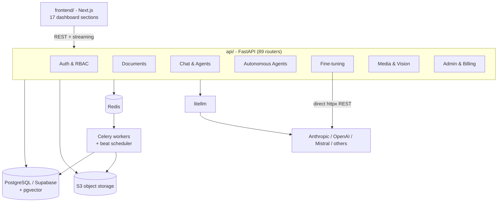

# Architecture Diagram

See [`ARCHITECTURE.md`](../../ARCHITECTURE.md) for the narrative
explanation of each component below.

```mermaid
graph TD
    FE[frontend/ - Next.js<br/>17 dashboard sections]

    subgraph API["api/ - FastAPI (89 routers)"]
        AUTH[Auth & RBAC]
        DOCS[Documents]
        CHAT[Chat & Agents]
        AUTO[Autonomous Agents]
        FT[Fine-tuning]
        MEDIA[Media & Vision]
        ADMIN[Admin & Billing]
    end

    DB[(PostgreSQL / Supabase<br/>+ pgvector)]
    REDIS[(Redis)]
    CELERY[Celery workers<br/>+ beat scheduler]
    S3[(S3 object storage)]
    LITELLM[litellm]
    LLM[Anthropic / OpenAI / Mistral / others]

    FE -->|REST + streaming| API
    API --> DB
    API --> S3
    API --> REDIS
    REDIS --> CELERY
    CELERY --> DB
    CELERY --> S3
    API --> LITELLM
    LITELLM --> LLM
    FT -->|direct httpx REST| LLM
```
