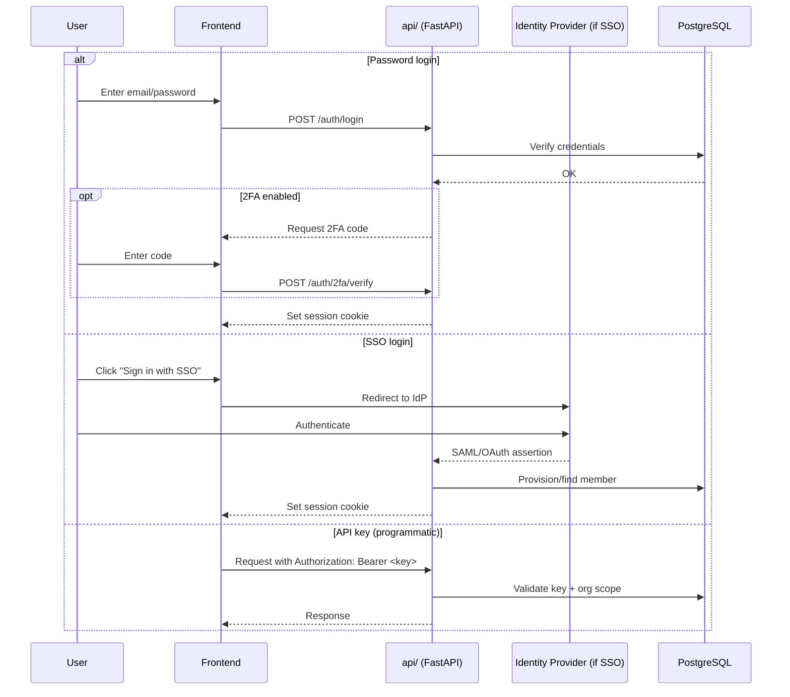

# Auth Flow Diagram

See [Authentication](../developer/AUTHENTICATION.md) and
[`docs/AUTH_BACKEND_SETUP.md`](../AUTH_BACKEND_SETUP.md) for the full
detail.

```mermaid
sequenceDiagram
    participant U as User
    participant FE as Frontend
    participant API as api/ (FastAPI)
    participant IDP as Identity Provider (if SSO)
    participant DB as PostgreSQL

    alt Password login
        U->>FE: Enter email/password
        FE->>API: POST /auth/login
        API->>DB: Verify credentials
        DB-->>API: OK
        opt 2FA enabled
            API-->>FE: Request 2FA code
            U->>FE: Enter code
            FE->>API: POST /auth/2fa/verify
        end
        API-->>FE: Set session cookie
    else SSO login
        U->>FE: Click "Sign in with SSO"
        FE->>IDP: Redirect to IdP
        U->>IDP: Authenticate
        IDP-->>API: SAML/OAuth assertion
        API->>DB: Provision/find member
        API-->>FE: Set session cookie
    else API key (programmatic)
        FE->>API: Request with Authorization: Bearer <key>
        API->>DB: Validate key + org scope
        API-->>FE: Response
    end
```
