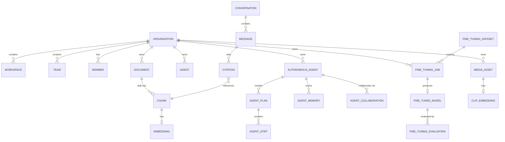

# Database Diagram

A simplified view of the core tables and their major relationships. See
[Database](../developer/DATABASE.md) for the full model reference under
`api/models/`.

## Notes

- Nearly every table above carries an `org_id`, omitted from the
  diagram for readability — see [Multi-tenancy](../advanced/MULTI_TENANCY.md).
- `AGENT` (configured chatbot persona) and `AUTONOMOUS_AGENT` are
  deliberately separate tables, not a shared hierarchy — see
  [Autonomous Agents](../advanced/AUTONOMOUS_AGENTS.md).
