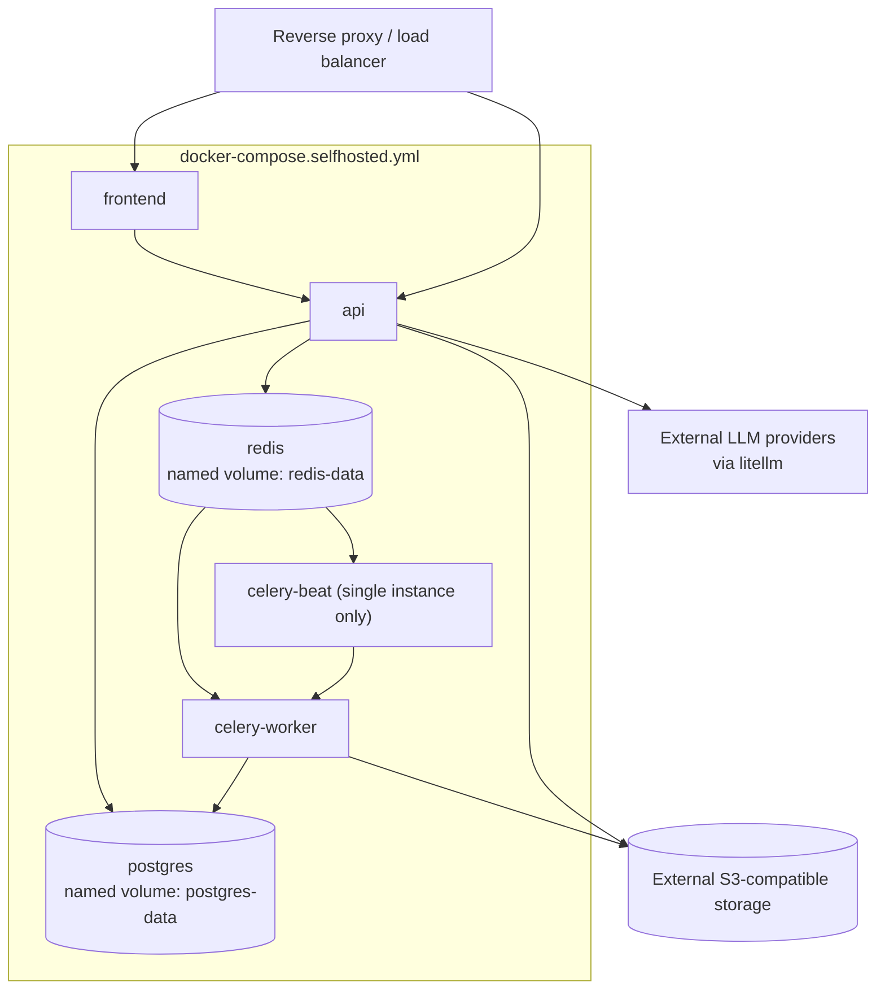

# Deployment Diagram

See [Docker](../install/DOCKER.md) and
[Self-hosted](../install/SELF_HOSTED.md) for the narrative.

No Kubernetes manifests exist for this topology today — see
[Kubernetes](../install/KUBERNETES.md) for the honest gap and a manual
adaptation table.
