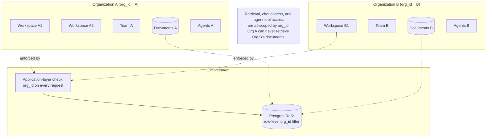

# Multi-tenancy Diagram

See [Multi-tenancy](../advanced/MULTI_TENANCY.md) for the narrative.

Workspaces and teams group resources/members *within* one organization
— neither is a tenancy boundary on its own.
