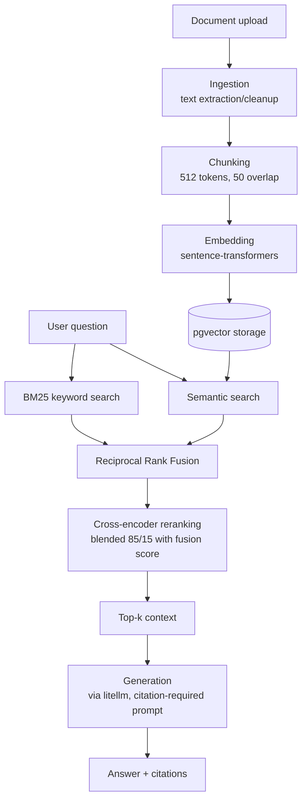

# RAG Pipeline Diagram

See [RAG Pipeline](../advanced/RAG_PIPELINE.md) for the narrative
explanation.

```mermaid
flowchart TD
    UP[Document upload] --> ING[Ingestion<br/>text extraction/cleanup]
    ING --> CHUNK[Chunking<br/>512 tokens, 50 overlap]
    CHUNK --> EMB[Embedding<br/>sentence-transformers]
    EMB --> STORE[(pgvector storage)]

    Q[User question] --> BM25[BM25 keyword search]
    Q --> SEM[Semantic search]
    STORE --> SEM
    BM25 --> RRF[Reciprocal Rank Fusion]
    SEM --> RRF
    RRF --> RERANK[Cross-encoder reranking<br/>blended 85/15 with fusion score]
    RERANK --> CTX[Top-k context]
    CTX --> GEN[Generation<br/>via litellm, citation-required prompt]
    GEN --> ANSWER[Answer + citations]
```
